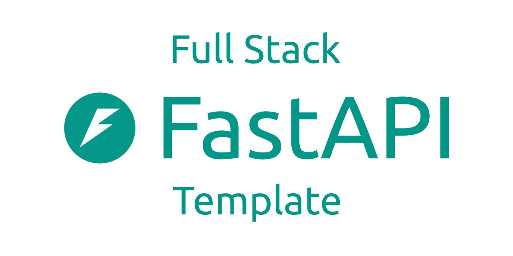

# HomeFin

HomeFin 是一个面向个人和家庭场景的全栈财务管理系统，提供记账、预算、分类管理、财务概览，以及面向 AI Agent 的 MCP Connector。项目基于 FastAPI + React 构建，适合继续作为一个可迭代的业务型开源项目演进。



## Features

- 用户认证与账户体系：支持 `login_name` 登录、密码找回、用户自助设置，以及可选 MFA。
- 财务核心能力：支持分类、预算、交易 CRUD，交易支持摘要 `summary` 与结构化详情 `detail`。
- 首页看板：提供收入、支出、结余、趋势、分类占比和预算使用情况。
- 管理能力：支持管理员用户管理、AI Connection 管理、MFA 重置。
- 数据交换：支持 Excel 模板导入导出、后台数据任务、结果文件与错误明细追踪。
- AI Connector：支持外部 Agent 通过 MCP、OAuth/CIMD 和服务端两阶段确认访问分类、预算、交易等能力。
- 工程化基础：提供 Docker Compose、本地开发热更新、OpenAPI Client 生成、Pytest 和 Playwright 测试。

## Tech Stack

| Layer | Stack |
| --- | --- |
| Frontend | React 19, TypeScript, Vite 7, TanStack Router, TanStack Query |
| UI | Tailwind CSS v4, Radix UI, shadcn-style local components |
| Backend | FastAPI, SQLModel, Pydantic v2 |
| Database | PostgreSQL |
| Tooling | Bun, uv, Biome, Ruff, MyPy, Ty |
| Testing | Pytest, Playwright |
| Deployment | Docker Compose, GitHub Actions |

## Screenshots

| Login | Dashboard | API Docs |
| --- | --- | --- |
|  |  |  |

## Quick Start

### Prerequisites

- [Docker](https://www.docker.com/)
- [Bun](https://bun.sh/)
- [uv](https://docs.astral.sh/uv/) for local backend development

### Start with Docker Compose

Use the repository entrypoint so each worktree gets a stable project name and
deterministic port block:

```bash
make dev-up
```

The default `DEV_SLOT=0` instance uses:

- Frontend: `http://127.0.0.1:21000`
- Backend API: `http://127.0.0.1:21001`
- Swagger UI: `http://127.0.0.1:21001/docs`

Run another worktree or instance with a different slot:

```bash
make dev-up DEV_SLOT=1
```

Each slot reserves 20 ports. `DEV_SLOT=1` therefore uses frontend `21020` and
backend `21021`. See all addresses before startup with:

```bash
make dev-env DEV_SLOT=1
```

The local environment is wired for branch-aware development:

- `backend` and `frontend` both mount the current workspace into the container.
- Restarting the local containers after switching branches makes them read the new branch files immediately.
- `backend` starts through `uv run` against the currently mounted code and `frontend` re-runs `bun install` on startup, so branch-level dependency changes are picked up too.
- Only frontend and backend are exposed by default; PostgreSQL stays on the Compose network.
- Adminer, Mailcatcher and Playwright UI are enabled only through their dedicated commands.

If you switch branches while the stack is already running, restart the app containers:

```bash
make dev-restart
```

Optional tools:

```bash
make adminer-up
make mail-up
make playwright-ui
```

Stop only the selected HomeFin instance without deleting its database volume:

```bash
make dev-down
```

The complete port map, conflict behavior and multi-worktree rules are documented
in [docs/local-development.md](docs/local-development.md).

## Local Development

### Frontend

```bash
bun install
bun run dev
```

### Backend

```bash
cd backend
uv sync
source .venv/bin/activate
fastapi dev app/main.py
```

### Generate frontend API client

Whenever backend OpenAPI changes, regenerate the client:

```bash
bash scripts/generate-client.sh
```

## Testing

### Frontend

```bash
bun run lint
bun run test
```

### Backend

```bash
cd backend
uv run bash scripts/tests-start.sh
```

### Full stack verification

Run isolated Docker-based verification projects:

```bash
make test-backend
make test-e2e
```

## Project Structure

```text
HomeFin/
├── backend/        # FastAPI application, SQLModel models, Alembic migrations, backend tests
├── frontend/       # React application, routes, components, generated OpenAPI client, Playwright tests
├── context/        # Living product, API, schema, UI, and changelog documentation
├── docs/           # Development and deployment documents
├── scripts/        # Utility scripts such as test and client generation
├── AGENTS.md        # Repository safety, risk, and completion rules
├── Makefile         # Stable local development and test entrypoints
├── compose.yml
├── compose.override.yml
└── README.md
```

## Documentation

- Backend guide: [backend/README.md](backend/README.md)
- Frontend guide: [frontend/README.md](frontend/README.md)
- Engineering conventions: [docs/development-guide.md](docs/development-guide.md)
- Development workflow: [docs/development-workflow.md](docs/development-workflow.md)
- Local multi-instance development: [docs/local-development.md](docs/local-development.md)
- Intranet deployment: [docs/intranet-production-validation-deployment.md](docs/intranet-production-validation-deployment.md)
- Product context: [context/readme.md](context/readme.md)
- HomeFin MCP / AI Agent integration: [context/modules/ai-connector/agent-integration-guide.md](context/modules/ai-connector/agent-integration-guide.md)

## Current Scope

The current repository focuses on:

- household finance management
- role-based admin and user settings flows
- MCP / OAuth AI Agent integration scenarios
- structured transaction data and import/export workflows

The product flow is centered on categories, budgets, transactions, dashboard, system management, and agent-facing APIs.

## Deployment

The repository keeps an intranet-oriented deployment workflow. For environment variables, persistence, ports, and validation steps, see:

- [docs/intranet-production-validation-deployment.md](docs/intranet-production-validation-deployment.md)
- [.env.example](.env.example)
- [.env.intranet.example](.env.intranet.example)

## Roadmap Notes

The implemented product state and version evolution are tracked in:

- [context/project.md](context/project.md)
- [context/changelogs/](context/changelogs)
- [context/prds/](context/prds)

## Contributing

Issues and pull requests are welcome. Before changing the repository, read
[AGENTS.md](AGENTS.md), the
[development workflow](docs/development-workflow.md), the engineering
conventions, and the current context docs. Use `make change-plan` to review the
minimum S/M/H risk and `make change-check` before declaring the work complete.

## License

This project is licensed under the [MIT License](LICENSE).
