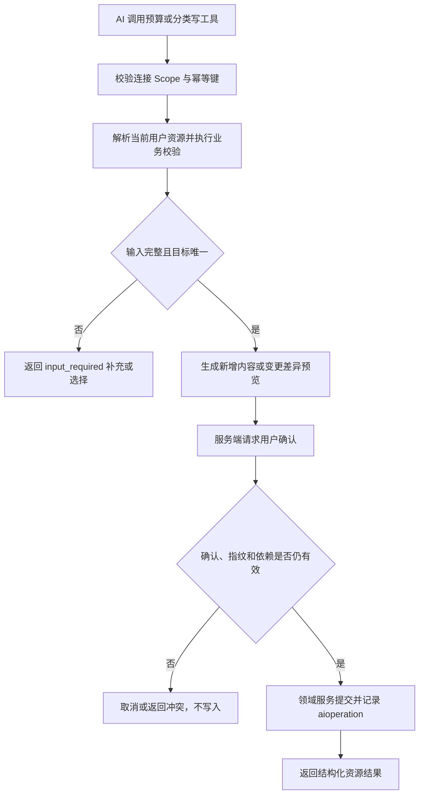

# AI Budget And Category Management

## 4.1 目标声明

### 背景
旧 Agent API 除交易外还允许维护预算和分类。若新 MCP Connector 只覆盖记账，直接移除旧接口会造成实际能力缺口。预算和分类又是交易写入的基础配置，因此需要提供与交易工具一致的用户身份、Scope、确认、幂等和依赖约束。

### 目标
- 获得对应 Scope 的 AI 连接可以创建、更新和删除当前用户预算与分类。
- 工具通过业务字段和精确候选工作，不要求模型理解 REST 路径或数据库关系。
- 所有写操作使用与交易工具相同的服务端确认和幂等机制。
- 删除操作严格执行现有交易引用、子分类和分类环约束，不自动级联或改写关联数据。
- 新能力完整覆盖旧 Agent API 的预算和分类 CRUD，作为其唯一替代入口。

### 不在范围内
- 不实现跨用户共享预算、共享分类或管理员代用户维护。
- 不自动合并同名分类，不自动重挂子分类或交易。
- 不自动解除预算与交易关系，也不提供级联删除。
- 不实现预算详情页、分类详情页或新的 HomeFin 管理页面。
- 不允许客户端绕过确认、Scope 或幂等保护。

## 4.2 模块影响表

| 模块 | 影响类型 | 说明 |
|------|---------|------|
| `ai-connector` | 新增 | 注册预算与分类写工具，并复用统一确认、幂等和 Scope 机制 |
| `budgets` | 修改 | 提供面向 MCP 的预算预览、CRUD 和依赖检查领域用例 |
| `categories` | 修改 | 提供分类精确解析、树校验、预览和 CRUD 领域用例 |
| `transactions` | 修改 | 为预算、分类删除提供一致的交易引用检查 |
| `shared-infra` | 修改 | 增加跨工具幂等、确认、约束和并发冲突测试 |

## 4.3 功能描述

### 功能点 1：创建和更新预算

**工具定义**
| 工具 | Scope | Annotation | 用途 |
|------|------|------------|------|
| `create_budget` | `finance:read + budgets:write` | 非只读、非破坏、幂等、封闭域 | 创建预算 |
| `update_budget` | `finance:read + budgets:write` | 非只读、破坏性、幂等、封闭域 | 更新预算 |

**正常流程**
1. AI 提交预算名称、金额、周期、可选年份和必填 `idempotency_key`。
2. 未提供年份时使用 `BUSINESS_TIMEZONE` 的当前业务年份，并在确认预览中明确展示。
3. 系统校验金额、周期和目标资源所有权，生成创建内容或更新差异。
4. 用户确认后，系统再次校验资源指纹并调用预算领域服务提交。
5. 返回预算 ID、名称、年份、周期、金额、已使用和剩余金额。

**边界条件**
- 金额必须大于 0，并能精确转换为整数分。
- 周期仅允许现有 `MONTH / QUARTER / YEAR` 枚举。
- 更新只改变明确提交的字段，不能把省略字段解释为空值。
- 名称可以重复时沿用当前业务规则；定位更新目标必须使用精确预算 ID。

**异常处理**
- 缺少无法安全默认的周期、金额或名称时返回 `input_required`。
- 目标在确认期间发生变化时返回并发冲突并要求重新确认。
- 相同幂等键对应不同参数时返回冲突。

### 功能点 2：删除预算

**工具定义**
| 工具 | Scope | Annotation | 用途 |
|------|------|------------|------|
| `delete_budget` | `finance:read + budgets:delete` | 非只读、破坏性、幂等、封闭域 | 永久删除预算 |

**正常流程**
1. AI 使用预算 ID 调用删除工具，并提交幂等键。
2. 系统展示预算名称、年份、金额、已使用金额和不可恢复说明。
3. 用户确认后，系统重新检查预算指纹和交易引用。
4. 无关联交易时删除预算并记录幂等结果。

**边界条件**
- 只有同时具备 `finance:read + budgets:delete` 才能发现和调用工具。
- 删除工具只接受预算 ID，不按名称猜测目标。
- 已关联任何交易的预算禁止删除，不自动把交易的 `budget_id` 置空。

**异常处理**
- 存在关联交易时返回明确业务错误，并保持所有数据不变。
- 确认后新增了关联交易时，以提交前实时检查为准并拒绝删除。

### 功能点 3：创建和更新分类

**工具定义**
| 工具 | Scope | Annotation | 用途 |
|------|------|------------|------|
| `create_category` | `finance:read + categories:write` | 非只读、非破坏、幂等、封闭域 | 创建分类 |
| `update_category` | `finance:read + categories:write` | 非只读、破坏性、幂等、封闭域 | 更新分类 |

**正常流程**
1. AI 提交分类名称、可选父分类、可选颜色和幂等键。
2. 父分类通过 ID 或规范化后的唯一精确名称解析；多个同名路径候选时要求用户选择。
3. 未提供颜色时使用产品中性色 `#64748b`，并在确认预览中明确展示。
4. 系统执行名称唯一、颜色格式、父分类所有权和任意深度环校验。
5. 用户确认后提交并返回分类 ID、名称、颜色、父分类和展示路径。

**边界条件**
- 分类名称按授权用户维度唯一。
- 颜色仅允许 `#RGB` 或 `#RRGGBB`。
- 更新目标必须使用分类 ID；父分类可显式设为 `null` 表示移动到根级。
- 不允许把分类本身或任意后代设为父分类。

**异常处理**
- 同名、非法颜色、非法父分类或分类环返回明确业务错误。
- 父分类在确认期间变化或删除时返回冲突，不创建或更新半成品分类。

### 功能点 4：删除分类

**工具定义**
| 工具 | Scope | Annotation | 用途 |
|------|------|------------|------|
| `delete_category` | `finance:read + categories:delete` | 非只读、破坏性、幂等、封闭域 | 永久删除分类 |

**正常流程**
1. AI 使用分类 ID 和幂等键调用删除工具。
2. 系统展示分类名称、完整路径、子分类数量、关联交易状态和不可恢复说明。
3. 只有不存在子分类且未被交易引用时才允许用户确认并提交删除。
4. 提交前再次执行依赖和资源指纹检查。

**边界条件**
- 只有同时具备 `finance:read + categories:delete` 才能发现和调用工具。
- 不允许按名称、“最近创建”或模糊描述直接删除。
- 删除不自动迁移子分类或交易到其他分类。

**异常处理**
- 存在子分类或关联交易时返回明确阻塞原因和资源摘要，不提供自动绕过操作。
- 依赖状态在确认期间变化时拒绝删除并要求重新确认。

### 功能点 5：复用统一写操作保护

**正常流程**
1. 六个工具复用 `aioperation`、签名确认状态和连接 `last_used_at` 更新规则。
2. 创建、更新和删除均由服务端强制确认；工具 Annotation 只用于向客户端表达风险。
3. 业务写入与幂等记录处于同一事务。

**边界条件**
- 幂等记录、确认有效期、参数哈希和资源指纹规则与交易工具一致。
- 客户端不支持 MCP `input_required` 时所有写工具不可用。

**异常处理**
- 不能因为客户端已显示自己的确认 UI 就跳过 HomeFin 服务端确认。

## 4.4 数据变更

新增表：
| 表名 | 用途说明 |
|------|---------|
| 无 | 复用 `aioperation` 记录预算与分类写工具的幂等结果 |

新增字段：
| 表名 | 字段名 | 类型 | 业务含义 |
|------|------|------|------|
| 无 | 无 | 本需求不新增字段 |

调整已有字段说明（字段本身不变，但行为/值域在本次需求中有扩展）：
| 表名 | 字段名 | 调整说明 |
|------|------|------|
| `budget` | `owner_id` | MCP 写入固定使用授权用户 ID |
| `budget` | `year` | AI 创建时可默认使用当前业务年份，但确认预览必须明确展示 |
| `category` | `owner_id` | MCP 写入固定使用授权用户 ID |
| `category` | `color` | AI 创建未提交颜色时使用明确产品默认值，仍受数据库约束 |
| `category` | `parent_id` | MCP 写入复用所有权和任意深度防环校验 |
| `aioperation` | `resource_type` | 扩展使用 `budget` 与 `category` 值 |

废弃字段（保留字段本身，说明中标注 [废弃]）：
| 表名 | 字段名 | 废弃原因 |
|------|------|------|
| 无 | 无 | 本需求不废弃预算或分类字段 |

## 4.5 UI 页面

| 变更类型 | 页面名 | 路由 | 说明 |
|------|------|------|------|
| 无 | 无独立页面 | 无 | 预算和分类写入确认在兼容 MCP 客户端中完成 |

每个新增/修改页面：
- 无独立 HomeFin 页面。
- 现有 `/budgets` 和 `/system/categories` 页面继续展示 MCP 写入后的统一业务数据，无需区分数据来源。

导航影响：
- 不影响 HomeFin 导航结构。

## 4.6 验收标准

- [ ] 预算和分类工具都要求 `finance:read`，并按 `write` 与 `delete` Scope 分别发现和授权；写权限不能隐式获得删除权限。
- [ ] 所有预算和分类写操作在服务端确认前不改变数据库。
- [ ] 客户端不支持 `input_required` 时，六个写工具明确失败且没有副作用。
- [ ] 相同幂等键和参数的重试只执行一次，相同键配合不同参数返回冲突。
- [ ] AI 不能创建或修改其他用户的预算和分类，也不能因授权用户是管理员而扩大范围。
- [ ] 删除有关联交易的预算时不会自动解除关联，删除有子分类或关联交易的分类时不会自动迁移数据。
- [ ] 分类名称、颜色、父分类和防环规则与 Web API 一致。
- [ ] 预算金额、周期、已使用金额规则与 Web API 一致。
- [ ] v0.13 的 MCP 工具完整覆盖旧 Agent API 对预算和分类的 CRUD 能力。
