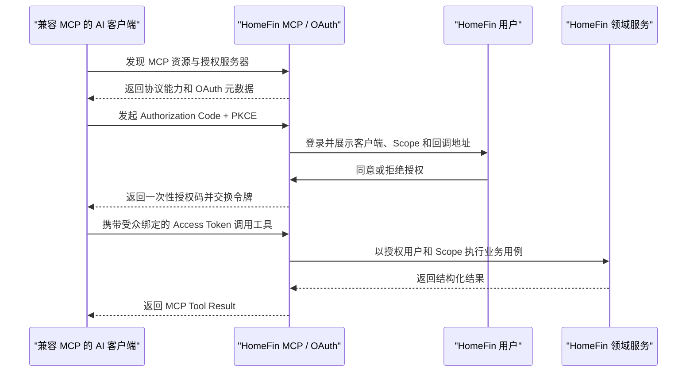

# AI Connection Management

## 4.1 目标声明

### 背景
当前外部 AI 需要用户创建长期 API Token、复制 Secret、安装专用 Skill，并由模型理解 REST 路径和 HMAC 规则。这种连接方式把协议细节暴露给用户和模型，也无法表达“哪个 AI 客户端获得了哪些权限”。HomeFin 需要以标准 MCP 和用户授权连接作为新的唯一 AI 入口。

### 目标
- 兼容 MCP 的 AI 客户端可以发现 HomeFin MCP 服务和可用工具。
- HomeFin 用户通过 OAuth 授权客户端代表自己访问数据，无需复制明文凭证。
- 用户在授权前看到客户端身份、申请 Scope 和权限含义，并可拒绝授权。
- 用户可以查看自己的 AI 连接、最后使用时间、授权范围和状态，并随时撤销。
- 所有 MCP 请求都能解析为明确的用户与连接身份，并执行资源、Scope 和 Token 受众校验。

### 不在范围内
- 不自动把内网 HomeFin 暴露到公网，不提供反向隧道、端口映射或托管中继。
- 不提供厂商专属 ChatGPT、Claude、Codex 或其他平台插件；平台通过标准 MCP 接入。
- 不实现 stdio 分发包、MCP Apps、Prompts、Resources、Tasks 或模型 Sampling。
- 不支持匿名 MCP 工具，也不允许以普通网页登录 JWT 直接调用 MCP。
- 不复用旧 `apitoken`、HMAC Secret 或 `apitokennonce` 作为 OAuth 凭证。

## 4.2 模块影响表

| 模块 | 影响类型 | 说明 |
|------|---------|------|
| `ai-connector` | 新增 | 承载 MCP HTTP 入口、工具发现、连接上下文、Scope 校验和 OAuth 资源服务能力 |
| `auth` | 修改 | 增加 OAuth 授权码、PKCE、Access/Refresh Token、发现元数据和撤销流程 |
| `users` | 修改 | 将连接绑定到真实授权用户，并在用户失效或认证版本变化时使连接重新授权 |
| `app-shell` | 修改 | 增加授权确认页和用户级 AI Connections 管理入口 |
| `shared-infra` | 修改 | 增加 MCP SDK、协议兼容测试、安全配置、限流和可观测性基础 |

## 4.3 功能描述

### 功能点 1：MCP 服务发现与协议入口

**正常流程**
1. 客户端访问标准发现元数据和 `/mcp` HTTP 入口。
2. HomeFin 以 MCP `2026-07-28` 作为 v0.13 基线，暴露 Server Discovery、Tools List 和 Tools Call 能力。
3. `/mcp` 使用无协议会话的 HTTP 请求模型；每次请求独立完成协议版本、客户端信息、身份和 Scope 校验。
4. 工具的输入与输出都使用 JSON Schema 2020-12，并返回结构化结果。
5. `tools/list` 只返回当前连接已授权 Scope 对应的工具。

**边界条件**
- 部署环境必须配置唯一、规范化的 MCP Resource URI。
- 非本地环境只允许 HTTPS；本地 HTTP 仅允许明确配置的 loopback 或受信内网主机。
- 必须校验 Host、协议版本以及 `Mcp-Method` / `Mcp-Name` 与请求体的一致性；请求携带 Origin 时还必须验证其属于允许来源。
- 客户端自报的名称、版本和能力只用于展示与诊断，不能作为授权依据。

**异常处理**
- 协议版本不受支持时返回明确的 MCP 协议错误，不静默降级到旧 Agent API。
- MCP Resource URI、Host、Origin 或请求头不一致时拒绝请求并记录不含敏感数据的安全事件。
- 服务未配置有效外部 HTTPS 地址时，只声明实际可达地址，不生成虚假的云端连接说明。

### 功能点 2：OAuth 用户授权与 Scope

**正常流程**
1. 客户端通过标准受保护资源和授权服务器元数据发现 OAuth 端点。
2. 客户端使用 Authorization Code + PKCE 发起授权，并通过 Client ID Metadata Document 提供可验证的客户端身份和精确回调地址；v0.13 不实现动态客户端注册（DCR），CIMD 是唯一客户端注册路径。
3. 未登录用户先完成 HomeFin 登录和可选 MFA，再进入授权确认页。
4. 页面展示客户端名称、回调域名、申请 Scope 和每项权限说明。
5. 用户同意后创建 `aiconnection`，签发一次性短期授权码；客户端交换短期 Access Token 和轮换式 Refresh Token。
6. MCP Access Token 包含独立用途、用户主体、连接 ID、Scope、MCP Resource Audience 和用户认证版本。

**Scope 定义**
| Scope | 能力 |
|------|------|
| `finance:read` | 读取当前用户财务概览、交易、预算和分类 |
| `transactions:write` | 创建和更新当前用户交易、读取写入所需候选 |
| `transactions:delete` | 删除当前用户交易 |
| `budgets:write` | 创建和更新当前用户预算 |
| `budgets:delete` | 删除当前用户预算 |
| `categories:write` | 创建和更新当前用户分类 |
| `categories:delete` | 删除当前用户分类 |

所有 `write` 和 `delete` Scope 都以 `finance:read` 为前置 Scope。授权服务器拒绝缺少 `finance:read` 的写入权限组合，避免客户端获得修改能力却无法读取目标、候选或确认预览。

**边界条件**
- 所有工具均需授权，不提供公共工具。
- PKCE 为强制要求；授权码最多有效 5 分钟且只能使用一次。
- Access Token 默认有效 15 分钟；Refresh Token 最长有效 30 天，每次刷新后必须轮换并检测重复使用。
- 普通 HTTPS 回调地址必须与经过验证的客户端元数据逐字符匹配；不接受通配符或请求临时指定的任意地址。
- 对 RFC 8252 loopback 回调实施专用匹配：只允许 `http://127.0.0.1`、`http://[::1]` 等明确 loopback 主机，scheme、host、path 和 query 必须与 CIMD 元数据登记值一致，但允许客户端在授权请求中选择临时端口；该例外不得扩展到 `localhost` 解析结果、内网 IP 或任意域名。
- Access Token 必须绑定 `/mcp` Resource Audience，不能用于普通 `/api/v1` Web API；普通登录 Token 也不能反向用于 MCP。
- 授权码兑换、Refresh Token 轮换和重复使用检测必须使用数据库事务，避免并发请求重复成功。

**异常处理**
- 用户拒绝授权时不创建连接，并按 OAuth 标准向客户端返回拒绝结果。
- Scope、PKCE、Issuer、Audience、回调地址或客户端元数据不合法时拒绝授权或换取令牌。
- Refresh Token 被重复使用时撤销其所属连接的全部令牌，并将连接标记为需要重新授权。
- 客户端不支持 OAuth 时停止连接，不提供复制旧 API Token 的替代路径。

### 功能点 3：Codex Desktop 兼容性基线

**正常流程**
1. HomeFin 在 OAuth Authorization Server Metadata 中声明 `client_id_metadata_document_supported: true`，且 `token_endpoint_auth_methods_supported` 包含 `none`。
2. Codex Desktop 通过 Streamable HTTP URL 添加 HomeFin，使用回调专属 CIMD 客户端标识完成 Authorization Code + PKCE 登录。
3. HomeFin 获取并验证 Codex 的 HTTPS CIMD 文档，只信任文档中声明的客户端名称和重定向 URI；CIMD 获取失败、内容类型错误、重定向到非 HTTPS 地址或超出受控大小时拒绝授权。
4. Codex 使用 `http://127.0.0.1:<临时端口>/callback/<callback_id>` 接收浏览器回调；HomeFin 按前述 RFC 8252 loopback 规则校验并跳转。
5. 授权成功后 Codex 可以发现工具、调用只读工具，并在写工具触发时完成结构化 `input_required` 两阶段往返。

**边界条件**
- HomeFin MCP URL 必须能从运行 Codex Desktop 的 Mac 直接访问；同机可使用 loopback，跨主机部署必须使用可解析的正式内网域名或部署方提供的正式外部域名。
- 非 loopback MCP URL 必须使用 HTTPS，证书链和主机名必须被该 Mac 信任；不接受仅 Docker 网络内可见的地址、自签名但未安装信任的证书或自动创建的公网隧道。
- MCP Server 初始化说明前 512 个字符必须自包含地说明 HomeFin、金额单位、业务时区、写操作确认和禁止跨用户访问，避免客户端只读取截断内容时丢失关键约束。
- HomeFin 的 `input_required` 是写工具的普通结构化结果，包含签名 `confirmation_id`，不要求 Codex 提供服务器反向请求通道；它仍是独立于 Codex 工具审批的服务端安全门槛。
- 单个同步工具调用应在 Codex 默认 60 秒工具超时内完成；需要更长时间的能力不进入 v0.13 工具集。

**异常处理**
- Codex CIMD 元数据或 loopback 回调不符合上述规则时明确终止 OAuth，不切换到 DCR、长期 Token 或旧 Agent API。
- Mac 无法访问 MCP URL、TLS 不受信任或浏览器无法回到 loopback listener 时，连接保持未授权并给出可诊断错误，不自动更改网络暴露范围。
- 当前 Codex 版本若不能保留结构化结果并用同一工具完成第二阶段确认，写工具验收失败并阻止 v0.13 发布；不得通过取消服务端确认绕过。

### 功能点 4：连接查看、撤销与失效

**正常流程**
1. 用户在 Settings 的 AI Connections 区域查看自己的连接。
2. 列表展示客户端名称、Scope、状态、创建时间和最后使用时间，不展示任何 Access/Refresh Token。
3. 用户确认撤销某个连接后，系统撤销其 Refresh Token，并使后续 Access Token 校验失败。
4. 客户端再次调用时收到需要重新授权的错误。

**边界条件**
- 用户只能查看和撤销自己的连接。
- 用户被停用、删除、修改密码、重置密码或 `auth_version` 变化后，已有 MCP Token 立即失效，连接进入 `REAUTH_REQUIRED` 或随用户删除级联清理。
- 同一客户端可以在用户明确授权后建立新连接，但不能通过旧 Refresh Token 恢复已撤销连接。
- 已撤销连接的非敏感元数据默认保留 90 天后清理；过期授权码在 24 小时内清理；过期或撤销的 Refresh Token 家族在连接审计保留期结束后清理。

**异常处理**
- 重复撤销保持幂等。
- 连接不存在或不属于当前用户时返回未找到，不泄露其他用户连接信息。
- 撤销事务失败时前端不得先行展示为已撤销。

## 4.4 数据变更

新增表：
| 表名 | 用途说明 |
|------|---------|
| `aiconnection` | 持久化用户对 AI 客户端的授权关系、Scope、状态和使用时间 |
| `aiauthorizationdecision` | 记录授权请求的一次性同意或拒绝，阻止重复决定产生多条连接 |
| `aiauthorizationcode` | 保存短期、一次性、PKCE 绑定的 OAuth 授权码状态 |
| `airefreshtoken` | 保存轮换式 Refresh Token 哈希、使用链和撤销状态 |

新增字段：
| 表名 | 字段名 | 类型 | 业务含义 |
|------|------|------|------|
| `aiconnection` | `id` | UUID | 连接主键 |
| `aiconnection` | `user_id` | UUID | 完成授权的数据主体，关联 `user.id` |
| `aiconnection` | `client_id` | varchar(500) | 经过验证的 OAuth 客户端标识 |
| `aiconnection` | `client_name` | varchar(255) | 授权时展示的客户端名称快照 |
| `aiconnection` | `scopes` | jsonb | 用户已授予 Scope 集合 |
| `aiconnection` | `status` | varchar(30) | `ACTIVE / REVOKED / REAUTH_REQUIRED` |
| `aiconnection` | `auth_version` | integer | 授权时用户认证版本 |
| `aiconnection` | `last_used_at` | timestamptz | 最近一次成功 MCP 调用时间 |
| `aiconnection` | `revoked_at` | timestamptz | 撤销时间 |
| `aiconnection` | `created_at` | timestamptz | 创建时间 |
| `aiauthorizationdecision` | `id` | UUID | 授权决定主键 |
| `aiauthorizationdecision` | `request_jti` | UUID | 授权请求唯一标识 |
| `aiauthorizationdecision` | `user_id` | UUID | 做出决定的用户 |
| `aiauthorizationdecision` | `approved` | boolean | 同意或拒绝结果 |
| `aiauthorizationdecision` | `created_at` | timestamptz | 决定时间 |
| `aiauthorizationcode` | `id` | UUID | 授权码记录主键 |
| `aiauthorizationcode` | `connection_id` | UUID | 关联 AI 连接 |
| `aiauthorizationcode` | `code_hash` | varchar(255) | 一次性授权码哈希 |
| `aiauthorizationcode` | `redirect_uri` | varchar(1000) | 已验证回调地址 |
| `aiauthorizationcode` | `code_challenge` | varchar(255) | PKCE Challenge |
| `aiauthorizationcode` | `expires_at` | timestamptz | 授权码过期时间 |
| `aiauthorizationcode` | `used_at` | timestamptz | 成功兑换时间 |
| `aiauthorizationcode` | `created_at` | timestamptz | 创建时间 |
| `airefreshtoken` | `id` | UUID | Refresh Token 记录主键 |
| `airefreshtoken` | `connection_id` | UUID | 关联 AI 连接 |
| `airefreshtoken` | `token_hash` | varchar(255) | Refresh Token 哈希 |
| `airefreshtoken` | `family_id` | UUID | 轮换链标识，用于重复使用检测 |
| `airefreshtoken` | `replaced_by_id` | UUID | 轮换后的下一 Token |
| `airefreshtoken` | `expires_at` | timestamptz | 最长有效时间 |
| `airefreshtoken` | `used_at` | timestamptz | 首次使用时间 |
| `airefreshtoken` | `revoked_at` | timestamptz | 撤销时间 |
| `airefreshtoken` | `created_at` | timestamptz | 创建时间 |

数据约束：
- `aiauthorizationdecision.request_jti`、`aiauthorizationcode.code_hash` 和 `airefreshtoken.token_hash` 必须分别唯一。
- `aiconnection.user_id`、授权码、Refresh Token 和后续 AI 操作记录在用户删除时级联清理。
- 清理任务只能处理已过期或超过保留期的记录，不能删除仍有效连接和 Token 家族。

调整已有字段说明（字段本身不变，但行为/值域在本次需求中有扩展）：
| 表名 | 字段名 | 调整说明 |
|------|------|------|
| `user` | `auth_version` | 同时参与 MCP Access/Refresh Token 失效判断，密码变化后连接需要重新授权 |

废弃字段（保留字段本身，说明中标注 [废弃]）：
| 表名 | 字段名 | 废弃原因 |
|------|------|------|
| 无 | 无 | 旧 API Token 数据的废弃由 `legacy-ai-access-retirement.md` 统一定义 |

## 4.5 UI 页面

| 变更类型 | 页面名 | 路由 | 说明 |
|------|------|------|------|
| 新增 | AI 授权确认页 | `/connect/authorize` | 展示客户端、回调域和 Scope，允许用户同意或拒绝 |
| 修改 | 用户设置页 | `/settings` | 增加 AI Connections 区域，管理当前用户连接 |

### AI 授权确认页
- 布局：认证上下文提示 + 客户端信息卡 + Scope 清单 + 同意/拒绝操作。
- 功能：未登录先进入正常登录/MFA 流程；登录后确认授权。
- 交互：拒绝直接返回客户端；同意后由后端生成一次性授权码并跳转到已验证回调地址。
- 字段：客户端名称、客户端标识、回调域名、申请 Scope、当前 HomeFin 用户。
- 安全：不展示 Access/Refresh Token；页面不得接受前端自行覆盖回调地址或 Scope。

### 用户设置页 AI Connections 区域
- 布局：沿用 Settings 响应式 Tab/分区，显示连接卡片或列表。
- 功能：查看连接名称、Scope、状态、创建时间和最后使用时间；撤销连接。
- 交互：撤销前二次确认，成功后刷新列表；移动端保持单列与完整触控区域。
- 字段：不展示任何令牌、授权码或 PKCE 内容。

导航影响：
- 不新增管理员导航项。
- AI Connections 作为所有已登录用户可见的 Settings 分区，不放入系统管理菜单。

## 4.6 验收标准

- [ ] 两个相互独立、支持 MCP `2026-07-28` 的客户端可以通过同一个 `/mcp` 入口发现服务和授权工具。
- [ ] 用户可以完成 OAuth Authorization Code + PKCE 授权，全程无需创建或复制 API Token。
- [ ] 授权页明确展示客户端、回调域名和申请 Scope，拒绝授权时不产生连接。
- [ ] MCP Access Token 不能用于普通 Web API，普通登录 Token 不能用于 MCP。
- [ ] `tools/list` 不向连接暴露未授权 Scope 对应的工具，直接调用未授权工具也会失败。
- [ ] 用户可以在 Settings 查看并撤销自己的 AI 连接，撤销后 Access/Refresh Token 均不可继续使用。
- [ ] 密码变化、用户停用或删除后，原有 MCP 连接不能继续访问财务数据。
- [ ] 非本地环境没有 HTTPS Resource URI 时，MCP 服务拒绝以不安全配置启动。
- [ ] HomeFin 不会自动创建公网入口、隧道或中继，也不会在 OAuth 失败时回退旧 API Token。
- [ ] HomeFin OAuth 元数据满足 Codex CIMD 发现条件，并能安全接受其 callback-specific CIMD 文档。
- [ ] Codex 使用随机 loopback 端口时可以完成登录；非 loopback URI 改端口、主机或路径时必须被拒绝。
- [ ] 使用实际计划发布的 Codex Desktop 版本完成添加服务器、OAuth 登录、重启重连、Token 刷新、只读调用、写入确认/拒绝/超时和撤销后失效验收。
- [ ] Codex 自身写工具审批与 HomeFin `input_required` 同时启用时流程可完成，任一层拒绝都不会产生业务写入。
- [ ] 从 Codex 所在 Mac 验证 MCP 域名解析、端口可达和 TLS 信任；仅容器内部可达或证书不受信任时发布验收失败。

## 参考

- OpenAI Codex MCP 文档：<https://developers.openai.com/codex/extend/mcp>
- RFC 8252 OAuth 2.0 for Native Apps：<https://www.rfc-editor.org/rfc/rfc8252>
