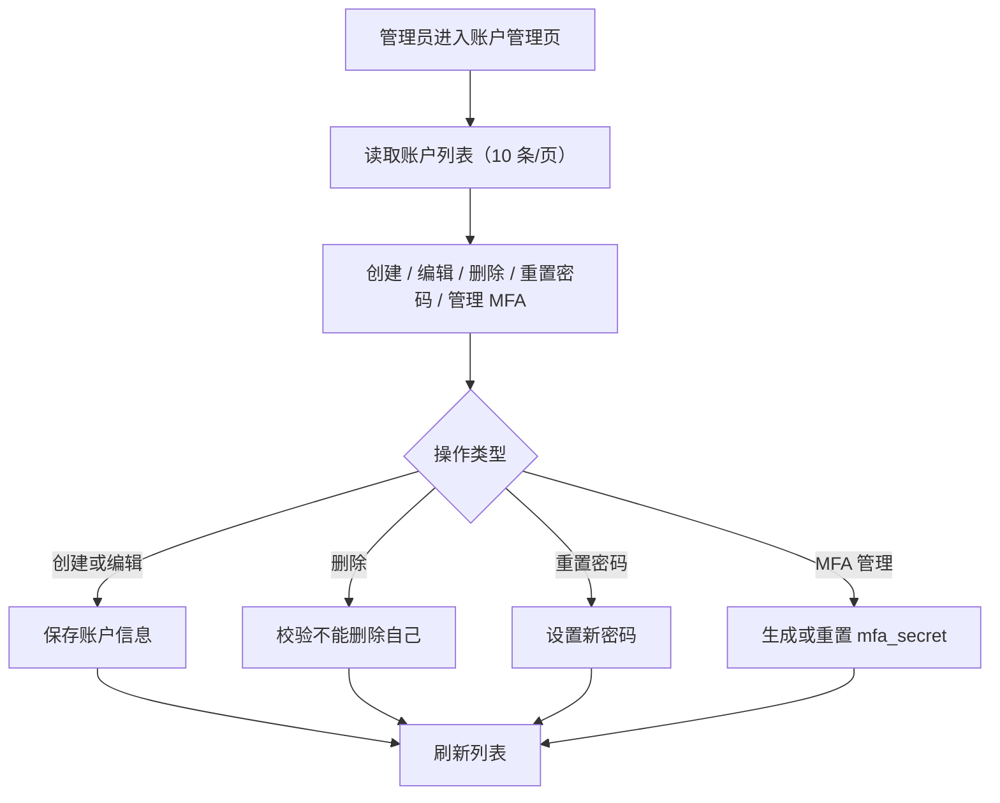

# Account Administration

## 4.1 目标声明

### 背景
模板已有基础用户管理，但 HomeFinAI 需要更贴近业务账户体系的后台能力，包括登录名、密码重置与 MFA Secret 管理。

### 目标
- 管理员可以分页管理账户。
- 管理员可以创建、编辑、删除用户，但不能删除自己。
- 管理员可以重置任意用户密码。
- 管理员可以查看并重置/生成用户 MFA Secret。

### 不在范围内
- 不实现复杂角色体系，只保留普通用户与管理员。
- 不实现批量导入用户。
- 不实现用户操作审计日志。

## 4.2 模块影响表

| 模块 | 影响类型 | 说明 |
|------|---------|------|
| `users` | 修改 | 账户列表、创建编辑字段、密码重置、MFA Secret 管理 |
| `auth` | 修改 | 账户登录能力依赖 `login_name` 与 MFA 状态 |
| `app-shell` | 修改 | 管理员导航与用户菜单保持一致 |
| `shared-infra` | 修改 | 提供管理员接口、权限校验与测试支撑 |

## 4.3 功能描述

### 功能点 1：账户列表与分页

**正常流程**
1. 管理员进入账户管理页。
2. 系统按每页 10 条读取账户列表。
3. 页面展示登录名、昵称、启用状态、管理员状态等字段。

**边界条件**
- 非管理员不得进入该页面。
- 分页参数超出范围时回到有效页码。

**异常处理**
- 列表读取失败时提示并允许重试。

### 功能点 2：账户创建、编辑与删除

**正常流程**
1. 管理员可新建账户，填写登录名、密码、昵称、启用状态、管理员状态。
2. 管理员可编辑昵称、启用状态、管理员状态。
3. 管理员可删除其他用户。

**边界条件**
- `login_name` 必须唯一。
- 删除用户时禁止删除当前登录管理员本人。

**异常处理**
- 登录名冲突时阻止保存并提示。
- 试图删除自己时返回明确错误。

### 功能点 3：密码重置与 MFA Secret 管理

**正常流程**
1. 管理员可对任意用户发起重置密码。
2. 管理员可查看该用户是否已配置 MFA。
3. 管理员可生成新的 `mfa_secret` 或重置已有 `mfa_secret`。

**边界条件**
- 重置密码不要求知道旧密码。
- 重置/生成 MFA Secret 后，旧验证码立即失效。

**异常处理**
- 当目标用户不存在或已被删除时，给出明确提示。

## 4.4 数据变更

新增表：
| 表名 | 用途说明 |
|------|------|
| 无 | 复用 `user` 表扩展账户能力 |

新增字段：
| 表名 | 字段名 | 类型 | 业务含义 |
|------|------|------|------|
| `user` | `login_name` | varchar(100) | 后台与登录使用的唯一账号名 |
| `user` | `mfa_secret` | varchar(255) | 用户 TOTP 秘钥 |

调整已有字段说明（字段本身不变，但行为/值域在本次需求中有扩展）：
| 表名 | 字段名 | 调整说明 |
|------|------|------|
| `user` | `full_name` | 在业务上更接近昵称字段 |
| `user` | `is_active` | 账户启用状态，用于管理员开关控制 |
| `user` | `is_superuser` | 继续表示管理员状态 |

废弃字段（保留字段本身，说明中标注 [废弃]）：
| 表名 | 字段名 | 废弃原因 |
|------|------|------|
| 无 | 无 | 无 |

## 4.5 UI 页面

| 变更类型 | 页面名 | 路由 | 说明 |
|------|------|------|------|
| 修改 | 账户管理页 | `/system/accounts` | 从模板 `/admin` 用户管理演进为业务账户管理 |
| 修改 | 用户设置页 | `/settings` | 需保留个人资料、密码修改与安全设置 |

每个新增/修改页面：

- 账户管理页
  - 布局：标题区 + 新增按钮 + 账户表格 + 行操作菜单。
  - 功能：分页、创建、编辑、删除、重置密码、MFA 管理。
  - 交互：大部分操作通过弹窗完成；敏感操作需二次确认。
  - 字段：`login_name` 新建时必填；`password` 新建和重置时必填；`nickname` 可选；`is_active` 必填；`is_superuser` 必填。

- 用户设置页
  - 布局：沿用现有页签结构，可增加安全设置区域。
  - 功能：保留个人资料、修改密码、退出登录等入口。
  - 交互：与后台管理能力区分开，不暴露其他用户管理动作。
  - 字段：当前用户资料字段按现有设置页延续。

若影响导航结构，必须显式声明：
- 用 `Accounts` 替换模板中的 `Admin` 用户管理入口，并放在系统管理分组下。

认证类子需求额外检查：
- 顶栏显示当前登录用户信息。
- 提供退出登录入口。
- 保留修改密码入口。
- 保留个人设置页。

## 4.6 验收标准

- [ ] 管理员可以按每页 10 条浏览账户列表。
- [ ] 管理员可以创建账户并设置登录名、密码、昵称、启用状态、管理员状态。
- [ ] 管理员可以编辑其他用户资料并删除其他用户，但不能删除自己。
- [ ] 管理员可以重置任意用户密码。
- [ ] 管理员可以查看并重置/生成任意用户的 MFA Secret。
