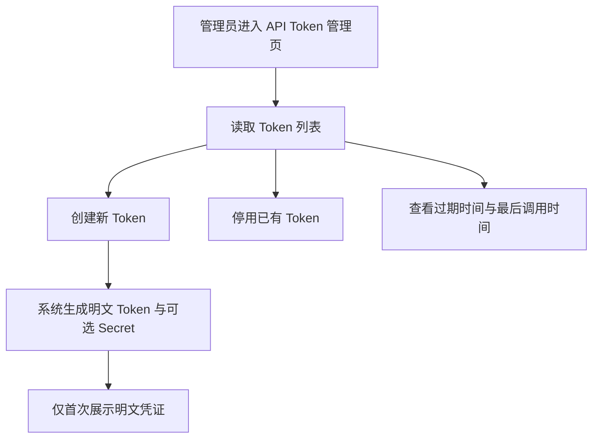

# Agent API Token Management

## 4.1 目标声明

### 背景
HomeFinAI 需要向外部 Agent 暴露交易接口，但当前模板没有独立的访问凭证生命周期管理能力。

### 目标
- 管理员可以创建 API Token。
- 管理员可以停用已发放 Token。
- 管理员可以查看 Token 过期时间与最后调用时间。
- Token 支持可选的 HMAC 增强校验元数据。

### 不在范围内
- 不实现 Token 权限粒度到单个接口或单个资源。
- 不实现 Token 使用配额与限流控制台。
- 不实现 Token 审计日志明细查询。

## 4.2 模块影响表

| 模块 | 影响类型 | 说明 |
|------|---------|------|
| `api-tokens` | 新增 | 承载 API Token 生命周期管理与后台页面 |
| `users` | 修改 | Token 需要记录创建人 |
| `app-shell` | 修改 | 新增系统管理下的 API Token 导航入口 |
| `shared-infra` | 修改 | 提供 Token 哈希、HMAC 校验基础能力与测试支撑 |

## 4.3 功能描述

### 功能点 1：Token 列表与状态查看

**正常流程**
1. 管理员进入 API Token 管理页。
2. 系统展示 Token 名称、前缀、启用状态、过期时间、最后调用时间、创建人。
3. 管理员可查看哪些 Token 可继续使用。

**边界条件**
- 明文 Token 不在列表中重复展示。
- 最后调用时间在未使用前可为空。

**异常处理**
- 列表读取失败时允许重试。

### 功能点 2：创建 Token

**正常流程**
1. 管理员点击创建 Token。
2. 填写名称、过期时间等信息。
3. 系统生成明文 Token，并为 HMAC 场景生成可选 Secret。
4. 系统仅首次展示明文结果，后续仅保留哈希与前缀。

**边界条件**
- Token 名称必填。
- 过期时间可空，空表示永不过期。
- 前缀需可用于后台辨识，但不能反推出完整 Token。

**异常处理**
- 创建失败时不应残留半成品 Token 记录。

### 功能点 3：停用 Token

**正常流程**
1. 管理员对某个 Token 执行停用。
2. 系统更新启用状态。
3. 被停用 Token 后续请求立即失效。

**边界条件**
- 已停用 Token 再次停用保持幂等。

**异常处理**
- Token 不存在时返回明确错误。

## 4.4 数据变更

新增表：
| 表名 | 用途说明 |
|------|------|
| `api_token` | 存储外部 Agent 访问凭证及其状态 |

新增字段：
| 表名 | 字段名 | 类型 | 业务含义 |
|------|------|------|------|
| `api_token` | `name` | varchar(100) | Token 名称 |
| `api_token` | `token_prefix` | varchar(20) | 用于后台展示和定位的前缀 |
| `api_token` | `token_hash` | varchar(255) | 明文 Token 哈希 |
| `api_token` | `secret_hash` | varchar(255) | HMAC Secret 哈希，可空 |
| `api_token` | `is_active` | boolean | 是否启用 |
| `api_token` | `created_by` | UUID | 创建人 |
| `api_token` | `expires_at` | timestamptz | 过期时间，可空 |
| `api_token` | `last_used_at` | timestamptz | 最近调用时间，可空 |

调整已有字段说明（字段本身不变，但行为/值域在本次需求中有扩展）：
| 表名 | 字段名 | 调整说明 |
|------|------|------|
| `user` | `id` | 作为 Token 创建人外键引用 |

废弃字段（保留字段本身，说明中标注 [废弃]）：
| 表名 | 字段名 | 废弃原因 |
|------|------|------|
| 无 | 无 | 无 |

## 4.5 UI 页面

| 变更类型 | 页面名 | 路由 | 说明 |
|------|------|------|------|
| 新增 | API Token 管理页 | `/system/api-tokens` | 创建、停用与查看 API Token |

每个新增/修改页面：

- API Token 管理页
  - 布局：标题区 + 创建按钮 + Token 表格 + 行操作。
  - 功能：查看状态、创建 Token、停用 Token。
  - 交互：创建成功后弹窗展示一次性明文 Token/Secret；停用需确认。
  - 字段：`name` 必填；`expires_at` 可空；是否生成 HMAC Secret 可选。

若影响导航结构，必须显式声明：
- 新增系统管理下的 `API Tokens` 导航项。

## 4.6 验收标准

- [ ] 管理员可以创建新的 API Token，并且只在创建成功当下看到一次明文 Token。
- [ ] Token 列表能展示名称、前缀、启用状态、过期时间、最后调用时间和创建人。
- [ ] 管理员可以停用 Token，停用后该 Token 立即不可用于外部接口访问。
- [ ] 支持为空的过期时间和为空的最后调用时间展示。
