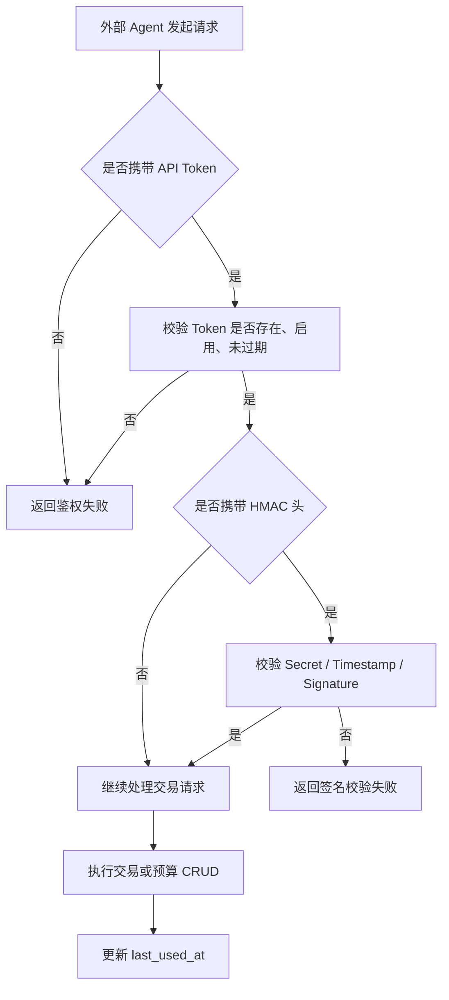

# Agent Transaction API

> 状态更新：当前实现已在原始交易接口范围上扩展，额外支持 Agent 预算与分类的列表和 CRUD。以下内容按最新落地状态同步。

## 4.1 目标声明

### 背景
HomeFinAI 需要为外部 Agent 提供交易写入与查询入口，用于自动记账或程序化读取，但当前模板只有面向前端页面的常规用户接口。

### 目标
- 提供 Agent 交易列表、详情、创建、更新、删除接口。
- 提供 Agent 预算列表、创建、更新、删除接口。
- 提供 Agent 分类列表、创建、更新、删除接口。
- 支持 `Authorization: Bearer <API_TOKEN>` 或 `X-API-Token` 鉴权。
- 支持可选的 HMAC 增强校验头。
- 在请求成功时更新 Token 的最后调用时间。

### 不在范围内
- 不开放账户管理的 Agent API。
- 不实现批量交易接口。
- 不实现预算详情接口。
- 不实现分类详情接口。
- 不实现 Webhook 回调。

## 4.2 模块影响表

| 模块 | 影响类型 | 说明 |
|------|---------|------|
| `transactions` | 修改 | 对外暴露 Agent 版本的交易 CRUD 能力 |
| `budgets` | 修改 | 对外暴露 Agent 版本的预算列表与 CRUD 能力 |
| `categories` | 修改 | 对外暴露 Agent 版本的分类列表与 CRUD 能力 |
| `api-tokens` | 修改 | Agent 请求依赖 Token 校验并更新 `last_used_at` |
| `shared-infra` | 修改 | 提供 Agent 鉴权、HMAC 校验、金额换算与错误处理 |

## 4.3 功能描述

### 功能点 1：Agent 鉴权

**正常流程**
1. 外部 Agent 调用 `/api/agent/transactions` 系列接口。
2. 系统从 `Authorization: Bearer <API_TOKEN>` 或 `X-API-Token` 读取凭证。
3. 系统校验 Token 存在、已启用且未过期。
4. 若请求带有 `X-API-Secret`、`X-Timestamp`、`X-Signature`，系统继续完成 HMAC 校验。

**边界条件**
- 两种 Token 传递方式至少提供一种。
- HMAC 为可选增强校验，但一旦提供相关 Header，必须整组校验通过。

**异常处理**
- Token 无效、已停用或已过期时返回鉴权错误。
- HMAC 签名错误时返回签名校验错误。

### 功能点 2：交易查询与详情

**正常流程**
1. Agent 可获取交易列表。
2. Agent 可获取单条交易详情。
3. 成功调用后，系统更新当前 Token 的 `last_used_at`。

**边界条件**
- 列表默认返回当前 Token 可见范围内的交易。
- 返回金额单位为元，日期格式为 `YYYY-MM-DD`。

**异常处理**
- 请求不存在的交易时返回明确的未找到错误。

### 功能点 3：交易创建、更新与删除

**正常流程**
1. Agent 以元为单位提交 `amount`，并传递 `transaction_date`。
2. 系统内部转换为分后写入 `transaction` 表。
3. 更新和删除操作按相同鉴权规则执行。
4. 成功后更新 `last_used_at`。

**边界条件**
- `transaction_date` 格式必须是 `YYYY-MM-DD`。
- 金额必须是合法数值，且能精确换算为分。

**异常处理**
- 金额格式或日期格式错误时返回字段级错误提示。

### 功能点 4：预算查询、创建、更新与删除

**正常流程**
1. Agent 可获取预算列表。
2. Agent 可创建、更新、删除预算。
3. 成功调用后，系统更新当前 Token 的 `last_used_at`。
4. 预算列表额外返回每条预算的 `used_amount`。

**边界条件**
- 预算金额按元传入和返回，内部统一转换为分。
- 当前不提供 Agent 预算详情接口。
- 删除已关联交易的预算时返回明确业务错误。

**异常处理**
- 请求不存在的预算时返回明确的未找到错误。
- 删除已关联交易的预算时返回业务错误提示。

### 功能点 5：分类查询、创建、更新与删除

**正常流程**
1. Agent 可获取分类列表。
2. Agent 可创建、更新、删除分类。
3. 成功调用后，系统更新当前 Token 的 `last_used_at`。

**边界条件**
- 分类颜色必须符合 `#RGB` 或 `#RRGGBB`。
- `parent_id` 必须指向当前 Token 所属账户自己的分类。
- 当前不提供 Agent 分类详情接口。

**异常处理**
- 请求不存在的分类时返回明确的未找到错误。
- 父分类非法、名称重复、存在子分类或存在关联交易时返回明确业务错误提示。

## 4.4 数据变更

新增表：
| 表名 | 用途说明 |
|------|------|
| 无 | 复用 `transaction` 与 `api_token` 表 |

新增字段：
| 表名 | 字段名 | 类型 | 业务含义 |
|------|------|------|------|
| 无 | 无 | 无 |

调整已有字段说明（字段本身不变，但行为/值域在本次需求中有扩展）：
| 表名 | 字段名 | 调整说明 |
|------|------|------|
| `transaction` | `amount_cents` | 对 Agent 输入输出时增加“元 ↔ 分”换算契约 |
| `transaction` | `transaction_date` | 对 Agent 输入输出时固定为 `YYYY-MM-DD` |
| `budget` | `amount_cents` | 对 Agent 输入输出时增加“元 ↔ 分”换算契约 |
| `api_token` | `last_used_at` | 每次成功访问 Agent 接口时更新 |

废弃字段（保留字段本身，说明中标注 [废弃]）：
| 表名 | 字段名 | 废弃原因 |
|------|------|------|
| 无 | 无 | 无 |

## 4.5 UI 页面

| 变更类型 | 页面名 | 路由 | 说明 |
|------|------|------|------|
| 无 | 无 | 无 | Agent 交易接口为外部调用能力，不新增前端页面 |

每个新增/修改页面：
- 无前端页面变更，本需求主要新增外部接口契约与后台 Token 配套能力。

## 4.6 验收标准

- [ ] 外部 Agent 可以通过 `Authorization: Bearer <API_TOKEN>` 或 `X-API-Token` 成功访问交易、预算和分类接口。
- [ ] 当请求带有 HMAC 相关 Header 时，只有在签名校验通过的情况下才允许访问。
- [ ] Agent 可以完成交易列表、详情、创建、更新、删除。
- [ ] Agent 可以完成预算列表、创建、更新、删除。
- [ ] Agent 可以完成分类列表、创建、更新、删除。
- [ ] Agent 输入金额按元传递，系统内部按分存储，响应返回仍为元。
- [ ] Agent 预算列表会返回已使用金额聚合值。
- [ ] 每次成功访问 Agent 接口后，对应 Token 的 `last_used_at` 会被更新。
