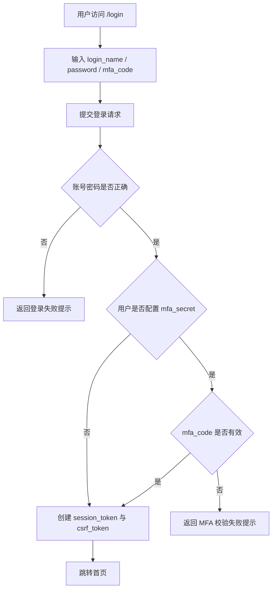

# Authentication And Session Hardening

## 4.1 目标声明

### 背景
当前模板使用邮箱 + JWT + `localStorage` 的后台模板式登录方案，无法满足 HomeFinAI 已落地需求中的 `login_name + password + mfa_code` 登录、Cookie Session 与 CSRF 防护要求。

### 目标
- 支持用户通过 `login_name + password + mfa_code` 登录系统。
- 当用户配置了 `mfa_secret` 时，登录必须完成 TOTP 校验；未配置时允许跳过 MFA。
- 登录成功后改为写入 `session_token` Cookie，并在登出时清理会话与 CSRF Cookie。
- 对 `POST` / `PUT` / `PATCH` / `DELETE` 请求启用 CSRF 校验，但 `/login` 例外。

### 不在范围内
- 不引入第三方 OAuth 登录。
- 不在本需求中替换密码哈希算法。
- 不包含操作审计日志。

## 4.2 模块影响表

| 模块 | 影响类型 | 说明 |
|------|---------|------|
| `auth` | 修改 | 登录、登出、会话写入、MFA 校验与未登录跳转逻辑调整 |
| `users` | 修改 | 用户实体需要支持 `login_name` 与 `mfa_secret` 相关能力 |
| `app-shell` | 修改 | 受保护页面初始化从本地 token 检查改为 Cookie 会话校验 |
| `shared-infra` | 修改 | 增加 CSRF 中间件、Cookie 会话支持与前端请求附带 CSRF Token 约定 |

## 4.3 功能描述

### 功能点 1：登录与会话建立

**正常流程**
1. 用户进入 `/login`，看到 `login_name`、密码、MFA 验证码输入框。
2. 用户提交登录表单，系统先校验账号密码。
3. 若该用户存在 `mfa_secret`，系统继续校验 `mfa_code`。
4. 校验通过后，系统写入 `session_token` Cookie 与 CSRF Cookie。
5. 前端跳转 `/`，后续受保护请求改为基于 Cookie 会话访问。

**边界条件**
- `login_name` 必填，且作为唯一登录标识。
- 未配置 `mfa_secret` 的用户，`mfa_code` 可为空。
- 已配置 `mfa_secret` 的用户，`mfa_code` 必填且必须在有效时间窗口内通过。

**异常处理**
- 账号或密码错误时，提示统一登录失败信息，不暴露更细粒度原因。
- MFA 码错误时，提示验证码无效并允许重试。
- 用户被停用时，阻止登录并提示账号不可用。

### 功能点 2：登出与未登录访问保护

**正常流程**
1. 已登录用户从用户菜单点击退出登录。
2. 系统清理 `session_token` 与 CSRF Cookie。
3. 用户被跳转到 `/login`。
4. 未登录用户访问受保护路由时，系统直接重定向到 `/login`。

**边界条件**
- 重复点击退出登录应保持幂等。
- Session 过期后再次访问受保护页面应视为未登录。

**异常处理**
- 会话失效时，前端统一清理本地状态并回到登录页。

### 功能点 3：CSRF 防护

**正常流程**
1. 用户在 Cookie 会话下发起写请求。
2. 前端通过 Header `X-CSRF-Token` 或表单字段 `_csrf` 传递 Token。
3. 后端校验 CSRF Token，通过后继续处理业务。
4. `/login` 请求不要求 CSRF 校验。

**边界条件**
- 仅对基于 Cookie 会话的写请求强制校验。
- 纯 Bearer Token 的 Agent API 请求不走该校验链路。

**异常处理**
- Token 缺失、格式错误或校验失败时返回统一 CSRF 错误。

## 4.4 数据变更

新增表：
| 表名 | 用途说明 |
|------|------|
| 无 | 本需求不新增独立表，以账户扩展字段与会话基础设施为主 |

新增字段：
| 表名 | 字段名 | 类型 | 业务含义 |
|------|------|------|------|
| `user` | `login_name` | varchar(100) | 用户登录名，替代邮箱作为主要登录凭证 |
| `user` | `mfa_secret` | varchar(255) | 用户 TOTP 密钥，存在时要求登录提交 MFA 验证码 |

调整已有字段说明（字段本身不变，但行为/值域在本次需求中有扩展）：
| 表名 | 字段名 | 调整说明 |
|------|------|------|
| `user` | `hashed_password` | 继续保存密码哈希，但登录口径从邮箱切换为 `login_name` |
| `user` | `email` | 从登录凭证调整为联系与找回密码用途 |

废弃字段（保留字段本身，说明中标注 [废弃]）：
| 表名 | 字段名 | 废弃原因 |
|------|------|------|
| 无 | 无 | 无 |

## 4.5 UI 页面

| 变更类型 | 页面名 | 路由 | 说明 |
|------|------|------|------|
| 修改 | 登录页 | `/login` | 表单从邮箱密码改为 `login_name`、密码、MFA 验证码 |
| 修改 | 应用主框架 | `/_layout/*` | 会话初始化与登出动作改为 Cookie Session 模式 |
| 修改 | 用户设置页 | `/settings` | 需预留个人安全设置中对 MFA 状态的展示入口 |

每个新增/修改页面：

- 登录页
  - 布局：沿用现有认证布局。
  - 功能：账号密码登录、可选 MFA 输入、错误提示。
  - 交互：成功后跳首页；失败后保留已输入 `login_name`。
  - 字段：`login_name` 必填；`password` 必填；`mfa_code` 在有 MFA 的账号场景下必填，要求 6 位数字。

- 应用主框架
  - 布局：沿用侧边栏 + 顶栏 + 内容区。
  - 功能：基于当前会话判断登录状态、用户菜单登出。
  - 交互：会话失效时自动回登录页。
  - 字段：无新增表单字段。

- 用户设置页
  - 布局：沿用现有 Tab 结构。
  - 功能：展示当前账号的安全设置入口。
  - 交互：后续进入 MFA 管理弹窗或页签。
  - 字段：MFA 状态只读展示。

认证类子需求额外检查：
- 覆盖登录态下顶栏用户信息展示。
- 覆盖退出登录入口。
- 保留修改密码入口。
- 保留个人设置页。

## 4.6 验收标准

- [ ] 未配置 `mfa_secret` 的用户可使用 `login_name + password` 成功登录，并写入 Cookie 会话。
- [ ] 已配置 `mfa_secret` 的用户缺少或填写错误 `mfa_code` 时无法登录。
- [ ] 登录成功后访问受保护页面不依赖 `localStorage.access_token`。
- [ ] 退出登录后，`session_token` 与 CSRF Cookie 被清理，再访问受保护页面会跳转 `/login`。
- [ ] 所有 Cookie 会话下的写请求在缺失或错误 CSRF Token 时都会被拒绝。
