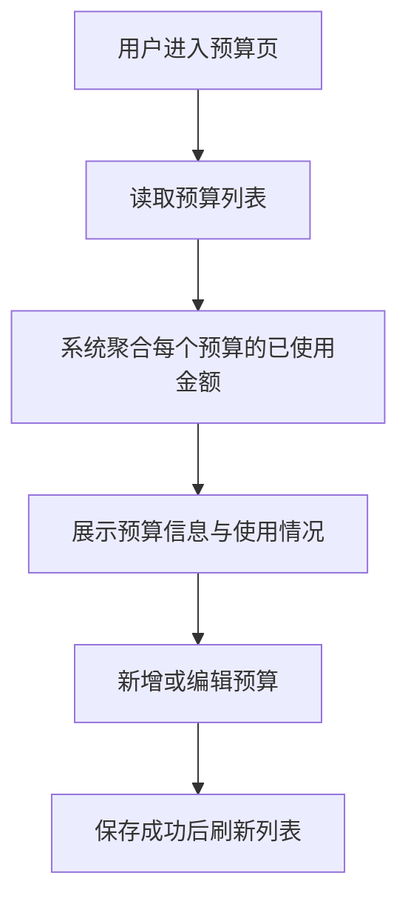

# Budget Management

## 4.1 目标声明

### 背景
预算是家庭收支控制的重要实体，当前模板没有预算能力，无法支撑预算统计与首页预算对比图表。

### 目标
- 支持普通用户创建、编辑、删除预算。
- 支持预算字段：名称、年份、周期、金额。
- 在预算列表中展示每个预算的已使用金额。

### 不在范围内
- 不实现预算预警通知。
- 不实现预算版本历史。
- 不实现跨年复制预算模板。

## 4.2 模块影响表

| 模块 | 影响类型 | 说明 |
|------|---------|------|
| `budgets` | 新增 | 承载预算实体生命周期与预算管理页 |
| `transactions` | 修改 | 交易可关联预算，支出汇总用于预算使用额计算 |
| `app-shell` | 修改 | 新增预算导航入口 |
| `shared-infra` | 修改 | 提供预算枚举、金额换算与聚合查询支撑 |

## 4.3 功能描述

### 功能点 1：预算列表与使用额展示

**正常流程**
1. 用户进入预算管理页。
2. 系统读取预算列表。
3. 系统基于关联支出交易聚合每个预算的已使用金额。
4. 页面展示预算金额、周期、年份和已使用金额。

**边界条件**
- 已使用金额只统计支出类交易。
- 未关联任何交易的预算已使用金额为 0。

**异常处理**
- 聚合计算失败时，预算基础列表仍可展示，但使用额位置给出错误提示。

### 功能点 2：预算新增与编辑

**正常流程**
1. 用户点击新增或编辑预算。
2. 在表单中填写名称、年份、周期、金额。
3. 提交成功后关闭弹窗并刷新列表。

**边界条件**
- 名称必填。
- 年份必须为有效年份。
- 周期只能是月/季/年。
- 金额必须大于 0，展示层输入元，系统内部存分。

**异常处理**
- 输入金额或年份格式错误时阻止提交并提示。

### 功能点 3：预算删除

**正常流程**
1. 用户发起删除预算。
2. 系统提示确认。
3. 删除成功后刷新列表。

**边界条件**
- 已被交易关联的预算删除策略为阻止删除，避免历史交易失去预算指向。

**异常处理**
- 删除失败时提示存在关联交易。

## 4.4 数据变更

新增表：
| 表名 | 用途说明 |
|------|------|
| `budget` | 存储家庭预算及其年度/周期配置 |

新增字段：
| 表名 | 字段名 | 类型 | 业务含义 |
|------|------|------|------|
| `budget` | `name` | varchar(100) | 预算名称 |
| `budget` | `year` | int | 预算所属年份 |
| `budget` | `period` | smallint | 预算周期枚举：月/季/年 |
| `budget` | `amount_cents` | bigint | 预算金额，单位分 |
| `budget` | `owner_id` | UUID | 预算所属用户 |

调整已有字段说明（字段本身不变，但行为/值域在本次需求中有扩展）：
| 表名 | 字段名 | 调整说明 |
|------|------|------|
| 无 | 无 | 无 |

废弃字段（保留字段本身，说明中标注 [废弃]）：
| 表名 | 字段名 | 废弃原因 |
|------|------|------|
| 无 | 无 | 无 |

## 4.5 UI 页面

| 变更类型 | 页面名 | 路由 | 说明 |
|------|------|------|------|
| 新增 | 预算管理页 | `/budgets` | 查看、创建、编辑、删除预算，并显示已使用金额 |
| 修改 | 交易管理页 | `/transactions` | 交易表单可选择预算 |
| 修改 | Dashboard 首页 | `/` | 预算对比卡片与图表读取预算聚合结果 |

每个新增/修改页面：

- 预算管理页
  - 布局：标题区 + 新增按钮 + 预算表格 + 行操作。
  - 功能：预算 CRUD、显示已使用金额。
  - 交互：提交后局部刷新；删除前确认。
  - 字段：`name` 必填；`year` 必填且为四位年份；`period` 必选；`amount` 必填且大于 0。

- 交易管理页
  - 布局：沿用交易列表页结构。
  - 功能：交易表单中可关联预算。
  - 交互：预算为可选字段。
  - 字段：预算字段可空。

- Dashboard 首页
  - 布局：沿用首页卡片与图表区。
  - 功能：展示当年预算与已使用对比。
  - 交互：预算数据缺失时显示空状态。
  - 字段：无新增输入字段。

若影响导航结构，必须显式声明：
- 新增 `Budgets` 导航项。

## 4.6 验收标准

- [ ] 用户可以创建、编辑、删除预算，并在列表中看到名称、年份、周期、金额。
- [ ] 预算金额在录入时按元输入，保存后按分存储并正确回显。
- [ ] 每个预算都能展示按支出交易汇总得到的已使用金额。
- [ ] 已有关联交易的预算不能被直接删除。
