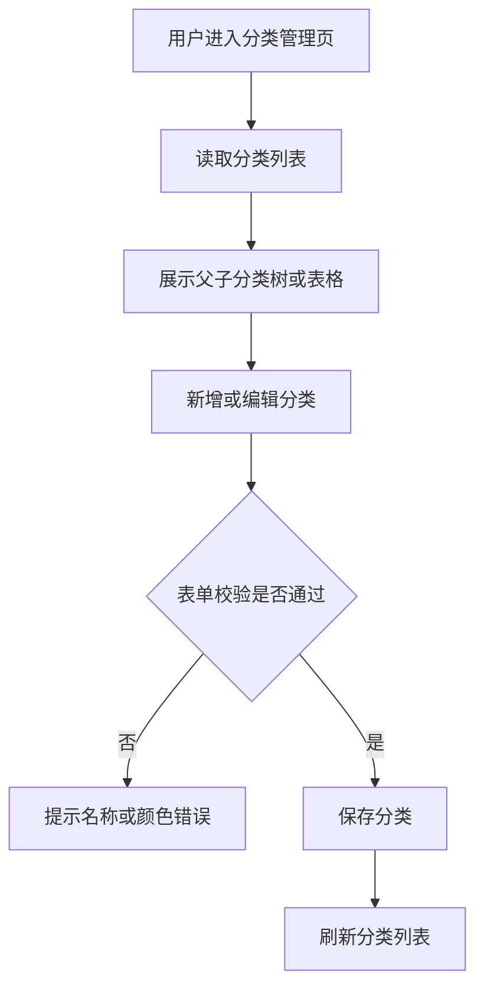

# Category Management

## 4.1 目标声明

### 背景
家庭账目需要稳定的分类体系来支撑录入、筛选和统计；当前模板不存在分类实体与管理能力。

### 目标
- 支持普通用户创建、编辑、删除分类。
- 支持分类的父子级结构与颜色配置。
- 支持交易表单和筛选面板复用分类数据。

### 不在范围内
- 不实现多层无限嵌套分类，本期只要求支持父子级。
- 不实现分类导入导出。
- 不实现跨账户共享分类模板市场。

## 4.2 模块影响表

| 模块 | 影响类型 | 说明 |
|------|---------|------|
| `categories` | 新增 | 承载分类实体生命周期与分类管理页面 |
| `transactions` | 修改 | 交易录入与筛选需要读取分类 |
| `app-shell` | 修改 | 新增系统管理导航入口 |
| `shared-infra` | 修改 | 提供分类接口契约、表单校验与测试支撑 |

## 4.3 功能描述

### 功能点 1：分类列表与层级展示

**正常流程**
1. 用户进入分类管理页。
2. 系统按父分类与子分类关系展示分类列表。
3. 用户可查看分类名称、父级分类、颜色。

**边界条件**
- 顶级分类的父级可为空。
- 子分类必须引用同一账户可见的顶级分类。

**异常处理**
- 分类列表读取失败时展示错误提示并允许重试。

### 功能点 2：分类新增与编辑

**正常流程**
1. 用户点击新增或编辑分类。
2. 系统弹出表单，填写名称、父级分类、颜色。
3. 提交成功后关闭弹窗并刷新列表。

**边界条件**
- 名称必填。
- 父级分类可为空。
- 颜色必须为约定格式的颜色值。
- 子分类不能选择自己作为父级。

**异常处理**
- 名称重复或父级非法时阻止保存并提示。

### 功能点 3：分类删除

**正常流程**
1. 用户在列表中发起删除操作。
2. 系统二次确认。
3. 删除成功后刷新列表。

**边界条件**
- 已被子分类引用的分类不能直接删除。
- 已被交易使用的分类不能物理删除，应先清理依赖或阻止操作。

**异常处理**
- 删除失败时，明确提示是“存在子分类”还是“存在关联交易”。

## 4.4 数据变更

新增表：
| 表名 | 用途说明 |
|------|------|
| `category` | 存储家庭记账分类及其父子级结构 |

新增字段：
| 表名 | 字段名 | 类型 | 业务含义 |
|------|------|------|------|
| `category` | `name` | varchar(100) | 分类名称 |
| `category` | `parent_id` | UUID | 父级分类，空表示顶级分类 |
| `category` | `color` | varchar(20) | 分类颜色标识 |
| `category` | `owner_id` | UUID | 分类所属用户 |

调整已有字段说明（字段本身不变，但行为/值域在本次需求中有扩展）：
| 表名 | 字段名 | 调整说明 |
|------|------|------|
| 无 | 无 | 无 |

废弃字段（保留字段本身，说明中标注 [废弃]）：
| 表名 | 字段名 | 废弃原因 |
|------|------|------|
| 无 | 无 | 无 |

## 4.5 UI 页面

| 变更类型 | 页面名 | 路由 | 说明 |
|------|------|------|------|
| 新增 | 分类管理页 | `/system/categories` | 查看、创建、编辑、删除分类 |
| 修改 | 交易管理页 | `/transactions` | 分类下拉与筛选条件读取分类数据 |

每个新增/修改页面：

- 分类管理页
  - 布局：标题区 + 新增按钮 + 分类列表/树 + 行操作。
  - 功能：分类 CRUD、父级选择、颜色配置。
  - 交互：提交后局部刷新；删除前二次确认。
  - 字段：`name` 必填；`parent_id` 可空；`color` 必填，校验颜色格式。

- 交易管理页
  - 布局：沿用交易列表页结构。
  - 功能：交易表单中选择分类；筛选面板按分类过滤。
  - 交互：分类加载失败时禁用相关控件并提示。
  - 字段：分类字段在创建/编辑交易时必填。

若影响导航结构，必须显式声明：
- 新增系统管理下的 `Categories` 导航项。

## 4.6 验收标准

- [ ] 用户可以创建顶级分类和子分类，并在列表中看到正确层级。
- [ ] 用户可以编辑分类名称、父级和颜色，保存后列表局部刷新。
- [ ] 存在子分类或关联交易的分类不能被直接删除，并能看到明确原因。
- [ ] 交易表单与筛选面板可以正常读取分类数据。
