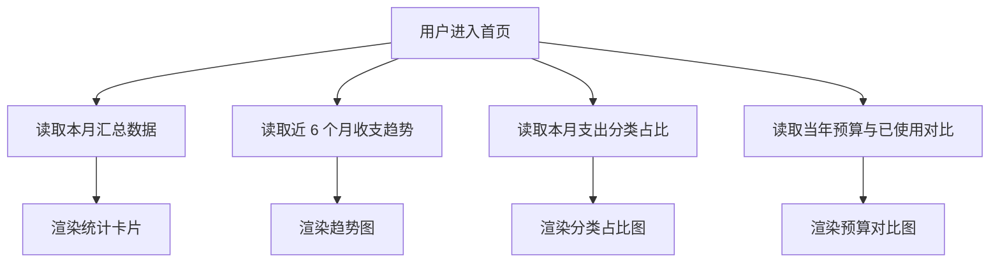

# Financial Dashboard

## 4.1 目标声明

### 背景
HomeFinAI 首页不再是模板欢迎页，而是用户进入系统后的经营视图，需要基于交易和预算输出可读的月度统计与图表。

### 目标
- 首页展示本月收入、本月支出、本月结余。
- 展示近 6 个月收支趋势。
- 展示本月支出分类占比。
- 展示当年预算与已使用对比。

### 不在范围内
- 不实现自定义看板布局。
- 不实现更长时间范围的图表切换。
- 不实现导出报表。

## 4.2 模块影响表

| 模块 | 影响类型 | 说明 |
|------|---------|------|
| `app-shell` | 修改 | 首页从欢迎页改为统计看板 |
| `transactions` | 修改 | 提供月度汇总、趋势与分类占比数据 |
| `budgets` | 修改 | 提供年度预算与已使用对比数据 |
| `shared-infra` | 修改 | 提供聚合查询、图表数据结构与测试支撑 |

## 4.3 功能描述

### 功能点 1：本月汇总卡片

**正常流程**
1. 用户进入首页。
2. 系统按当前月份与 `transaction_date` 聚合收入、支出与结余。
3. 页面展示三张汇总卡片。

**边界条件**
- 无数据月份展示 0 值而不是报错。
- 结余 = 收入 - 支出。

**异常处理**
- 聚合失败时卡片显示加载失败状态并支持刷新。

### 功能点 2：趋势与分类占比图表

**正常流程**
1. 系统读取近 6 个月收支趋势。
2. 系统读取本月支出分类占比。
3. 页面分别渲染趋势图和占比图。

**边界条件**
- 当月没有支出时，占比图显示空状态。
- 某个月只有收入或只有支出时，趋势图应仍能正常展示单侧数据。

**异常处理**
- 图表数据异常时不影响其他区块展示。

### 功能点 3：预算对比

**正常流程**
1. 系统读取当前年份预算总额与已使用总额，或逐预算对比结果。
2. 页面展示预算与已使用对比图。

**边界条件**
- 无预算时显示空状态。
- 已使用金额只统计支出。

**异常处理**
- 预算数据不可用时显示提示，不阻塞首页其他模块。

## 4.4 数据变更

新增表：
| 表名 | 用途说明 |
|------|------|
| 无 | 首页看板基于交易与预算聚合，不新增独立表 |

新增字段：
| 表名 | 字段名 | 类型 | 业务含义 |
|------|------|------|------|
| 无 | 无 | 无 |

调整已有字段说明（字段本身不变，但行为/值域在本次需求中有扩展）：
| 表名 | 字段名 | 调整说明 |
|------|------|------|
| `transaction` | `transaction_date` | 作为首页月度汇总、趋势与分类占比的统一统计口径 |
| `budget` | `amount_cents` | 作为年度预算对比统计基数 |

废弃字段（保留字段本身，说明中标注 [废弃]）：
| 表名 | 字段名 | 废弃原因 |
|------|------|------|
| 无 | 无 | 无 |

## 4.5 UI 页面

| 变更类型 | 页面名 | 路由 | 说明 |
|------|------|------|------|
| 修改 | Dashboard 首页 | `/` | 从模板欢迎页升级为家庭财务看板 |

每个新增/修改页面：

- Dashboard 首页
  - 布局：顶部摘要卡片区 + 趋势图区 + 分类占比图区 + 预算对比图区。
  - 功能：展示本月统计、趋势、占比与预算对比。
  - 交互：页面加载自动请求数据；局部失败局部展示错误态。
  - 字段：无表单输入字段。

若影响导航结构，必须显式声明：
- 首页导航名称可保留 `Dashboard`，但内容语义切换为财务看板。

## 4.6 验收标准

- [ ] 首页能展示本月收入、本月支出、本月结余三项统计。
- [ ] 首页能展示最近 6 个月的收支趋势图。
- [ ] 首页能展示本月支出分类占比，在无支出时给出空状态。
- [ ] 首页能展示当年预算与已使用对比结果。
- [ ] 任一图表区块加载失败时，不会阻塞其他区块展示。
