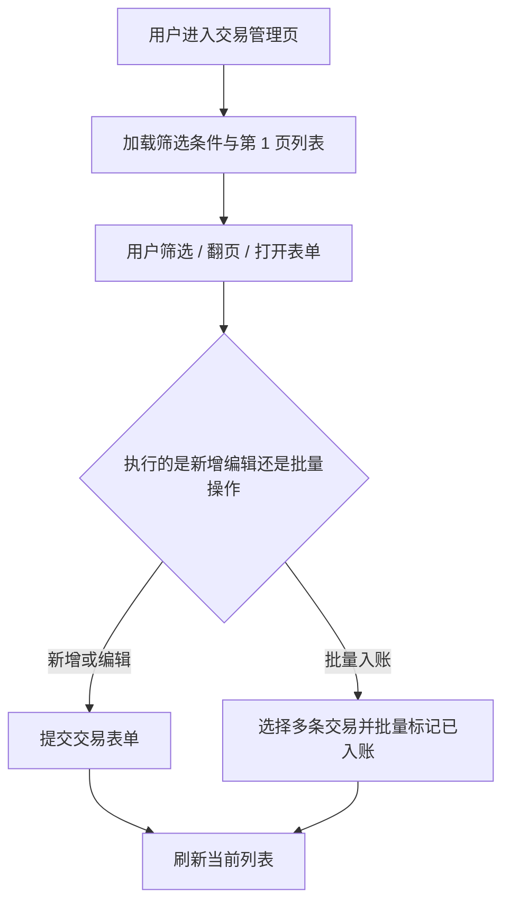

# Transaction Management

## 4.1 目标声明

### 背景
交易记录是 HomeFinAI 的核心写实体，当前模板中的 `items` 无法承载金额、收支类型、分类、预算、入账状态与交易日期等业务语义。

### 目标
- 支持普通用户管理账目，完成分页、筛选、增删改查与批量入账。
- 支持交易字段：分类、收支类型、金额、预算、描述、入账状态、经手人、交易日期。
- 默认按 `transaction_date desc, created_at desc` 排序。

### 不在范围内
- 不实现导入导出。
- 不实现附件上传。
- 不实现自动记账规则或银行对账。

## 4.2 模块影响表

| 模块 | 影响类型 | 说明 |
|------|---------|------|
| `transactions` | 新增 | 承载交易实体生命周期与交易管理页 |
| `categories` | 修改 | 交易依赖分类选择与分类筛选 |
| `budgets` | 修改 | 交易可关联预算，支出影响预算已使用额 |
| `app-shell` | 修改 | 新增交易导航入口 |
| `shared-infra` | 修改 | 提供金额单位转换、分页/筛选契约与测试支撑 |

## 4.3 功能描述

### 功能点 1：交易列表、分页与筛选

**正常流程**
1. 用户进入交易管理页。
2. 系统按默认排序加载第一页数据，每页 10 条。
3. 用户可按起止日期、收支类型、分类、入账状态、经手人筛选。
4. 用户切换页码后读取对应结果集。

**边界条件**
- 日期筛选允许只填开始或结束时间。
- 筛选条件可组合使用。
- 管理员是否可看全量交易不在本期需求中展开，默认以当前登录用户可见范围为准。

**异常处理**
- 列表读取失败时保留筛选条件并允许重试。

### 功能点 2：交易新增与编辑

**正常流程**
1. 用户点击新增或编辑交易。
2. 系统弹出表单，填写分类、收支类型、金额、预算、描述、入账状态、经手人、交易日期。
3. 提交成功后关闭弹窗并局部刷新列表。

**边界条件**
- 分类、收支类型、金额、入账状态、交易日期必填。
- 预算可为空。
- 金额展示层输入元，系统内部存分。
- 交易日期用于列表排序与统计口径。

**异常处理**
- 金额非法、日期非法或分类不存在时阻止提交并提示。

### 功能点 3：删除与批量入账

**正常流程**
1. 用户可以删除单条交易。
2. 用户可以选择多条交易并批量设置为“已入账”。
3. 操作成功后局部刷新列表。

**边界条件**
- 批量操作仅允许作用于当前筛选结果中被选中的记录。
- 已为“已入账”的交易可重复提交批量入账，但结果保持幂等。

**异常处理**
- 部分记录更新失败时，系统返回失败明细并保留用户选择状态供重试。

## 4.4 数据变更

新增表：
| 表名 | 用途说明 |
|------|------|
| `transaction` | 存储家庭收支记录 |

新增字段：
| 表名 | 字段名 | 类型 | 业务含义 |
|------|------|------|------|
| `transaction` | `category_id` | UUID | 所属分类 |
| `transaction` | `transaction_type` | smallint | 收支类型：收入/支出 |
| `transaction` | `amount_cents` | bigint | 交易金额，单位分 |
| `transaction` | `budget_id` | UUID | 关联预算，可空 |
| `transaction` | `description` | varchar(255) | 交易描述 |
| `transaction` | `entry_status` | smallint | 入账状态：待入账/不入账/已入账 |
| `transaction` | `handler_name` | varchar(100) | 经手人 |
| `transaction` | `transaction_date` | date | 交易日期 |
| `transaction` | `owner_id` | UUID | 交易所属用户 |

调整已有字段说明（字段本身不变，但行为/值域在本次需求中有扩展）：
| 表名 | 字段名 | 调整说明 |
|------|------|------|
| 无 | 无 | 无 |

废弃字段（保留字段本身，说明中标注 [废弃]）：
| 表名 | 字段名 | 废弃原因 |
|------|------|------|
| `item` | `title` | [废弃] 模板演示实体被真实业务交易实体替代 |
| `item` | `description` | [废弃] 模板演示实体被真实业务交易实体替代 |

## 4.5 UI 页面

| 变更类型 | 页面名 | 路由 | 说明 |
|------|------|------|------|
| 新增 | 交易管理页 | `/transactions` | 交易列表、筛选、分页、CRUD 与批量入账 |
| 修改 | Dashboard 首页 | `/` | 首页统计读取交易数据 |

每个新增/修改页面：

- 交易管理页
  - 布局：标题区 + 筛选区 + 批量操作区 + 表格 + 分页器。
  - 功能：交易 CRUD、筛选、分页、批量设置已入账。
  - 交互：弹窗表单提交后自动关闭并局部刷新；支持多选。
  - 字段：`category_id` 必填；`transaction_type` 必填；`amount` 必填且大于 0；`budget_id` 可空；`description` 可空；`entry_status` 必填；`handler_name` 可选填；`transaction_date` 必填。

- Dashboard 首页
  - 布局：卡片区 + 图表区。
  - 功能：消费交易聚合结果。
  - 交互：无新增直接输入。
  - 字段：无。

若影响导航结构，必须显式声明：
- 用 `Transactions` 替换模板中的 `Items` 导航项。

## 4.6 验收标准

- [ ] 用户进入交易页后默认看到按 `transaction_date desc, created_at desc` 排序的分页列表。
- [ ] 用户可以按日期、收支类型、分类、入账状态、经手人组合筛选交易。
- [ ] 用户可以创建、编辑、删除单条交易，成功后列表局部刷新且弹窗自动关闭。
- [ ] 用户可以批量将多条交易设置为“已入账”，并看到正确结果。
- [ ] 金额在输入时按元处理，保存后按分存储，页面回显正确换算值。
