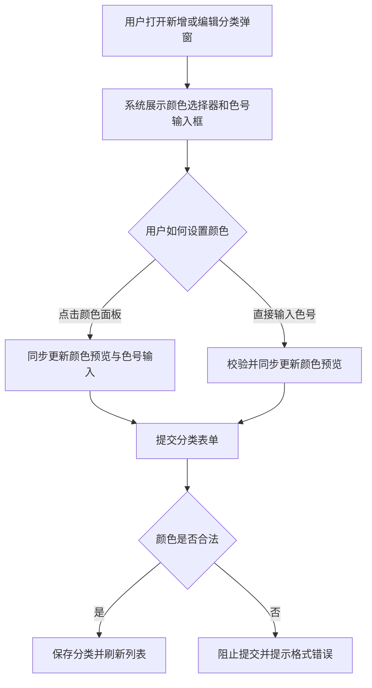

# Category Color Input Enhancement

## 4.1 目标声明

### 背景
当前分类颜色只能通过手动输入色号完成，录入门槛高、试错成本大，尤其在移动端或非设计类用户场景下不够友好。

### 目标
- 用户在新增或编辑分类时可通过可视化颜色选择器选择颜色。
- 用户仍可直接输入合法色号，兼容熟悉十六进制色值的用户。
- 分类列表与交易相关页面继续复用统一的分类颜色结果。

### 不在范围内
- 不实现品牌色模板市场或跨用户共享色板。
- 不支持透明度、渐变或多色配置。
- 不放宽颜色格式校验规则，仍以十六进制色号为准。

## 4.2 模块影响表

| 模块 | 影响类型 | 说明 |
|------|---------|------|
| `categories` | 修改 | 分类表单新增更友善的颜色选择交互 |
| `transactions` | 修改 | 继续消费分类颜色，用于筛选或展示一致性 |
| `shared-infra` | 修改 | 统一颜色值校验、默认值处理与表单测试支撑 |

## 4.3 功能描述

### 功能点 1：颜色选择器与输入框并存

**正常流程**
1. 用户打开分类新增或编辑弹窗。
2. 系统展示可视化颜色选择器、当前颜色预览块和色号输入框。
3. 用户可通过任一方式更新颜色值，另一种方式实时同步。

**边界条件**
- 编辑已有分类时，默认回显当前颜色。
- 新建分类时，系统可提供一个默认合法颜色值。

**异常处理**
- 颜色控件加载失败时，至少保留可手动输入色号的能力。

### 功能点 2：十六进制颜色校验

**正常流程**
1. 用户直接输入色号或通过颜色选择器生成色值。
2. 系统在失焦或提交时校验格式。
3. 颜色合法时允许提交。

**边界条件**
- 仅接受 `#RGB` 或 `#RRGGBB`。
- 输入大小写字母时按统一格式保留或规范化展示。

**异常处理**
- 非法色号时，阻止提交并展示明确格式提示。

### 功能点 3：颜色结果在列表中可识别

**正常流程**
1. 用户保存分类后返回分类列表。
2. 系统在列表中展示该分类颜色标识。
3. 交易表单、筛选器和其他消费分类颜色的区域继续复用保存后的颜色值。

**边界条件**
- 极浅色或极深色在列表中的标识需保证基本可辨识度，可通过边框或底纹增强可见性。

**异常处理**
- 若旧数据中存在异常颜色值，列表区域应使用兜底样式并提示用户编辑修复。

## 4.4 数据变更

新增表：
| 表名 | 用途说明 |
|------|------|
| 无 | 复用现有 `category` 表 |

新增字段：
| 表名 | 字段名 | 类型 | 业务含义 |
|------|------|------|------|
| 无 | 无 | 无 | 无 |

调整已有字段说明（字段本身不变，但行为/值域在本次需求中有扩展）：
| 表名 | 字段名 | 调整说明 |
|------|------|------|
| `category` | `color` | 输入方式从纯文本升级为“可视化选色 + 手动输入”，但持久化值仍为十六进制色号 |

废弃字段（保留字段本身，说明中标注 [废弃]）：
| 表名 | 字段名 | 废弃原因 |
|------|------|------|
| 无 | 无 | 无 |

## 4.5 UI 页面

| 变更类型 | 页面名 | 路由 | 说明 |
|------|------|------|------|
| 修改 | 分类管理页 | `/system/categories` | 分类弹窗中的颜色录入改为颜色选择器与色号输入并存 |

每个新增/修改页面：

- 分类管理页
  - 布局：分类弹窗中增加颜色预览块、颜色选择器和色号输入框。
  - 功能：通过选色器或色号输入设置分类颜色。
  - 交互：两种输入方式实时同步；非法颜色时阻止提交并提示。
  - 字段：`color` 必填，格式限定为 `#RGB` 或 `#RRGGBB`。

若影响导航结构，必须显式声明：
- 不影响导航结构。

## 4.6 验收标准

- [ ] 用户在新增或编辑分类时，可以使用可视化颜色选择器完成颜色设置。
- [ ] 用户仍可以直接输入合法色号，且输入值会同步到颜色预览与颜色选择器。
- [ ] 非法色号会被明确拦截，分类不会以非法颜色保存。
- [ ] 分类保存后，列表与交易相关页面继续展示正确的分类颜色。
