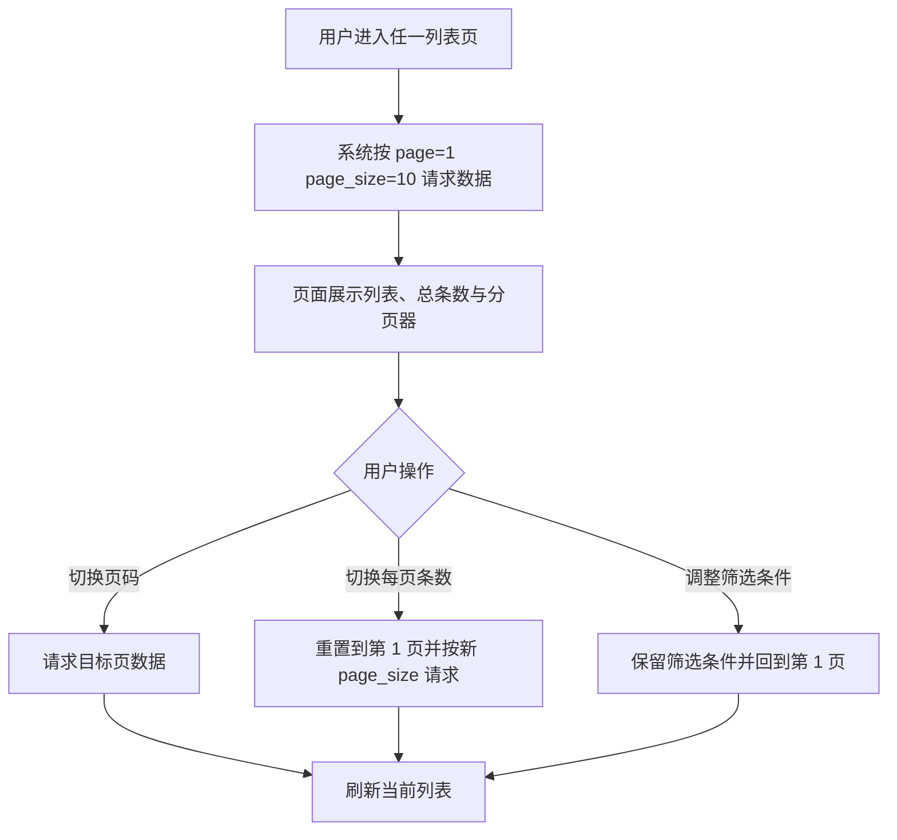

# List Pagination Standardization

## 4.1 目标声明

### 背景
当前 HomeFin 多个业务页面仍以一次性加载完整列表为主，缺少统一的分页交互和每页条数规范，随着数据增多会影响浏览效率与页面一致性。

### 目标
- 所有主业务列表页默认按每页 10 条加载数据。
- 用户可在列表页切换每页 `10 / 20 / 50 / 100 / 200` 条。
- 列表页统一分页器信息和交互规范，并将该规范沉淀到 `context/ui.md`。

### 不在范围内
- 不实现无限滚动或虚拟滚动。
- 不实现服务端导出整表能力。
- 不为遗留 `items` 兼容接口新增前端分页页面。

## 4.2 模块影响表

| 模块 | 影响类型 | 说明 |
|------|---------|------|
| `app-shell` | 修改 | 沉淀全局分页交互规范与通用表格能力 |
| `users` | 修改 | 账户列表遵守统一分页规则 |
| `categories` | 修改 | 分类管理页列表遵守统一分页规则 |
| `budgets` | 修改 | 预算列表遵守统一分页规则 |
| `transactions` | 修改 | 交易列表遵守统一分页规则 |
| `api-tokens` | 修改 | API Token 列表遵守统一分页规则 |
| `shared-infra` | 修改 | 统一分页请求参数、响应结构与前后端测试支撑 |

## 4.3 功能描述

### 功能点 1：统一分页默认行为

**正常流程**
1. 用户进入带列表的数据管理页面。
2. 系统默认按第 1 页、每页 10 条请求数据。
3. 页面展示当前页记录、总条数和总页数。

**边界条件**
- 当总条数小于等于 10 时，仍显示统一分页信息，但页码不可跳到不存在的页。
- 当用户请求页码超出有效范围时，系统返回最后一个有效页的数据或重置到有效页。

**异常处理**
- 分页请求失败时保留当前筛选条件和分页参数，并允许重试。

### 功能点 2：统一每页条数切换

**正常流程**
1. 用户在分页器中切换每页条数。
2. 系统立即按新的 `page_size` 重新请求列表。
3. 页面重置到第 1 页并刷新总页数。

**边界条件**
- 可选值固定为 `10 / 20 / 50 / 100 / 200`。
- 不允许输入自定义每页条数。

**异常处理**
- 非法 `page_size` 请求被后端拒绝时，页面回退到最近一次有效值并提示。

### 功能点 3：分页与筛选联动规则

**正常流程**
1. 用户在列表页设置筛选条件。
2. 系统保留筛选条件，并从第 1 页开始读取结果。
3. 用户继续翻页时，筛选条件持续生效。

**边界条件**
- 若筛选后结果总数变少，当前页超出范围时自动回到第 1 页。
- 清空筛选条件后，列表按默认排序重新从第 1 页加载。

**异常处理**
- 筛选条件与分页参数同时变更导致接口失败时，页面保留用户输入并给出错误提示。

## 4.4 数据变更

新增表：
| 表名 | 用途说明 |
|------|------|
| 无 | 本需求仅调整列表查询契约与前端交互，不新增独立数据表 |

新增字段：
| 表名 | 字段名 | 类型 | 业务含义 |
|------|------|------|------|
| 无 | 无 | 无 | 无 |

调整已有字段说明（字段本身不变，但行为/值域在本次需求中有扩展）：
| 表名 | 字段名 | 调整说明 |
|------|------|------|
| 无 | 无 | 无 |

废弃字段（保留字段本身，说明中标注 [废弃]）：
| 表名 | 字段名 | 废弃原因 |
|------|------|------|
| 无 | 无 | 无 |

## 4.5 UI 页面

| 变更类型 | 页面名 | 路由 | 说明 |
|------|------|------|------|
| 修改 | 交易管理页 | `/transactions` | 增加统一分页器和每页条数切换 |
| 修改 | 预算管理页 | `/budgets` | 增加统一分页器和每页条数切换 |
| 修改 | 分类管理页 | `/system/categories` | 增加统一分页器和每页条数切换 |
| 修改 | 账户管理页 | `/system/accounts` | 增加统一分页器和每页条数切换 |
| 修改 | API Token 管理页 | `/system/api-tokens` | 增加统一分页器和每页条数切换 |

每个新增/修改页面：

- 交易管理页
  - 布局：筛选区下方保留表格区与分页器区。
  - 功能：切换页码、切换每页条数、展示总条数。
  - 交互：筛选变更后回到第 1 页；分页器状态与 URL 查询参数或页面状态同步。
  - 字段：分页器支持 `page`、`page_size`。

- 预算管理页
  - 布局：列表底部增加统一分页器。
  - 功能：浏览预算分页数据。
  - 交互：创建、编辑、删除成功后留在当前有效页；若当前页被删空则回退前一有效页。
  - 字段：分页器支持 `page`、`page_size`。

- 分类管理页
  - 布局：分类列表底部增加统一分页器。
  - 功能：浏览当前用户分类分页数据。
  - 交互：新增、编辑、删除后局部刷新当前页。
  - 字段：分页器支持 `page`、`page_size`。

- 账户管理页
  - 布局：沿用表格页结构并统一分页器样式。
  - 功能：分页管理账户列表。
  - 交互：搜索或筛选后回到第 1 页。
  - 字段：分页器支持 `page`、`page_size`。

- API Token 管理页
  - 布局：列表底部增加统一分页器。
  - 功能：分页浏览 Token 列表。
  - 交互：创建或禁用 Token 后刷新当前有效页。
  - 字段：分页器支持 `page`、`page_size`。

若影响导航结构，必须显式声明：
- 不新增导航项，但所有现有列表页需遵守统一分页设计规范。

## 4.6 验收标准

- [ ] 用户进入任一主业务列表页时，默认看到每页 10 条的分页结果。
- [ ] 用户可以在各列表页切换 `10 / 20 / 50 / 100 / 200` 条每页，并看到列表从第 1 页重新加载。
- [ ] 用户在分页状态下调整筛选条件后，系统会保留筛选条件并自动回到第 1 页。
- [ ] `context/ui.md` 已明确记录统一分页规范，可作为后续新页面的默认约束。
