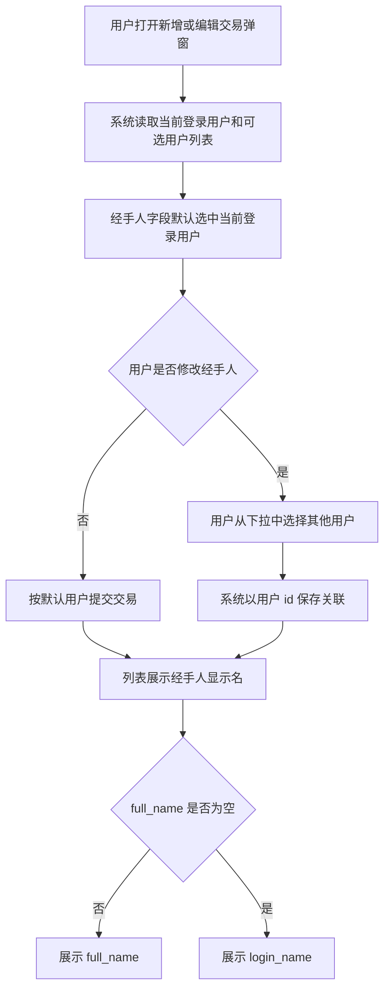

# Transaction Handler User Linking

## 4.1 目标声明

### 背景
当前交易经手人以 `handler_name` 文本保存，无法可靠对应系统内用户，也会造成重名、改名后难以追溯和编辑时默认值不稳定的问题。

### 目标
- 交易经手人改为关联系统用户 `id`。
- 新增或编辑交易时，经手人默认选择当前登录用户。
- 列表和相关展示位置优先显示用户 `full_name`，为空时回退显示 `login_name`。

### 不在范围内
- 不实现复杂的多经手人协作模型。
- 不实现按经手人维度的权限隔离扩展。
- 不在本期处理历史脏数据清洗策略之外的用户合并问题。

## 4.2 模块影响表

| 模块 | 影响类型 | 说明 |
|------|---------|------|
| `transactions` | 修改 | 交易表单、列表和筛选从经手人文本改为用户关联 |
| `users` | 修改 | 为交易经手人选择提供用户候选和统一展示名规则 |
| `agent-api` | 修改 | 交易资源模型跟随经手人字段语义升级，保持外部接口与主交易模型一致 |
| `shared-infra` | 修改 | 增加交易与用户关联契约、数据迁移支撑与回归测试 |

## 4.3 功能描述

### 功能点 1：表单默认当前登录用户

**正常流程**
1. 用户打开新增交易弹窗。
2. 系统读取当前登录用户信息和可选经手人列表。
3. 经手人字段默认选中当前登录用户。
4. 用户可保留默认值或改选其他用户。

**边界条件**
- 若当前登录用户不在候选列表中，系统阻止提交并提示数据异常。
- 编辑已有交易时，优先回显该交易已关联的经手人；若为空则回退为当前登录用户。

**异常处理**
- 用户列表加载失败时，禁止提交依赖经手人的表单并提示刷新重试。

### 功能点 2：以用户 ID 保存关联

**正常流程**
1. 用户提交交易表单。
2. 系统将经手人以用户 `id` 写入交易记录。
3. 后端校验该用户在当前业务规则下可被选择。

**边界条件**
- 不再依赖 `handler_name` 作为主关联字段。
- 历史记录若仍存在旧文本字段，需要在迁移阶段映射到用户关联或保留空值待修复。

**异常处理**
- 提交不存在的用户 `id` 或无权选择的用户时，阻止保存并返回明确错误。

### 功能点 3：统一展示名回退规则

**正常流程**
1. 交易列表或详情类区域展示经手人。
2. 系统优先读取关联用户的 `full_name`。
3. 当 `full_name` 为空时，自动回退显示 `login_name`。

**边界条件**
- 若关联用户已被停用但记录仍存在，历史交易仍可按同样规则显示其展示名。
- 若关联用户被删除且未保留可展示快照，页面使用统一兜底文案，如“已删除用户”。

**异常处理**
- 关联用户数据缺失时，交易列表不能因单条记录展示失败而整体报错。

## 4.4 数据变更

新增表：
| 表名 | 用途说明 |
|------|------|
| 无 | 复用现有 `transaction` 与 `user` 表关系 |

新增字段：
| 表名 | 字段名 | 类型 | 业务含义 |
|------|------|------|------|
| `transaction` | `handler_user_id` | UUID | 交易经手人，关联 `user.id` |

调整已有字段说明（字段本身不变，但行为/值域在本次需求中有扩展）：
| 表名 | 字段名 | 调整说明 |
|------|------|------|
| `user` | `full_name` | 作为交易经手人首选展示名 |
| `user` | `login_name` | 当 `full_name` 为空时作为交易经手人回退展示名 |
| `transaction` | `owner_id` | 继续表示交易归属用户，不等同于经手人字段 |

废弃字段（保留字段本身，说明中标注 [废弃]）：
| 表名 | 字段名 | 废弃原因 |
|------|------|------|
| `transaction` | `handler_name` | [废弃] 纯文本经手人无法可靠关联系统用户，后续迁移完成后由 `handler_user_id` 替代 |

## 4.5 UI 页面

| 变更类型 | 页面名 | 路由 | 说明 |
|------|------|------|------|
| 修改 | 交易管理页 | `/transactions` | 交易表单中的经手人改为用户选择器，并在列表中展示统一显示名 |

每个新增/修改页面：

- 交易管理页
  - 布局：交易弹窗中的经手人字段改为用户下拉选择器；列表中的经手人列展示用户显示名。
  - 功能：默认当前用户、允许改选、按用户 ID 保存、统一展示名回退。
  - 交互：新建时默认当前登录用户；编辑时优先回显已保存用户；用户选择器支持按显示名检索。
  - 字段：`handler_user_id` 默认当前登录用户；展示规则为 `full_name || login_name`。

若影响导航结构，必须显式声明：
- 不影响导航结构。

## 4.6 验收标准

- [ ] 用户新建交易时，经手人字段默认选中当前登录用户。
- [ ] 用户编辑交易时，可以查看并改选经手人，保存后系统以用户 `id` 关联。
- [ ] 交易列表展示经手人时，优先显示 `full_name`，为空时回退显示 `login_name`。
- [ ] 历史仍使用 `handler_name` 的数据在迁移前后都有明确兜底策略，不会导致交易列表不可用。
