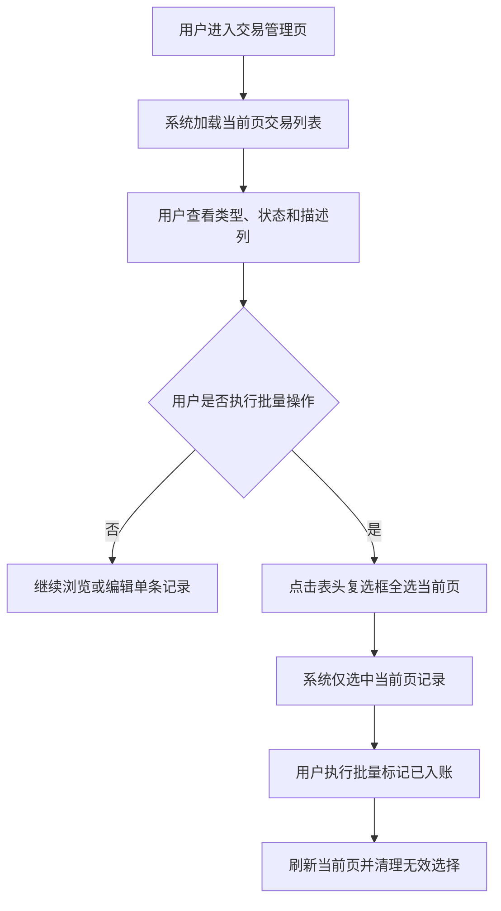

# Transaction List Experience Upgrade

## 4.1 目标声明

### 背景
当前交易列表已经具备基本筛选和批量入账能力，但在批量选择效率、字段可见性和状态语义表达上仍不够完善，用户处理日常账目时需要更多点击和记忆成本。

### 目标
- 交易列表支持“全选当前页”。
- 交易列表明确展示 `description` 字段。
- 交易列表中的 `transaction_type` 和 `entry_status` 通过不同颜色增强可读性。

### 不在范围内
- 不实现跨页全选。
- 不实现批量删除、批量改分类或批量改预算。
- 不在本需求中新增交易详情页。

## 4.2 模块影响表

| 模块 | 影响类型 | 说明 |
|------|---------|------|
| `transactions` | 修改 | 升级交易列表列结构、多选交互与状态视觉表达 |
| `app-shell` | 修改 | 统一表格复选框、标签颜色和空状态交互规范 |
| `shared-infra` | 修改 | 为分页表格选择状态、状态映射与组件测试提供支撑 |

## 4.3 功能描述

### 功能点 1：当前页全选

**正常流程**
1. 用户进入交易管理页并看到当前页数据。
2. 用户点击表头复选框。
3. 系统选中当前页全部可操作记录，再次点击则取消当前页选择。

**边界条件**
- 全选仅作用于当前页，不跨页累积。
- 翻页后默认不继承上一页的选择状态。
- 当前页无数据时，全选控件为禁用状态。

**异常处理**
- 批量操作失败时保留当前页选择状态，方便用户重试。

### 功能点 2：描述字段上屏

**正常流程**
1. 用户查看交易列表。
2. 系统在表格中展示 `description` 列内容。
3. 用户无需打开编辑弹窗即可快速识别交易用途。

**边界条件**
- `description` 为空时显示统一占位符，如 `-`。
- 长描述需截断展示，并支持悬浮查看完整内容或通过可读方式展开。

**异常处理**
- 列数据缺失时不影响其他列渲染，使用占位符兜底。

### 功能点 3：类型与状态颜色语义

**正常流程**
1. 系统为 `transaction_type` 和 `entry_status` 渲染带颜色的标签或文本。
2. 用户通过颜色快速识别收入/支出、待入账/不入账/已入账。

**边界条件**
- 不同状态颜色需在浅色和深色主题下都保持可读。
- 颜色只是增强语义，仍需保留文本，避免仅依赖颜色识别。

**异常处理**
- 未知枚举值时使用中性兜底颜色和原始文本，避免页面报错。

## 4.4 数据变更

新增表：
| 表名 | 用途说明 |
|------|------|
| 无 | 本需求仅调整交易列表展示与交互，不新增数据表 |

新增字段：
| 表名 | 字段名 | 类型 | 业务含义 |
|------|------|------|------|
| 无 | 无 | 无 | 无 |

调整已有字段说明（字段本身不变，但行为/值域在本次需求中有扩展）：
| 表名 | 字段名 | 调整说明 |
|------|------|------|
| `transaction` | `description` | 从“表单可编辑字段”扩展为“列表默认展示字段” |
| `transaction` | `transaction_type` | 在列表中增加颜色语义映射 |
| `transaction` | `entry_status` | 在列表中增加颜色语义映射 |

废弃字段（保留字段本身，说明中标注 [废弃]）：
| 表名 | 字段名 | 废弃原因 |
|------|------|------|
| 无 | 无 | 无 |

## 4.5 UI 页面

| 变更类型 | 页面名 | 路由 | 说明 |
|------|------|------|------|
| 修改 | 交易管理页 | `/transactions` | 增加当前页全选、描述列和类型/状态颜色标签 |

每个新增/修改页面：

- 交易管理页
  - 布局：筛选区下方的表格增加表头复选框、描述列和带颜色语义的类型/状态列。
  - 功能：当前页全选、批量入账、描述快速识别、状态可视化。
  - 交互：表头复选框只选中当前页；翻页后重新计算选择状态；类型和状态始终以“颜色 + 文本”形式展示。
  - 字段：`description` 列默认可见；`transaction_type`、`entry_status` 需有稳定的颜色映射。

若影响导航结构，必须显式声明：
- 不影响导航结构。

## 4.6 验收标准

- [ ] 用户可以通过表头复选框一次选中或取消选中当前页全部交易记录。
- [ ] 用户翻页后不会误保留上一页的全选状态。
- [ ] 交易列表默认展示 `description`，为空时显示统一占位符。
- [ ] 交易列表中的类型和状态同时以文本和颜色展示，且不同枚举有清晰区分。
