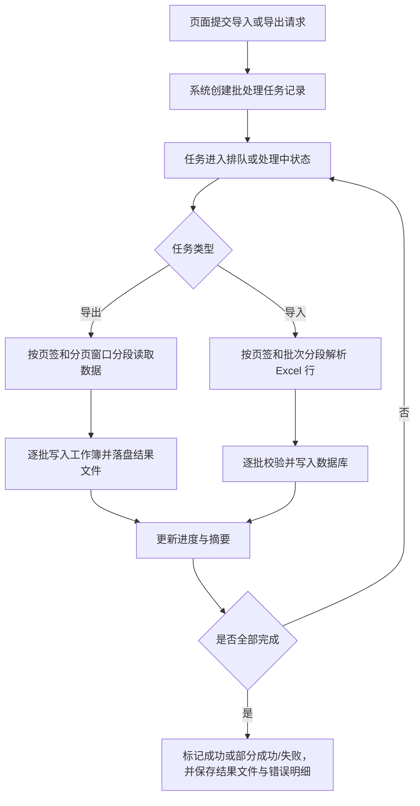

# Bulk Data Processing Foundation

## 4.1 目标声明

### 背景
账单数据体量可能远高于分类和预算，若继续沿用现有同步 CRUD 思路处理导入导出，容易出现请求超时、内存占用过高、失败不可追踪和重复提交等问题。系统需要一套面向大体量 Excel 文件的批处理底座，保证导入导出任务在规模提升后仍然稳定、可恢复、可定位问题。

### 目标
- 导入和导出均采用任务化处理，避免长耗时操作直接阻塞 Web 请求。
- 任务执行需支持分页读取、分批解析、分批写入和进度统计。
- 任务结果需持久化保存状态、统计摘要、失败原因和结果文件位置，便于页面查询与下载。
- 为账单等高体量数据提供可重试、可恢复、可观测的处理基础。

### 不在范围内
- 不在本需求中引入外部消息队列平台作为前置条件。
- 不实现跨租户、跨实例的分布式调度编排。
- 不把本次批处理能力泛化成任意业务对象都可配置的通用工作流引擎。

## 4.2 模块影响表

| 模块 | 影响类型 | 说明 |
|------|---------|------|
| `shared-infra` | 修改 | 新增导入导出任务模型、文件存储约定、批处理执行器和结果查询能力 |
| `transactions` | 修改 | 为大批量账单读取、校验、写入和错误定位提供批次化处理支持 |
| `budgets` | 修改 | 参与导入导出任务的批次化读取与校验 |
| `categories` | 修改 | 参与导入导出任务的批次化读取与层级解析 |
| `app-shell` | 修改 | 页面侧需要轮询或刷新任务状态，并展示摘要、失败原因和下载入口 |

## 4.3 功能描述

### 功能点 1：任务化提交与状态跟踪

**正常流程**
1. 页面发起导入或导出请求。
2. 系统快速返回任务编号，而不是等待整个文件处理完成。
3. 后台执行器根据任务类型处理，并持续更新任务状态和统计信息。
4. 页面通过轮询或主动刷新查看最新状态。

**边界条件**
- 任务状态至少包含 `PENDING`、`PROCESSING`、`SUCCEEDED`、`PARTIAL_SUCCESS`、`FAILED`、`CANCELLED`。
- 同一管理员短时间内重复提交同类型任务时，系统应具备幂等提示或频率限制，降低误操作风险。
- 页面可只展示最近一段时间的任务，但后台需保留必要的审计记录。

**异常处理**
- 执行器异常退出时，任务不能长期停留在未知状态，需要可识别为失败或可恢复状态。
- 页面查询不到结果文件时，应能根据任务状态给出“已过期”或“重新生成”提示。

### 功能点 2：大数据量导出执行策略

**正常流程**
1. 导出任务按页签拆分读取分类、预算、账单数据。
2. 账单数据按固定窗口分页读取，例如按主键或时间顺序分段拉取。
3. 系统逐批写入 Excel 工作簿，避免一次性把全量账单加载到内存。
4. 文件生成完成后写入结果存储，并记录文件地址、过期时间和记录数摘要。

**边界条件**
- 导出顺序固定，保证引用关系和用户阅读体验一致。
- 单批读取量应可配置，便于在不同环境下调优。
- 导出文件名称需包含任务类型、创建时间或任务编号，避免覆盖。

**异常处理**
- 某批次读取失败时，应记录失败位置，允许整体任务失败并给出明确原因。
- 导出文件生成未完成时不得对页面暴露不完整文件。

### 功能点 3：大数据量导入执行策略

**正常流程**
1. 系统先做文件级校验，再把工作簿按页签拆解进入处理流程。
2. 分类与预算先建立映射上下文，再处理账单页签。
3. 账单页签按固定批次解析行数据、校验关联关系并写入数据库。
4. 每个批次处理结束后更新累计成功数、失败数、跳过数和当前进度。

**边界条件**
- 文件级错误直接终止任务；行级错误进入错误明细，不阻断其他合法行。
- 批次大小应可配置，避免单事务过大。
- 错误明细需保留足够上下文，包括页签名、Excel 行号、业务主键或关键字段摘要。
- 对于预算和分类的同文件前置记录，应支持在同一任务上下文中被后续账单引用。

**异常处理**
- 某批次写入失败时，应记录该批失败原因，并根据事务边界控制回滚范围，不影响已成功提交的前序批次。
- 当系统检测到文件内容超过安全阈值时，应拒绝执行并提示用户拆分文件或稍后重试。

### 功能点 4：结果文件与错误明细管理

**正常流程**
1. 成功导出任务生成可下载 Excel 文件。
2. 导入任务在存在失败记录时生成错误明细文件，可为 Excel 或 CSV，但首版推荐仍使用 Excel 多页签或单页错误表。
3. 页面展示任务摘要，并允许下载结果文件或错误明细。

**边界条件**
- 文件存储需要设置保留时长，超过时长后允许自动清理。
- 错误明细下载不应暴露敏感内部堆栈，只返回用户可理解的业务错误。
- 同一任务的结果文件和错误文件应具备稳定命名规则与可追溯关系。

**异常处理**
- 文件已过期或被清理时，任务详情仍需保留摘要信息。
- 文件下载失败时，不应影响任务本身状态。

## 4.4 数据变更

新增表：
| 表名 | 用途说明 |
|------|------|
| `data_job` | 记录导入导出任务元数据、执行状态、统计信息和结果文件位置 |
| `data_job_error` | 记录导入任务中的行级错误明细，支持页面展示与错误文件生成 |

新增字段：
| 表名 | 字段名 | 类型 | 业务含义 |
|------|------|------|------|
| `data_job` | `id` | UUID | 任务主键 |
| `data_job` | `job_type` | varchar(20) | 任务类型，区分 `EXPORT` / `IMPORT` |
| `data_job` | `status` | varchar(30) | 任务状态，如待处理、处理中、成功、部分成功、失败 |
| `data_job` | `template_version` | varchar(20) | 导入模板版本或导出格式版本 |
| `data_job` | `created_by` | UUID | 发起任务的管理员用户 |
| `data_job` | `source_file_path` | varchar(500) | 导入源文件存储位置 |
| `data_job` | `result_file_path` | varchar(500) | 导出结果文件或导入结果汇总文件位置 |
| `data_job` | `error_file_path` | varchar(500) | 导入错误明细文件位置 |
| `data_job` | `total_rows` | integer | 任务识别到的总行数 |
| `data_job` | `success_rows` | integer | 成功处理行数 |
| `data_job` | `failed_rows` | integer | 失败行数 |
| `data_job` | `skipped_rows` | integer | 跳过行数 |
| `data_job` | `progress_percent` | smallint | 粗粒度任务进度百分比 |
| `data_job` | `started_at` | timestamptz | 任务开始时间 |
| `data_job` | `finished_at` | timestamptz | 任务结束时间 |
| `data_job` | `failure_reason` | varchar(500) | 文件级失败原因摘要 |
| `data_job` | `created_at` | timestamptz | 创建时间 |
| `data_job_error` | `id` | UUID | 错误记录主键 |
| `data_job_error` | `job_id` | UUID | 关联导入任务 |
| `data_job_error` | `sheet_name` | varchar(100) | 出错页签名 |
| `data_job_error` | `row_number` | integer | Excel 行号 |
| `data_job_error` | `field_name` | varchar(100) | 出错字段 |
| `data_job_error` | `error_message` | varchar(500) | 用户可读错误原因 |
| `data_job_error` | `raw_key` | varchar(255) | 原始业务定位键，如分类名或交易描述摘要 |
| `data_job_error` | `created_at` | timestamptz | 创建时间 |

调整已有字段说明（字段本身不变，但行为/值域在本次需求中有扩展）：
| 表名 | 字段名 | 调整说明 |
|------|------|------|
| `transaction` | `created_at` | 参与大数据量导出时可作为稳定排序和分页窗口辅助字段 |
| `budget` | `created_at` | 参与导出文件生成时的稳定排序 |
| `category` | `created_at` | 参与导出文件生成时的稳定排序 |

废弃字段（保留字段本身，说明中标注 [废弃]）：
| 表名 | 字段名 | 废弃原因 |
|------|------|------|
| 无 | 无 | 无 |

## 4.5 UI 页面

| 变更类型 | 页面名 | 路由 | 说明 |
|------|------|------|------|
| 修改 | 系统管理页 | `/system/data-management` | 增加任务状态列表、进度展示、失败原因和结果文件下载 |

每个新增/修改页面：

- 系统管理页
  - 布局：在导入导出操作区下方新增任务列表区，按任务时间倒序展示。
  - 功能：展示任务类型、状态、进度、成功数、失败数、文件下载与失败原因。
  - 交互：进行中的任务支持轮询刷新；失败任务支持查看明细；已过期文件显示不可下载状态。
  - 字段：任务列表需包含 `job_type`、`status`、`progress_percent`、`created_at`、`finished_at`、`success_rows`、`failed_rows`、`skipped_rows`。

若影响导航结构，必须显式声明：
- 不新增额外导航项，复用 `/system/data-management` 页面承载批处理结果查看。

## 4.6 验收标准

- [ ] 页面发起导入或导出后，接口能快速返回任务编号，而不是等待完整文件处理结束。
- [ ] 导出任务对账单数据采用分段读取和逐批写入，避免一次性全量加载导致明显超时或内存风险。
- [ ] 导入任务对账单数据采用分批校验和分批写入，单行错误不会阻断整份文件中其他合法记录。
- [ ] 系统可以持久化任务状态、进度、成功数、失败数、跳过数和失败原因，并在页面可见。
- [ ] 导入失败时，系统能生成包含页签、行号、字段和错误原因的错误明细。
- [ ] 结果文件过期或被清理后，任务摘要仍可追溯，用户不会看到“成功但无任何说明”的空白状态。
