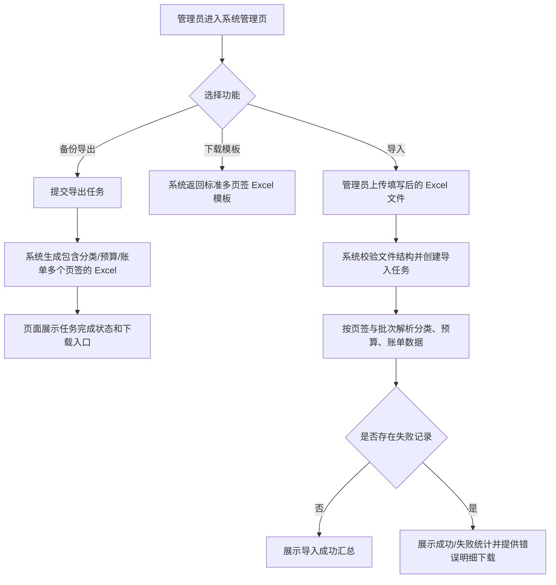

# System Data Import Export

## 4.1 目标声明

### 背景
账单、预算、分类已经成为 HomeFin 中最重要的数据资产。当前系统缺少面向业务用户的备份导出与结构化导入能力，一旦用户需要迁移数据、批量初始化账本或做离线备份，只能依赖手工录入或数据库层操作，风险高且效率低。

### 目标
- 在 Web 端新增“系统管理”页面，提供“备份导出”和“导入”两个功能分区。
- 系统支持将分类、预算、账单导出为一个多页签 Excel 文件。
- 系统支持下载标准导入模板，并导入包含分类、预算、账单的多页签 Excel 文件。
- 导入结果必须给出成功数量、失败数量和可下载的错误明细，方便用户修复后再次导入。

### 不在范围内
- 不提供 CSV、JSON、PDF 等其他格式的导入导出。
- 不在本需求中支持图片附件、票据影像或外部云盘自动同步。
- 不在本需求中实现“部分字段映射可配置”的通用 ETL 能力。
- 不允许普通用户访问系统级导入导出页面，本需求默认由管理员执行。

## 4.2 模块影响表

| 模块 | 影响类型 | 说明 |
|------|---------|------|
| `app-shell` | 修改 | 新增“系统管理”导航分组与页面骨架，承载导入导出入口、任务状态和结果反馈 |
| `transactions` | 修改 | 交易数据参与多页签 Excel 导入导出，并遵守大批量处理规则与校验约束 |
| `budgets` | 修改 | 预算数据参与多页签 Excel 导入导出，并在导入时校验周期、年份和金额 |
| `categories` | 修改 | 分类数据参与多页签 Excel 导入导出，并处理父子层级、颜色与唯一性约束 |
| `users` | 修改 | 导入模板和导入解析需要复用用户信息，校验交易经手人等关联字段 |
| `shared-infra` | 修改 | 提供 Excel 文件生成、模板下载、导入任务提交、错误明细回传与统一消息格式 |

## 4.3 功能描述

### 功能点 1：系统管理页新增导入导出入口

**正常流程**
1. 管理员从侧边导航进入系统管理页。
2. 页面展示“备份导出”和“导入”两个卡片或页签分区。
3. 管理员可分别发起导出、下载模板、上传导入文件和查看最近任务结果。

**边界条件**
- 仅管理员可见该导航项和页面路由。
- 页面需要展示最近若干条导入导出任务状态，避免用户重复提交。
- 当存在进行中的同类任务时，页面应明确提示当前状态，而不是无反馈重复触发。

**异常处理**
- 非管理员直接访问 `/system/data-management` 时返回无权限页或跳转。
- 页面初始化失败时保留已上传文件和筛选状态，并允许重试获取任务列表。

### 功能点 2：多页签 Excel 备份导出

**正常流程**
1. 管理员在“备份导出”区域点击“导出数据”。
2. 系统创建导出任务，并按预定义顺序生成 Excel 文件。
3. Excel 至少包含 `README`、`Categories`、`Budgets`、`Transactions` 四个页签。
4. 任务完成后，页面展示导出时间、导出人、记录数摘要和下载按钮。

**边界条件**
- `README` 页签需说明各业务页签字段含义、枚举值、金额单位和填写规则。
- `Transactions` 页签按业务字段导出，不要求保留数据库主键为必填导入字段，但允许将其作为可选回写列保留。
- 若数据量较大，导出应以后台任务方式处理，不阻塞页面请求。
- 导出文件默认包含当前系统内全部分类、预算、账单数据，不提供按条件筛选导出作为首版能力。

**异常处理**
- 导出失败时，任务状态需标记为失败，并返回简明失败原因。
- 生成文件超出单次可下载时限时，系统需给出“重新生成”入口，而不是返回空文件。

### 功能点 3：模板下载

**正常流程**
1. 管理员在“导入”区域点击“下载模板”。
2. 系统返回与当前导入规则一致的标准 Excel 模板。
3. 模板包含 `README`、`Categories`、`Budgets`、`Transactions` 页签，并预置表头、示例值或枚举说明。

**边界条件**
- 模板字段顺序、字段名和枚举说明必须与导入解析规则一致。
- 模板应避免把系统内部技术字段暴露为必填项，例如数据库 UUID、时间戳。
- 模板需明确分类导入与预算导入应先于账单生效的业务约束。

**异常处理**
- 模板生成失败时，页面给出失败提示并允许重试下载。
- 当前版本模板若升级，旧模板上传时需能识别版本不匹配并提示用户重新下载。

### 功能点 4：多页签 Excel 导入

**正常流程**
1. 管理员下载模板并按要求填写多个页签。
2. 管理员上传 Excel 文件并确认导入。
3. 系统先校验文件结构、模板版本和必填字段，再创建导入任务。
4. 导入按“分类 -> 预算 -> 账单”的顺序处理。
5. 任务完成后，页面展示总行数、成功数、失败数、跳过数和错误明细下载入口。

**边界条件**
- 分类名称、预算名称与周期、交易金额、交易日期、交易类型、入账状态、经手人等字段都需按现有业务规则校验。
- 导入账单时，引用的分类和预算必须能在同一文件中找到，或在系统中已存在。
- 对于账单大数据量场景，系统应按分批写入处理，而不是一次性将整本工作簿载入业务事务。
- 首版导入以“新增为主”，不要求支持按主键智能更新历史记录；若检测到模板中携带系统已存在的主键或唯一组合冲突，按错误或跳过规则处理并返回明细。

**异常处理**
- 单行校验失败不应导致整份文件全部回滚，除非文件结构本身无效。
- 结构错误、模板版本错误、页签缺失等文件级错误应在任务早期失败并明确提示。
- 行级失败应记录到错误明细文件，包含页签、行号、字段和原因，便于修正后重新导入。

## 4.4 数据变更

新增表：
| 表名 | 用途说明 |
|------|------|
| 无 | 本需求的持久化设计由批处理基础能力子需求统一承接 |

新增字段：
| 表名 | 字段名 | 类型 | 业务含义 |
|------|------|------|------|
| 无 | 无 | 无 | 无 |

调整已有字段说明（字段本身不变，但行为/值域在本次需求中有扩展）：
| 表名 | 字段名 | 调整说明 |
|------|------|------|
| `category` | `name` | 需要支持从 Excel 模板导入时进行用户维度唯一性校验 |
| `category` | `parent_id` | 需要支持按模板中的父分类关系解析并建立层级 |
| `budget` | `name` | 需要支持从 Excel 模板导入时与年份、周期一起校验业务重复性 |
| `budget` | `period` | 需要支持 Excel 模板中的枚举值映射 |
| `transaction` | `category_id` | 需要支持从 Excel 导入时按分类映射解析 |
| `transaction` | `budget_id` | 需要支持从 Excel 导入时按预算映射解析 |
| `transaction` | `handler_user_id` | 需要支持从 Excel 导入时按经手人字段解析系统用户 |

废弃字段（保留字段本身，说明中标注 [废弃]）：
| 表名 | 字段名 | 废弃原因 |
|------|------|------|
| 无 | 无 | 无 |

## 4.5 UI 页面

| 变更类型 | 页面名 | 路由 | 说明 |
|------|------|------|------|
| 新增 | 系统管理页 | `/system/data-management` | 管理员执行数据备份导出、模板下载、文件导入与结果查看 |

每个新增/修改页面：

- 系统管理页
  - 布局：顶部为页面说明和最近任务摘要，中部使用“备份导出 / 导入”双分区或双页签，底部展示最近任务列表与结果下载入口。
  - 功能：发起导出、下载模板、上传 Excel、提交导入、查看任务状态、下载导出文件与错误明细。
  - 交互：上传后先做基础校验再允许提交；提交后页面展示处理中状态；完成后支持刷新或轮询获取结果；失败任务可查看失败原因。
  - 字段：上传文件仅允许 `.xlsx`；页面显示模板版本、任务类型、创建时间、处理结果、成功数、失败数和下载链接。

若影响导航结构，必须显式声明：
- 左侧导航新增“System”分组或在现有系统区域下新增 `Data Management` 入口，路径为 `/system/data-management`，权限为管理员。

## 4.6 验收标准

- [ ] 管理员可以在 `/system/data-management` 页面看到“备份导出”和“导入”入口，普通用户不可访问。
- [ ] 用户发起导出后，系统生成一个至少包含 `README`、`Categories`、`Budgets`、`Transactions` 页签的 Excel 文件。
- [ ] 用户可以下载与当前导入规则一致的模板文件，并看到字段说明或枚举说明。
- [ ] 用户上传有效模板文件后，系统按“分类 -> 预算 -> 账单”顺序处理导入。
- [ ] 导入完成后，页面能展示成功数、失败数、跳过数，并提供错误明细下载。
- [ ] 当文件结构错误、模板版本错误或页签缺失时，系统会明确提示，而不会产生部分脏数据。
