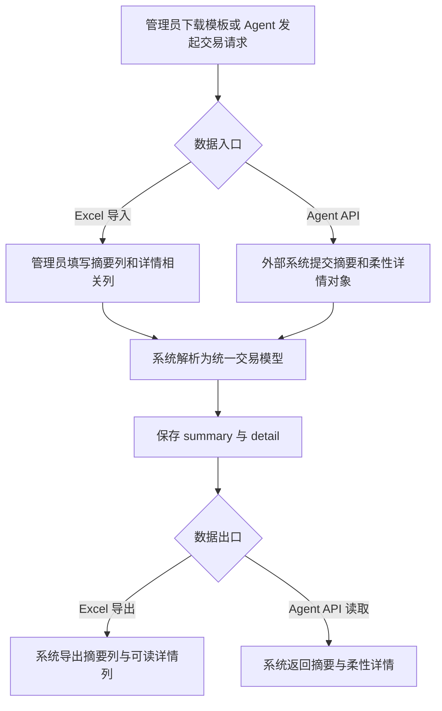

# Transaction Summary Detail Data Exchange

## 4.1 目标声明

### 背景
交易记录一旦升级为“摘要 + 柔性详情”，系统内录入、Excel 批量交换和 Agent API 集成就必须保持同一套语义。如果只改 Web 端，而导入导出和外部接口仍停留在旧 `description` 单字段模型，后续数据会出现回写丢失、字段混乱和多入口不一致的问题。

### 目标
- Excel 模板、导入、导出与 Agent API 统一支持交易摘要和详情。
- 数据交换链路不要求外部调用方维护复杂固定 schema，但要能稳定传递结构化详情。
- 对旧 `description` 兼容链路提供过渡策略，避免现有批量数据或外部调用立即失效。

### 不在范围内
- 不在本需求中提供 CSV、XML 或第三方 SaaS 直连同步格式。
- 不要求 Agent 首版支持按详情明细项做检索、聚合或统计分析。
- 不在本需求中实现 Excel 中的复杂公式、嵌套表格或可变列模板。

## 4.2 模块影响表

| 模块 | 影响类型 | 说明 |
|------|---------|------|
| `transactions` | 修改 | 定义对外统一交易契约，支撑摘要与详情在各入口保持一致 |
| `data-jobs` | 修改 | 更新 Excel 模板、导入导出规则和错误明细定位方式 |
| `agent-api` | 修改 | 调整交易 DTO 和兼容策略，支持摘要与柔性详情对外读写 |
| `shared-infra` | 修改 | 提供 JSON 校验、版本迁移、序列化兼容与回归测试 |

## 4.3 功能描述

### 功能点 1：Excel 模板与导入导出支持摘要和详情

**正常流程**
1. 管理员下载最新 Excel 模板。
2. `Transactions` 页签提供独立的摘要字段，以及用于详情交换的可读字段。
3. 管理员填写或导入摘要和详情后，系统将其转换为统一的交易摘要与柔性详情结构。
4. 导出时，系统按同一规则输出摘要和详情，确保再次回导时信息不丢失。

**边界条件**
- 摘要字段为模板中的主业务字段，建议必填，但导入解析层允许为空并按错误明细或兼容策略处理。
- 详情在 Excel 中不应要求管理员手写原始 JSON；应提供可读列，例如“详情说明”“详情明细”等。
- 首版模板可将明细项列表压缩到单元格中的可读文本表达，或拆分为有限辅助列，但不能要求可变列无限扩张。
- 导出文件中的详情表达需要保持“人可读 + 可再次导入”，优先保证稳定回写，而不是追求最复杂的表格展示。

**异常处理**
- 模板版本不匹配、缺失摘要列或详情列格式错误时，任务返回明确错误。
- 某行详情无法解析时，只阻断该行，不影响其他合法交易行继续处理。

### 功能点 2：Agent API 支持摘要与柔性详情双字段

**正常流程**
1. 外部 Agent 创建或更新交易时，提交 `summary` 和可选 `detail`。
2. 后端校验 `detail` 是否为合法柔性对象，并保存到统一交易模型。
3. 外部 Agent 读取交易时，接口返回 `summary`、`detail` 以及兼容过渡字段。

**边界条件**
- `detail` 允许只包含备注文本，也允许包含明细项数组。
- 接口不强制要求明细项含金额、数量、单位等固定属性，只要求整体结构合法。
- 在兼容期内，若调用方仍发送旧 `description`，系统可按兼容规则映射到 `summary`，但新文档必须明确 `summary` 为主字段。

**异常处理**
- 当 `detail` 不是对象、明细项结构严重错误或字段类型明显非法时，返回 400 与可读错误信息。
- 兼容期过后若仍使用旧字段，系统应有明确弃用提示，而不是静默覆盖新字段。

### 功能点 3：旧字段到新字段的过渡兼容

**正常流程**
1. 系统引入 `summary` 和 `detail` 后，先通过迁移或读写兼容保证旧交易仍可用。
2. 对历史 `description` 数据，系统至少保证其能迁移或映射为 `summary`。
3. 新入口、新模板和新 API 文档全部以 `summary` / `detail` 为主，不再鼓励继续写入旧字段。

**边界条件**
- 兼容策略需要明确读优先级，避免同一条交易同时存在旧字段和新字段时产生歧义。
- 错误明细、导出文件和 Agent 响应中的字段命名应统一，不要一部分叫 `description`、一部分叫 `summary`。
- 过渡期内允许保留旧字段，但必须有明确的废弃声明和后续移除方向。

**异常处理**
- 遇到历史脏数据无法自动转换时，系统应保留最小可读结果并给出可追踪的修复方式。
- 兼容逻辑出现冲突时，以新字段 `summary` / `detail` 为准，避免覆盖用户新录入内容。

## 4.4 数据变更

新增表：
| 表名 | 用途说明 |
|------|------|
| 无 | 本需求复用现有交易与数据任务表结构，不新增交换专用表 |

新增字段：
| 表名 | 字段名 | 类型 | 业务含义 |
|------|------|------|------|
| `transaction` | `summary` | varchar(255) | 供 Excel 与 Agent API 统一交换的短摘要字段 |
| `transaction` | `detail` | jsonb | 供 Excel 与 Agent API 统一交换的柔性详情字段 |

调整已有字段说明（字段本身不变，但行为/值域在本次需求中有扩展）：
| 表名 | 字段名 | 调整说明 |
|------|------|------|
| `datajob` | `template_version` | 模板版本需升级以反映交易摘要与详情字段的新交换格式 |
| `datajoberror` | `raw_key` | 交易行定位键从旧 `description` 语义调整为优先使用 `summary` 或导入行可读摘要 |
| `transaction` | `description` | 在兼容期内可作为旧交换字段映射来源，但不再作为主导出字段和主 API 字段 |

废弃字段（保留字段本身，说明中标注 [废弃]）：
| 表名 | 字段名 | 废弃原因 |
|------|------|------|
| `transaction` | `description` | [废弃] 无法稳定表达新模型下的摘要与柔性详情双层语义 |

## 4.5 UI 页面

| 变更类型 | 页面名 | 路由 | 说明 |
|------|------|------|------|
| 修改 | 数据管理页 | `/system/data-management` | 下载和导入的新模板需要体现交易摘要与详情交换规则 |
| 无 | 无独立终端页 | 无 | Agent API 无独立页面，但其接口文档与调用契约需要同步升级 |

每个新增/修改页面：

- 数据管理页
  - 布局：导入区继续提供模板下载和文件上传；页面说明中补充交易摘要与详情字段的填写规则。
  - 功能：管理员可下载新版模板、上传带摘要与详情的交易数据、查看导入导出结果是否保留详情。
  - 交互：模板说明区需明确摘要是主识别字段，详情可由补充说明和明细内容组成；错误明细要能定位到摘要或可读交易标识。
  - 字段：模板中的交易页至少体现 `summary` 和面向详情交换的字段组；不要求用户直接编辑 JSON 单元格。

若影响导航结构，必须显式声明：
- 不影响导航结构。

## 4.6 验收标准

- [ ] 管理员下载的新模板中，交易页能区分摘要与详情相关信息，而不是继续只有单一描述列。
- [ ] 管理员导入包含摘要和详情的交易数据后，系统能保存并在后续导出中保留相同语义。
- [ ] 详情交换格式对管理员和外部调用方都是可理解的，不要求终端用户直接维护原始 JSON。
- [ ] Agent 创建、更新和读取交易时，能够稳定传递 `summary` 和可选 `detail`。
- [ ] 在兼容期内，旧 `description` 调用链路不会立刻失效，但新文档和新入口均以 `summary` / `detail` 为主。
- [ ] 当详情格式错误或无法解析时，系统能返回明确错误，并避免覆盖已存在的正确摘要与详情数据。
