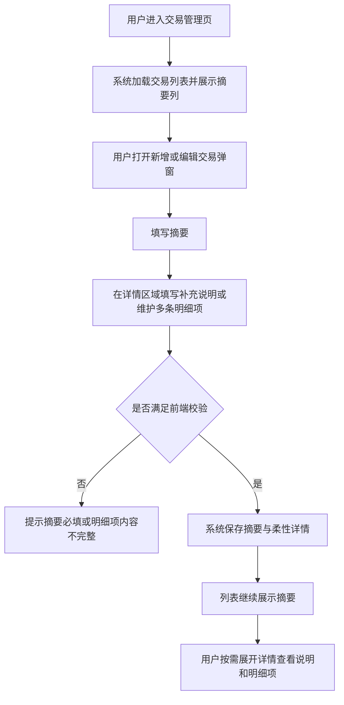

# Transaction Summary Detail Management

## 4.1 目标声明

### 背景
当前交易只有一个 `description` 字段，既被拿来做列表快速识别，又被用户期待承载更细的消费说明，导致字段语义混杂。对于“打车”“房租”“麦当劳”这类账单，用户需要一个一眼就能看懂的短摘要；对于“超市采购明细”“套餐内容”“保险分项”这类信息，又需要更长、可逐步结构化维护的详情能力。

### 目标
- 交易记录拆分为“摘要”和“详情”两层信息。
- 摘要用于列表主展示和快速识别，在前端创建与编辑时要求填写。
- 详情支持结构化维护，不以 JSON 原文直接暴露给终端用户。
- 详情首版采用柔性结构，既支持自由补充说明，也支持逐条维护明细项，为后续更强结构化演进预留空间。

### 不在范围内
- 不在本需求中实现严格会计级分录、商品级金额汇总或税费计算。
- 不在本需求中引入独立的交易明细子表。
- 不在本需求中实现票据图片 OCR、外部小票解析或自动商品分类。
- 不要求历史所有旧 `description` 数据都自动拆分出高质量详情内容。

## 4.2 模块影响表

| 模块 | 影响类型 | 说明 |
|------|---------|------|
| `transactions` | 修改 | 交易模型、表单、列表和详情展示从单一描述升级为摘要 + 柔性详情 |
| `app-shell` | 修改 | 为交易页补充统一的详情展示容器、展开区和空状态交互约定 |
| `shared-infra` | 修改 | 提供 JSON 字段契约、数据迁移、接口 DTO 与测试支撑 |

## 4.3 功能描述

### 功能点 1：交易记录拆分为摘要与详情

**正常流程**
1. 用户创建或编辑交易时，表单中单独看到“摘要”和“详情”两个区域。
2. 用户在摘要中填写一条简短、易读的账单说明，如“打车”“房租”“麦当劳”。
3. 用户可在详情区域补充备注，或新增多条明细项，如“牛奶”“鸡蛋”“纸巾”。
4. 系统保存后，列表主列展示摘要；详情仅在查看或编辑时展开。

**边界条件**
- 摘要在前端为必填，但接口和数据库层允许为空，以兼容旧数据、导入链路和外部集成渐进升级。
- 详情整体为可空，允许只有摘要没有详情。
- 当详情存在但没有结构化明细项时，仍可仅保存一段补充说明文本。

**异常处理**
- 前端若检测到摘要为空，阻止提交并给出明确提示。
- 后端若收到不合法的详情结构，返回可读错误，而不是静默丢弃字段。

### 功能点 2：详情以结构化 UI 维护，而不是直接编辑 JSON

**正常流程**
1. 用户在交易弹窗中进入详情区域。
2. 页面提供“补充说明”多行输入框，以及“明细项列表”编辑区。
3. 用户可新增、删除和重排明细项；每条明细项至少维护名称，其他信息按需填写。
4. 系统将结构化输入转换为统一的柔性详情对象后提交。

**边界条件**
- 明细项首版只强依赖“名称”有值，不强制要求金额、数量、单位、类型等固定字段。
- 若某条明细项已创建但所有可编辑内容均为空，前端在提交前将其视为空项并提示或自动忽略。
- 详情区域需要兼容移动端和桌面端，不要求首版提供复杂拖拽排序，可使用“上移/下移”或按录入顺序保存。

**异常处理**
- 明细项编辑区加载失败或局部渲染异常时，不应影响摘要字段录入；用户至少仍可完成基础交易保存。
- 详情区域提交失败时，页面保留用户已输入内容，允许修正后重试。

### 功能点 3：列表以摘要为主，详情按需展开查看

**正常流程**
1. 用户进入交易列表。
2. 系统默认展示摘要列，而不在表格中直接铺开全部详情。
3. 当某条交易存在详情时，用户可通过展开区、悬浮面板或二级说明区域查看详情备注和明细项列表。
4. 用户编辑该交易时，可继续在结构化表单中维护同一份详情数据。

**边界条件**
- 列表中的主识别字段从旧 `description` 语义切换为“摘要”语义。
- 详情为空时，不展示冗余展开控件，或展示禁用/占位态。
- 长摘要在列表中可截断，但需要保留完整查看方式。

**异常处理**
- 某条记录详情数据损坏时，列表仍应正常展示摘要，并在详情区域提示“详情暂不可读”。
- 未知详情子字段不得直接暴露为 JSON 文本堆到界面上，应忽略或收敛到通用补充说明区域。

## 4.4 数据变更

新增表：
| 表名 | 用途说明 |
|------|------|
| 无 | 首版采用 `transaction` 单表承载摘要与柔性详情，不新增明细子表 |

新增字段：
| 表名 | 字段名 | 类型 | 业务含义 |
|------|------|------|------|
| `transaction` | `summary` | varchar(255) | 交易短摘要，用于列表主展示和快速识别 |
| `transaction` | `detail` | jsonb | 交易柔性详情，承载补充说明和可扩展明细项列表 |

调整已有字段说明（字段本身不变，但行为/值域在本次需求中有扩展）：
| 表名 | 字段名 | 调整说明 |
|------|------|------|
| `transaction` | `description` | 由当前主业务描述字段调整为 [废弃] 兼容字段；历史数据迁移后不再作为主读写入口 |
| `transaction` | `detail` | 顶层结构约定为柔性对象，建议至少支持 `note`、`items`、`extra` 三类信息承载 |

废弃字段（保留字段本身，说明中标注 [废弃]）：
| 表名 | 字段名 | 废弃原因 |
|------|------|------|
| `transaction` | `description` | [废弃] 单字段同时承担摘要与详情语义，无法满足短摘要与结构化详单并存的业务需求 |

## 4.5 UI 页面

| 变更类型 | 页面名 | 路由 | 说明 |
|------|------|------|------|
| 修改 | 交易管理页 | `/transactions` | 将交易描述升级为摘要主列，并提供结构化详情查看与编辑能力 |

每个新增/修改页面：

- 交易管理页
  - 布局：列表区域以摘要作为主描述列；新增/编辑弹窗中将交易信息分为基础字段区与详情区，详情区包含补充说明和明细项编辑列表。
  - 功能：用户可填写摘要、补充自由说明、增删明细项、查看已有详情、继续编辑历史详情。
  - 交互：摘要字段前端必填；详情区默认折叠或次级展示以控制复杂度；存在详情的记录可按需展开查看；空明细项提交前自动清理或提示。
  - 字段：`summary` 前端必填且建议不超过 255 字；`detail.note` 可选；`detail.items` 可选，列表项至少要求 `name`；不得向终端用户直接显示原始 JSON。

若影响导航结构，必须显式声明：
- 不影响导航结构。

## 4.6 验收标准

- [ ] 用户创建或编辑交易时，表单中能分别维护摘要和详情，而不是继续共用一个描述字段。
- [ ] 摘要在前端为必填项，摘要为空时用户无法直接提交表单。
- [ ] 用户可以在详情区域维护一段补充说明，以及 0 到多条结构化明细项。
- [ ] 交易列表默认展示摘要，详情不会以原始 JSON 文本形式直接暴露。
- [ ] 存在详情的交易记录可以被用户以结构化方式查看和再次编辑。
- [ ] 旧 `description` 字段退出主业务入口后，历史数据仍有兼容读取或迁移策略，不会导致现有交易记录不可读。
