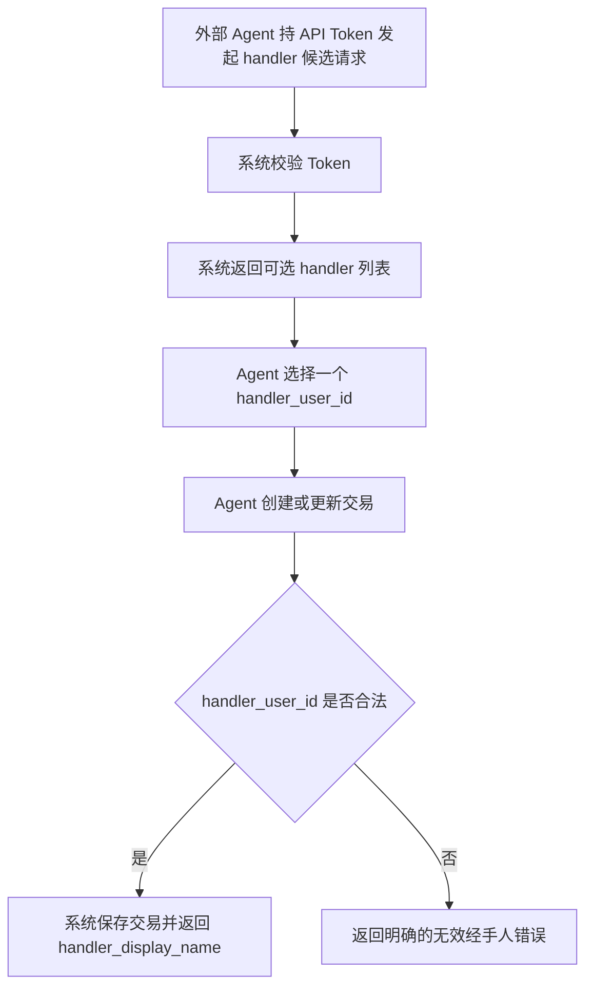

# Agent Handler Options For Transaction Entry

## 4.1 目标声明

### 背景
当前 Agent 账单录入接口已经支持传入 `handler_user_id`，但外部调用方无法通过 Agent 鉴权上下文获知“有哪些可选 handler”。这会导致调用方只能猜测或硬编码用户 ID，既不利于自动化接入，也让“支持 handler 字段”在实际上难以落地。

### 目标
- Agent 可以通过 API Token 读取可选 handler 候选列表。
- 候选列表的返回结构与现有用户侧 `handler-options` 尽量保持一致。
- Agent 在创建和更新交易前，可以先查询候选列表，再提交合法的 `handler_user_id`。
- 在不传 `handler_user_id` 时，继续保留默认经手人为 Token 所属用户的行为。

### 不在范围内
- 不实现 Agent 侧按关键字搜索、模糊匹配或复杂筛选。
- 不实现独立的 Agent 用户详情接口。
- 不实现跨租户或跨所有者的 handler 可见范围扩展。
- 不改变交易记录中 `handler_user_id` 的主存储语义。

## 4.2 模块影响表

| 模块 | 影响类型 | 说明 |
|------|---------|------|
| `agent-api` | 修改 | 新增 Agent 可调用的 handler 候选读取接口，并补齐交易写接口对候选来源的前置支持 |
| `users` | 修改 | 复用或适配现有 handler 候选数据组装逻辑，确保展示名规则一致 |
| `transactions` | 修改 | 交易写入继续支持 `handler_user_id`，但文档与契约需要明确“先查候选再提交”的推荐路径 |
| `shared-infra` | 修改 | 增加 Agent 候选接口 DTO、鉴权测试与主从接口一致性校验 |

## 4.3 功能描述

### 功能点 1：读取 Agent 可用的 handler 候选列表

**正常流程**
1. 外部 Agent 使用 API Token 调用 handler 候选接口。
2. 系统按现有 Agent 鉴权规则校验 Token 是否有效、启用且未过期。
3. 鉴权通过后，系统返回当前可选 handler 列表。
4. 每个候选项返回 `id`、`full_name`、`login_name` 和 `display_name`。

**边界条件**
- 候选列表返回结构应与用户侧 `/users/handler-options` 保持一致，降低调用方适配成本。
- 至少应包含 Token 所属用户本人，避免默认经手人逻辑失效。
- 若存在停用用户，不应作为可选候选返回。

**异常处理**
- Token 无效、禁用或过期时返回 401。
- 候选读取失败时，调用方可以安全重试，不应产生副作用。

### 功能点 2：先查候选，再提交 `handler_user_id`

**正常流程**
1. Agent 先调用候选接口获取可选经手人。
2. 选择其中一个 `id` 作为 `handler_user_id`。
3. Agent 调用交易创建或更新接口提交账单。
4. 系统校验该 `handler_user_id` 是否属于可接受候选，并完成保存。

**边界条件**
- 若请求未提供 `handler_user_id`，系统继续默认回填为 Token 所属用户。
- 若请求显式提供 `handler_user_id`，则必须是存在且可用的用户。
- 返回交易时继续包含 `handler_user_id` 与 `handler_display_name`。

**异常处理**
- 提交不存在或不可用的 `handler_user_id` 时，返回明确错误，而不是静默回退到默认用户。
- 候选列表与写入之间若目标用户被停用，写入阶段应以实时校验结果为准。

### 功能点 3：与用户侧展示规则保持一致

**正常流程**
1. 系统构造候选列表时，为每个用户生成展示名。
2. 若用户存在 `full_name`，优先使用 `full_name`。
3. 若 `full_name` 为空，则回退为 `login_name`。
4. Agent 在交易返回结果中看到的 `handler_display_name` 与候选接口中的 `display_name` 保持同一规则。

**边界条件**
- 候选接口不要求暴露邮箱等与交易选择无关的信息。
- 当用户资料更新后，后续候选读取与交易返回都应体现新的展示名规则。

**异常处理**
- 某条候选记录字段缺失时，不应导致整个列表读取失败；至少需保证可回退出 `login_name`。

## 4.4 数据变更

新增表：
| 表名 | 用途说明 |
|------|------|
| 无 | 复用现有 `user` 与 `transaction` 关系，不新增表 |

新增字段：
| 表名 | 字段名 | 类型 | 业务含义 |
|------|------|------|------|
| 无 | 无 | 无 | 本需求不新增表字段，以新增 Agent 读取接口和契约补齐为主 |

调整已有字段说明（字段本身不变，但行为/值域在本次需求中有扩展）：
| 表名 | 字段名 | 调整说明 |
|------|------|------|
| `transaction` | `handler_user_id` | Agent 侧正式具备“先读候选、再写入”的使用路径，减少硬编码和盲填 |
| `user` | `full_name` | 继续作为 handler 首选展示名来源 |
| `user` | `login_name` | 当 `full_name` 为空时作为展示名回退来源 |

废弃字段（保留字段本身，说明中标注 [废弃]）：
| 表名 | 字段名 | 废弃原因 |
|------|------|------|
| 无 | 无 | 无 |

## 4.5 UI 页面

| 变更类型 | 页面名 | 路由 | 说明 |
|------|------|------|------|
| 修改 | 无独立页面 | 无 | 本需求无终端用户页面，主要变更体现在 Agent API 契约与配套说明 |

每个新增/修改页面：

- 无独立页面
  - 布局：不涉及前端页面布局。
  - 功能：通过新增 Agent 接口满足外部调用方查询 handler 候选的需求。
  - 交互：外部调用方先查候选再写交易。
  - 字段：返回 `id`、`full_name`、`login_name`、`display_name`。

若影响导航结构，必须显式声明：
- 不影响导航结构。

## 4.6 验收标准

- [ ] 外部 Agent 可以使用 API Token 成功读取 handler 候选列表。
- [ ] 候选列表返回 `id`、`full_name`、`login_name` 和 `display_name`，并沿用 `full_name || login_name` 的展示规则。
- [ ] Agent 在创建或更新交易前，可先调用候选接口，再用返回的 `handler_user_id` 成功提交交易。
- [ ] 未传 `handler_user_id` 时，系统仍默认把 Token 所属用户作为经手人。
- [ ] 传入不存在或不可用的 `handler_user_id` 时，系统返回明确错误，而不是静默改写为默认值。
