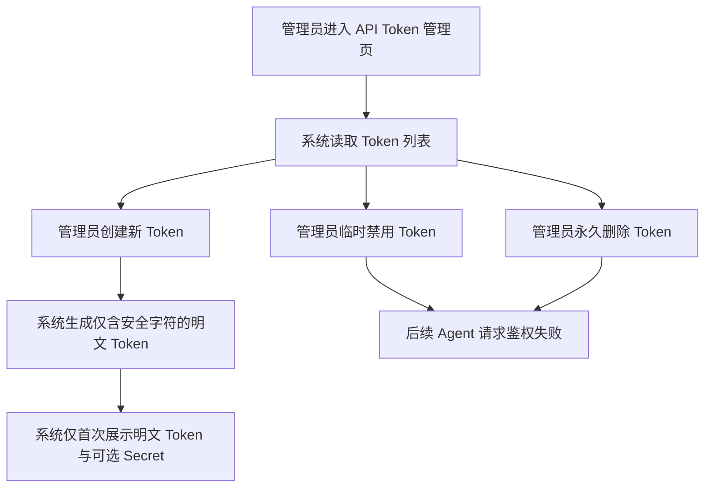

# Agent Token Management Hardening

## 4.1 目标声明

### 背景
当前 API Token 管理存在两个直接影响接入可用性的问题：一是管理员只能禁用 Token，无法删除不再需要或误建的凭证；二是新生成 Token 会出现带符号的字符串，部分 Agent、脚本或 Header 拼接链路在未做额外转义时会出现复制、传递或解析失败，导致凭证“看起来已创建，实际上不好用”。

### 目标
- 管理员可以删除不再需要的 API Token。
- 新创建的 Token 默认使用适合 URL 与 HTTP Header 直接传递的安全字符集。
- 保留现有禁用能力，用于临时停用 Token。
- 删除后的 Token 立即失效，且不再出现在列表中。

### 不在范围内
- 不实现 Token 细粒度权限、作用域或资源级授权。
- 不实现 Token 审计日志明细页。
- 不实现批量删除、批量禁用或回收站机制。
- 不要求对历史已发放 Token 执行强制再生成。

## 4.2 模块影响表

| 模块 | 影响类型 | 说明 |
|------|---------|------|
| `api-tokens` | 修改 | Token 生命周期从“创建 + 禁用”扩展为“创建 + 禁用 + 删除”，并调整生成规则与管理页交互 |
| `agent-api` | 修改 | Token 删除后 Agent 鉴权应立即失败，保持与禁用、过期一致的失效语义 |
| `app-shell` | 修改 | `/system/api-tokens` 页面需要补充删除操作、确认提示和一次性明文展示说明 |
| `shared-infra` | 修改 | 提供新的安全 Token 生成约定、回归测试与删除后的鉴权校验支撑 |

## 4.3 功能描述

### 功能点 1：创建可直接使用的安全 Token

**正常流程**
1. 管理员进入 API Token 管理页并打开创建弹窗。
2. 填写 Token 名称、可选过期时间，以及是否生成 HMAC Secret。
3. 系统生成新的明文 Token，并保证其字符集可直接用于 `Authorization: Bearer <token>` 或 `X-API-Token`。
4. 系统仅在创建成功当次展示明文 Token 和可选 Secret。
5. 管理员复制后关闭弹窗，后续列表只保留前缀、状态和元数据。

**边界条件**
- Token 名称必填。
- 过期时间可空，空表示长期有效。
- Token 明文不得包含会显著增加转义或解析风险的符号字符。
- `token_prefix` 继续用于后台辨识，但不能反推出完整 Token。

**异常处理**
- 创建失败时不应留下半成品 Token 记录。
- 明文结果展示失败时，系统应明确提示“请重新创建”，而不是允许管理员事后再次读取明文。

### 功能点 2：禁用 Token 作为临时停用手段

**正常流程**
1. 管理员在列表中对仍处于启用状态的 Token 执行禁用。
2. 系统将该 Token 标记为不可用。
3. 后续 Agent 使用该 Token 发起请求时，鉴权直接失败。

**边界条件**
- 已禁用 Token 再次禁用保持幂等。
- 禁用不删除 Token 元数据，列表仍可查看其名称、前缀、创建人、过期时间和最后使用时间。

**异常处理**
- Token 不存在时返回明确错误。
- 状态更新失败时，列表不能错误地展示为已禁用。

### 功能点 3：删除 Token 作为永久清理手段

**正常流程**
1. 管理员在列表中对某个 Token 执行删除。
2. 系统弹出确认提示，明确删除后该 Token 无法恢复。
3. 管理员确认后，系统永久移除 Token 记录。
4. 列表刷新后，该 Token 不再显示。
5. 若外部 Agent 继续使用该 Token，系统返回与无效 Token 一致的鉴权失败结果。

**边界条件**
- 删除操作仅面向已存在 Token，不区分当前是否启用。
- 删除后不保留“可恢复”状态。
- 删除一个从未使用过的 Token 也应被允许。

**异常处理**
- Token 不存在时返回明确错误。
- 删除请求成功前，前端不能提前移除行数据，避免假删除。

## 4.4 数据变更

新增表：
| 表名 | 用途说明 |
|------|------|
| 无 | 复用现有 `apitoken` 表承载删除前的全部生命周期信息 |

新增字段：
| 表名 | 字段名 | 类型 | 业务含义 |
|------|------|------|------|
| 无 | 无 | 无 | 本需求不新增表字段，以接口能力和生成规则调整为主 |

调整已有字段说明（字段本身不变，但行为/值域在本次需求中有扩展）：
| 表名 | 字段名 | 调整说明 |
|------|------|------|
| `apitoken` | `token_hash` | 继续保存明文 Token 哈希，但其来源明文改为新的安全字符集生成规则 |
| `apitoken` | `token_prefix` | 继续用于后台展示与辨识，前缀截取规则需兼容新 Token 格式 |
| `apitoken` | `is_active` | 继续表示临时启停状态；删除能力新增后，`is_active=false` 不再等价于最终清理 |
| `apitoken` | `last_used_at` | 删除前仍可用于定位最近使用情况，删除后整条记录一并消失 |

废弃字段（保留字段本身，说明中标注 [废弃]）：
| 表名 | 字段名 | 废弃原因 |
|------|------|------|
| 无 | 无 | 无 |

## 4.5 UI 页面

| 变更类型 | 页面名 | 路由 | 说明 |
|------|------|------|------|
| 修改 | API Token 管理页 | `/system/api-tokens` | 补充删除操作、删除确认和“新 Token 可直接复制使用”的引导说明 |

每个新增/修改页面：

- API Token 管理页
  - 布局：沿用标题区 + 创建按钮 + Token 表格；在行操作中增加删除入口。
  - 功能：查看状态、创建 Token、禁用 Token、删除 Token。
  - 交互：创建成功后弹窗继续一次性展示明文 Token 和可选 Secret，并显式提示需要立即复制；删除前需二次确认。
  - 字段：`name` 必填；`expires_at` 可空；`generate_secret` 可选。

若影响导航结构，必须显式声明：
- 不影响导航结构。

## 4.6 验收标准

- [ ] 管理员创建新 API Token 后，返回的明文 Token 可直接用于 `Authorization: Bearer <token>` 或 `X-API-Token`，无需额外转义处理。
- [ ] 管理员仍可禁用 Token，禁用后的 Token 请求会立即鉴权失败。
- [ ] 管理员可以删除任意 API Token，删除确认后该 Token 不再出现在列表中。
- [ ] 已删除 Token 再用于 Agent 接口访问时，会得到与无效 Token 一致的失败结果。
- [ ] 列表不会再次展示完整明文 Token，只保留前缀和生命周期元数据。
