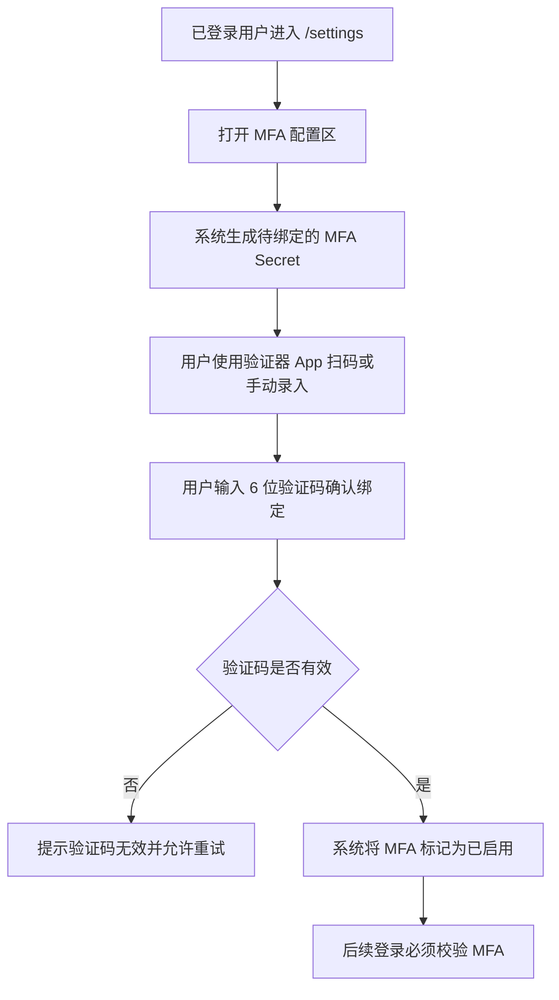
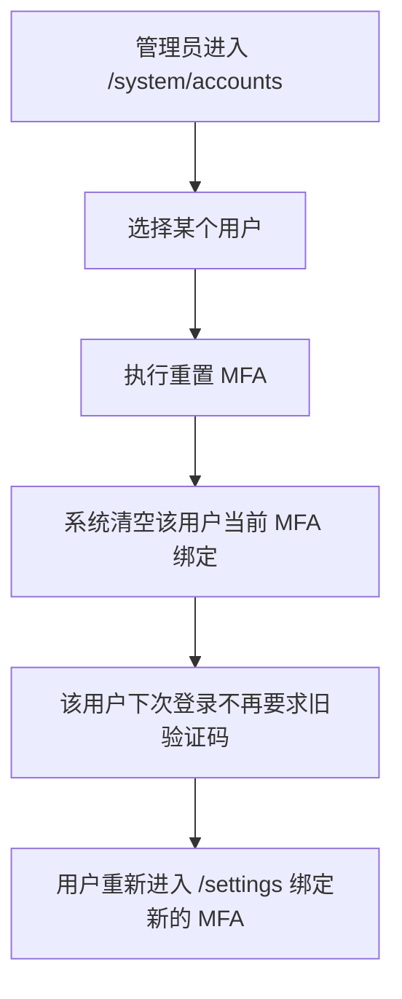

# MFA Self Service And Admin Reset

## 4.1 目标声明

### 背景
当前登录页已经预留了 MFA 输入框，系统也具备“用户存在 `mfa_secret` 时登录需校验 TOTP”的底层规则，但缺少两个关键管理入口：第一，普通用户没有地方自行启用、查看、重置或关闭 MFA；第二，管理员也无法在用户遗失设备、验证码失效或被锁出时重置目标账户的 MFA。这导致 MFA 能力停留在“登录链路知道怎么校验”，但在真实使用场景中既难以启用，也难以恢复。

### 目标
- 用户可以在设置页自助启用 MFA，并完成首次绑定。
- 用户可以查看自己的 MFA 已启用状态，并在需要时执行重置或关闭。
- 管理员可以在账户管理页对指定用户执行 MFA 重置。
- 登录链路明确遵循“未配置可不填、已配置必须校验、重置后需重新绑定”的一致规则。

### 不在范围内
- 不实现短信、邮件或硬件密钥等非 TOTP 形态的 MFA。
- 不实现恢复码、一次性备用码或设备信任名单。
- 不实现 MFA 操作审计报表。
- 不在本需求中扩展到前端以外的第三方单点登录体系。

## 4.2 模块影响表

| 模块 | 影响类型 | 说明 |
|------|---------|------|
| `users` | 修改 | 新增当前用户自助管理 MFA 的接口与管理员重置目标账户 MFA 的能力 |
| `auth` | 修改 | 登录流程与 MFA 配置状态保持一致，明确启用后、重置后与关闭后的校验语义 |
| `app-shell` | 修改 | `/settings` 需要新增可见的 MFA 管理入口；账户管理页需要承载管理员重置 MFA 的触发点 |
| `shared-infra` | 修改 | 提供 TOTP Secret 生成、二维码或手动密钥展示契约、验证确认逻辑和回归测试 |

## 4.3 功能描述

### 功能点 1：用户自助启用 MFA

**正常流程**
1. 已登录用户进入 `/settings`，看到独立的 MFA 安全配置区。
2. 用户点击启用 MFA。
3. 系统生成新的待绑定 MFA Secret，并以二维码和可手动录入的 Secret 形式展示。
4. 用户使用 TOTP 验证器应用扫码或手动录入。
5. 用户输入当前 6 位验证码完成绑定确认。
6. 系统校验通过后，将该 Secret 设为当前生效的 MFA 配置。
7. 后续该用户登录时，除 `login_name` 和密码外，还必须提供有效 `mfa_code`。

**边界条件**
- MFA 只有在用户完成验证码确认后才算真正启用，不能在仅生成 Secret 后立即生效。
- 同一时刻仅存在一套生效的 MFA 配置。
- 用户需要能够看到“未启用 / 已启用”的明确状态。

**异常处理**
- 验证码错误时，系统保留当前待绑定上下文并允许用户重新输入。
- 若绑定过程失败或页面关闭，未确认的 Secret 不应被误认为已启用。

### 功能点 2：用户自助重置或关闭 MFA

**正常流程**
1. 已启用 MFA 的用户在 `/settings` 查看到当前状态。
2. 用户可选择“重置 MFA”或“关闭 MFA”。
3. 若选择重置，系统清除当前生效 Secret，并引导用户重新走一遍绑定流程。
4. 若选择关闭，系统清除当前生效 Secret，并将账号恢复到“登录无需 MFA”状态。

**边界条件**
- 重置和关闭都应要求明确确认，避免误操作。
- 未启用 MFA 的用户不应看到可执行的“关闭已启用 MFA”操作，或应展示禁用态。
- 用户完成重置但尚未重新绑定前，系统应视为“当前未启用 MFA”。

**异常处理**
- 清除 Secret 失败时，前端不能错误显示为已关闭。
- 用户在重置后若未完成新绑定，系统不得继续要求旧验证码登录。

### 功能点 3：管理员重置指定账户的 MFA

**正常流程**
1. 管理员进入 `/system/accounts`。
2. 在目标用户行或详情操作中点击“重置 MFA”。
3. 系统弹出确认提示，说明该用户现有 MFA 绑定将失效。
4. 管理员确认后，系统清空目标用户当前 MFA 配置。
5. 该用户后续登录时不再要求旧验证码，直到其重新在 `/settings` 完成绑定。

**边界条件**
- 管理员应可对普通用户和管理员账户都执行重置。
- 重置动作不修改用户密码、登录名或其他资料。
- 被重置的用户无需先在线或主动配合。

**异常处理**
- 目标用户不存在时返回明确错误。
- 重置失败时，不应向管理员错误提示“已完成”。

### 功能点 4：登录链路与 MFA 状态保持一致

**正常流程**
1. 用户在 `/login` 输入 `login_name` 和密码。
2. 系统校验账号密码后，判断该用户当前是否存在已生效的 MFA 配置。
3. 若未启用 MFA，则直接允许完成登录。
4. 若已启用 MFA，则必须提交有效 6 位验证码。
5. 若该用户的 MFA 被用户自己关闭，或被管理员重置，则后续登录不再要求旧验证码，直到再次绑定成功。

**边界条件**
- 登录页继续保留 MFA 输入框，但是否强制填写取决于账号当前状态。
- `mfa_code` 仅在账号存在生效 MFA 配置时必填。
- 重新绑定成功后，应立即按新 Secret 校验，不再接受旧 Secret。

**异常处理**
- 验证码错误时，提示明确但不泄露 Secret 信息。
- 用户状态与 MFA 状态读取异常时，登录应失败并返回可重试错误，而不是绕过 MFA。

## 4.4 数据变更

新增表：
| 表名 | 用途说明 |
|------|------|
| 无 | 复用现有 `user` 表中的 MFA 相关字段，不新增独立表 |

新增字段：
| 表名 | 字段名 | 类型 | 业务含义 |
|------|------|------|------|
| 无 | 无 | 无 | 本需求不新增表字段，以围绕现有 `mfa_secret` 的管理能力补齐为主 |

调整已有字段说明（字段本身不变，但行为/值域在本次需求中有扩展）：
| 表名 | 字段名 | 调整说明 |
|------|------|------|
| `user` | `mfa_secret` | 从“仅登录时被动读取”扩展为“用户自助绑定、重置、关闭，以及管理员代重置”的完整生命周期字段 |
| `user` | `login_name` | 继续作为登录主标识，MFA 校验始终附着在该账号的登录流程上 |

废弃字段（保留字段本身，说明中标注 [废弃]）：
| 表名 | 字段名 | 废弃原因 |
|------|------|------|
| 无 | 无 | 无 |

## 4.5 UI 页面

| 变更类型 | 页面名 | 路由 | 说明 |
|------|------|------|------|
| 修改 | 用户设置页 | `/settings` | 新增 MFA 安全配置区，支持启用、查看状态、重置和关闭 |
| 修改 | 账户管理页 | `/system/accounts` | 新增管理员重置指定账户 MFA 的操作入口 |
| 修改 | 登录页 | `/login` | 继续保留 MFA 输入框，并补齐状态提示与错误反馈，使其与配置能力闭环 |

每个新增/修改页面：

- 用户设置页
  - 布局：在现有资料、密码、危险操作之外新增 MFA 安全区或独立页签。
  - 功能：查看 MFA 状态、启用绑定、展示待绑定 Secret、确认验证码、重置、关闭。
  - 交互：启用时先展示二维码或手动 Secret，再要求输入验证码确认；重置和关闭都需确认。
  - 字段：`mfa_code` 为 6 位数字；手动 Secret 只在绑定过程中展示；状态字段为只读展示。

- 账户管理页
  - 布局：在用户表格或行操作菜单中补充 “Reset MFA” 入口。
  - 功能：管理员对目标账户执行 MFA 重置。
  - 交互：点击后需二次确认，成功后给出可读提示。
  - 字段：不新增可编辑账户字段，以动作型操作为主。

- 登录页
  - 布局：沿用现有认证布局。
  - 功能：账号密码登录、MFA 验证码输入、错误反馈。
  - 交互：当账号已启用 MFA 且验证码缺失或错误时，返回明确提示并允许重试；未启用时不要求填写。
  - 字段：`login_name` 必填；`password` 必填；`mfa_code` 在需要时为 6 位数字。

若影响导航结构，必须显式声明：
- 不新增新的一级导航；MFA 入口位于现有 `/settings` 与 `/system/accounts` 中。

认证类子需求额外检查：
- 覆盖登录态下顶栏用户信息展示。
- 不影响退出登录入口。
- 保留修改密码入口。
- 保留并增强个人设置页。

## 4.6 验收标准

- [ ] 普通用户可以在 `/settings` 启用 MFA，并在输入正确 6 位验证码确认后进入“已启用”状态。
- [ ] 已启用 MFA 的用户再次登录时，缺少或填写错误 `mfa_code` 都无法登录。
- [ ] 用户可以在 `/settings` 重置或关闭自己的 MFA，完成后旧验证码立即失效。
- [ ] 管理员可以在 `/system/accounts` 对任意目标账户执行 MFA 重置。
- [ ] 被管理员重置 MFA 的用户后续登录不再要求旧验证码，并可以重新在 `/settings` 完成新的绑定。
- [ ] MFA 管理能力补齐后，登录页的 MFA 输入框与账户真实状态保持一致，不再出现“只能输入、无法配置或恢复”的断裂体验。
