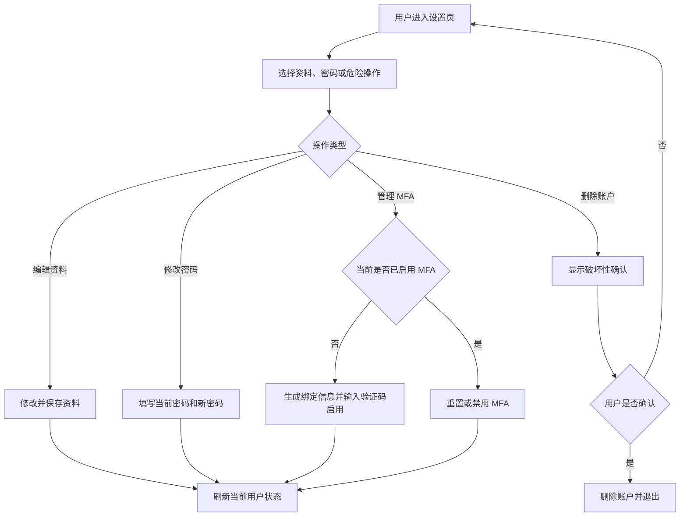
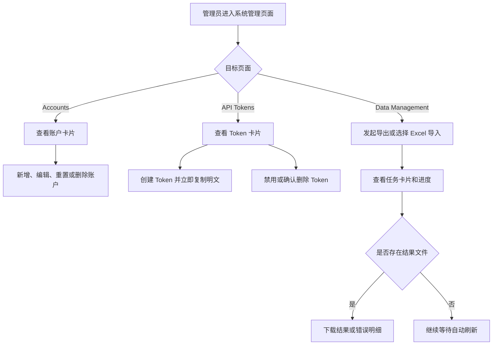

# 移动端账户与系统管理

## 1. 目标声明

### 背景
用户设置、MFA、账户管理、API Token 和数据导入导出页面包含大量安全与管理操作。当前设置页的 Tabs、MFA 状态操作和管理员列表主要按桌面宽度组织；API Token 还会展示不可重复获取的长凭证，数据任务则包含进度、统计和文件操作。手机端若只使用横向表格或压缩按钮，会增加误操作和遗漏关键信息的风险。

### 目标
- 让用户在手机端完成资料维护、密码修改、MFA 设置和账户删除。
- 让管理员在手机端完成账户创建、编辑、删除、密码重置和 MFA 重置。
- 让管理员在手机端安全地创建、复制、禁用和删除 API Token。
- 让管理员在手机端发起导出、选择 Excel 文件导入、查看任务进度并下载结果或错误文件。
- 对破坏性和不可逆操作保持清晰确认，不因移动布局增加误触风险。

### 不在范围内
- 不改变账户、MFA、API Token 或数据任务的权限与接口契约。
- 不新增 Token 权限范围、任务取消、任务详情页或文件预览。
- 不改变 Excel 模板结构、导入导出任务执行方式或文件保留策略。
- 不改变公开注册策略或管理员角色模型。

## 2. 模块影响表

| 模块 | 影响类型 | 说明 |
|------|---------|------|
| users | 修改 | 调整用户设置、MFA 和管理员账户管理的手机布局与操作方式 |
| api-tokens | 修改 | 增加移动 Token 卡片、长凭证换行与复制交互 |
| data-jobs | 修改 | 增加移动数据任务卡片、响应式导入导出操作和文件下载入口 |

## 3. 功能描述

### 3.1 用户资料与安全设置

#### 正常流程
1. 用户进入设置页，在手机端通过可滚动或等宽适配的 Tabs 切换资料、密码和危险操作。
2. 用户编辑资料或密码时，表单占满可用宽度，提交按钮在触控场景中清晰可见。
3. 用户未启用 MFA 时，可生成 Secret 与 otpauth URI，录入六位验证码并启用。
4. 用户已启用 MFA 时，可重置或禁用，并在操作后刷新当前用户状态。
5. 用户删除账户前必须完成现有二次确认流程。

#### 边界条件
- Tabs 文案在 320px 下不得撑宽页面，可采用横向滚动或等宽分布，但当前选中状态必须清晰。
- Secret、otpauth URI 和邮箱必须在卡片内换行，不产生页面级横向滚动。
- MFA 状态说明、Reset 和 Disable 操作在手机端纵向排列；破坏性按钮与普通操作保持视觉区分。
- 软键盘打开时，六位验证码和启用按钮均可触达。

#### 异常处理
- MFA setup 或 enable 失败时保留当前绑定信息和验证码输入区域，显示现有错误反馈。
- 资料或密码保存失败时保留表单内容，不切回只读状态。
- 删除账户失败时保持登录状态和确认页面，不显示虚假成功。

### 3.2 管理员账户、Token 与数据任务

#### 正常流程
1. 管理员进入账户、API Token 或数据管理页面，手机端展示对应记录卡片，桌面端继续展示表格。
2. 账户卡片展示登录名、姓名、邮箱、角色、状态和当前用户标识，并提供账户管理操作。
3. Token 卡片展示名称、前缀、状态、过期时间和最后使用时间；创建成功后单独展示一次性明文 Token 和可选 Secret。
4. 管理员可复制 Token、Secret 或示例凭证文本，并继续执行禁用或确认删除。
5. 数据管理页在手机端纵向展示导出与导入卡片；管理员可选择 `.xlsx` 文件并创建任务。
6. 任务卡片展示类型、状态、进度、行数统计、创建时间和可用文件操作；运行中继续自动刷新。

#### 边界条件
- 当前管理员账户仍不可删除；卡片操作必须沿用现有禁用规则。
- 一次性 Token 或 Secret 很长时必须完整保留、允许换行并提供明确复制反馈。
- 复制功能失败时不得隐藏原始值，用户仍可手动选择文本。
- 文件输入中的长文件名不得撑宽导入卡片。
- 数据任务同时存在结果文件和错误文件时，两个下载入口都必须可见；无文件时明确显示无可下载内容。
- 任务进度、统计数字和状态文案较长时允许纵向排列。

#### 异常处理
- 管理员权限校验失败继续跳转 Dashboard，不渲染系统管理内容。
- Token 创建失败时保留创建表单；禁用或删除失败时保留 Token 卡片。
- 导入文件缺失或格式错误时在当前操作卡片显示反馈，不创建虚假任务。
- 下载失败时展示错误提示，任务卡片和其他可用操作保持不变。

## 4. 数据变更

### 新增表
无。

### 新增字段
无。

### 调整已有字段说明
无。

### 废弃字段
无。

## 5. UI 页面

| 变更类型 | 页面名 | 路由 | 说明 |
|---------|-------|------|------|
| 修改 | 用户设置页 | `/settings` | 调整 Tabs、资料、密码、MFA 和危险操作的小屏布局 |
| 修改 | 账户管理页 | `/system/accounts` | 增加移动账户卡片和响应式账户操作弹窗 |
| 修改 | API Token 管理页 | `/system/api-tokens` | 增加移动 Token 卡片、凭证换行复制和安全操作布局 |
| 修改 | 数据管理页 | `/system/data-management` | 增加移动导入导出布局和任务卡片 |

### 用户设置页
- **布局**：Tabs 在窄屏中可完整访问；资料、密码、MFA 和危险操作使用单列内容。
- **功能**：保留资料编辑、密码修改、MFA setup/enable/reset/disable 和账户删除。
- **交互**：MFA 状态操作在手机端纵向排列；长 Secret 与 URI 可换行；提交与取消按钮不相互挤压。
- **字段**：沿用当前资料、密码和六位 MFA 验证码规则。

### 账户管理页
- **布局**：手机端账户卡片，桌面端保留 DataTable；页面标题和新增按钮响应式排列。
- **功能**：保留新增、编辑、删除、密码重置和 MFA 重置。
- **交互**：次要操作可收敛到操作菜单；删除与重置继续使用确认弹窗；当前账户标识清晰可见。
- **字段**：卡片展示 `login_name`、`full_name`、`email`、`is_superuser`、`is_active`。

### API Token 管理页
- **布局**：说明 Alert、一次性凭证区域和 Token 卡片均限制在视口内；桌面保留表格。
- **功能**：保留创建、禁用、删除并新增前端复制入口，不改变后端 Token 生命周期。
- **交互**：Token、Secret 和示例 Authorization 文本可分别复制并反馈结果；删除继续二次确认。
- **字段**：卡片展示名称、前缀、状态、过期时间、最后使用时间；明文仅在创建成功后当次展示。

### 数据管理页
- **布局**：导出与导入卡片在手机端纵向排列；最近任务改为卡片列表，桌面保留表格。
- **功能**：保留模板下载、创建导出、选择文件导入、任务自动刷新、结果与错误文件下载。
- **交互**：文件输入占满可用宽度；运行任务提示和刷新操作不遮挡标题；任务文件按钮根据实际文件状态显示。
- **字段**：任务卡片展示类型、状态、进度、总行数、成功数、失败数、创建时间和文件状态。

### 导航影响
不改变 Settings、Accounts、API Tokens 和 Data Management 的导航名称、路径和权限；管理员入口仍仅对 `is_superuser` 用户显示。

## 6. 验收标准

- [ ] 普通用户在 320×568 和 390×844 下可访问设置页的全部 Tabs，页面无横向滚动。
- [ ] 用户可在手机端完成资料修改、密码修改以及 MFA setup、enable、reset、disable 流程。
- [ ] MFA Secret 和 otpauth URI 在手机端完整可读或可复制，不会撑宽页面。
- [ ] 账户删除、管理员删除账户、重置密码、重置 MFA、删除 Token 等敏感操作继续具备清晰确认和破坏性视觉提示。
- [ ] 管理员无需横向滚动即可从账户卡片识别登录名、姓名、邮箱、角色和状态，并执行全部现有账户操作。
- [ ] 管理员创建 Token 后，可在手机端查看并复制一次性 Token 与可选 Secret；长文本不产生页面级横向滚动。
- [ ] 管理员可在手机端禁用和删除 Token，失败时对应卡片保持可见且状态不被错误更新。
- [ ] 管理员可在手机端下载模板、选择 `.xlsx` 文件、创建导入任务和创建导出任务。
- [ ] 数据任务卡片完整展示状态、进度、行数统计和创建时间，并能下载所有实际可用文件。
- [ ] 存在运行中任务时手机端自动刷新继续生效，不导致列表滚动位置异常跳动或操作按钮不可用。
- [ ] 非管理员访问三个系统管理路由时继续按现有规则跳转，不短暂暴露管理数据。
- [ ] 768px 及以上继续使用现有账户、Token 和任务表格，桌面端管理操作无回归。
