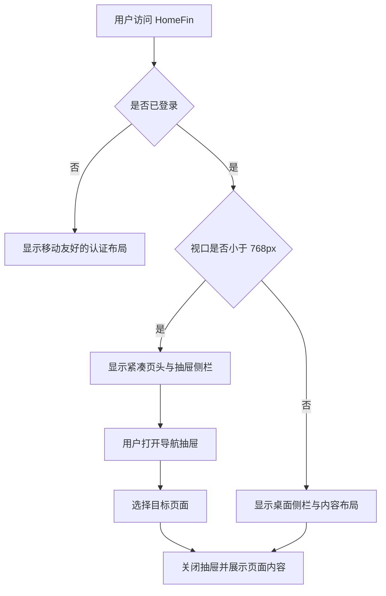
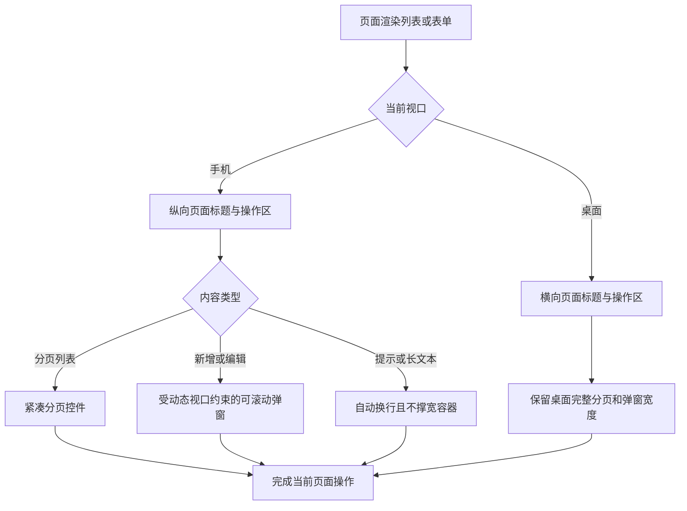

# 移动端体验基础

## 1. 目标声明

### 背景
HomeFin 当前以桌面工作台布局为主，已经具备移动端抽屉侧栏、基础响应式 Grid 和表格横向滚动，但页面标题操作区、分页器、长表单弹窗、触控尺寸和移动端自动化验证仍缺少统一约定。各业务页面若分别处理这些问题，容易形成断点、间距和交互方式不一致的实现。

### 目标
- 建立适用于全部现有页面的移动端布局与组件基线。
- 保证 320px 及以上视口不存在页面级横向滚动，内容不会被侧栏、页头、Footer 或安全区遮挡。
- 保证主要操作、分页和导航可通过触控完成，主要触控目标尺寸尽量不小于 44×44 CSS px。
- 保证长表单在手机软键盘和动态视口高度下仍能滚动并触达关闭、取消和提交操作。
- 在 Chromium 与 WebKit 移动视口中建立核心页面的自动化回归入口，并继续保留桌面端测试。

### 不在范围内
- 不开发原生 iOS / Android 应用、PWA 安装、离线缓存或推送通知。
- 不修改后端接口、认证机制、数据库结构或权限模型。
- 不调整现有品牌、主题配色、业务文案语言或导航信息架构。
- 不以缩放整个桌面页面或仅依赖横向滚动作为移动端主方案。

## 2. 模块影响表

| 模块 | 影响类型 | 说明 |
|------|---------|------|
| app-shell | 修改 | 统一移动端应用骨架、页头、侧栏、内容间距、分页、弹窗及通用页面状态 |
| auth | 修改 | 调整登录、找回密码和重置密码页面在小屏、软键盘和安全区下的布局 |
| shared-infra | 修改 | 增加移动设备 Playwright 项目和跨视口响应式回归约定 |

## 3. 功能描述

### 3.1 响应式应用框架

#### 正常流程
1. 用户访问公开或受保护路由。
2. 系统继续沿用现有登录态与权限判断。
3. 在小于 768px 的视口中，受保护区域显示紧凑顶部栏和抽屉导航；内容区使用手机间距。
4. 用户打开抽屉并选择导航项后，抽屉自动关闭，目标页面获得完整可用宽度。
5. 在 768px 及以上视口中，继续使用现有桌面侧栏和内容结构。

#### 边界条件
- 最低支持宽度为 320px；超长用户名、邮箱、页面标题和导航文案不得撑宽页面。
- 页面应使用动态视口高度和安全区留白，适配带刘海、底部手势区域和移动浏览器地址栏变化。
- 旋转屏幕或跨越断点时，侧栏打开状态不得造成页面遮挡或无法操作。
- 兼容路由 `/signup`、`/items`、`/admin` 继续按当前规则跳转，不新增独立页面。

#### 异常处理
- 当前用户读取失败时继续沿用全局登录失效处理，不在移动布局中保留不可操作的空壳页面。
- 页面级错误和 404 状态必须在窄屏中居中显示，文本可换行，返回操作可触达。

### 3.2 公共交互组件

#### 正常流程
1. 页面通过统一标题区域展示标题、说明和主要操作。
2. 手机端标题与操作纵向排列，多个主要操作允许换行或占满可用宽度；桌面端保持横向排列。
3. 分页列表在手机端展示记录范围、每页条数、上一页、当前页/总页数和下一页；桌面端继续展示首页、上一页、下一页和末页。
4. 新增、编辑和确认弹窗在手机端限制为动态视口高度，内容区域可滚动，关闭与提交路径始终可访问。
5. Token、URI、邮箱等不可自然断行文本在容器内换行或截断，并提供完整值的可访问方式。

#### 边界条件
- 总数为 0 时分页显示 `0-0`，页码保持在有效范围内。
- 最后一页数据因删除而减少时，页面不得停留在无效页码。
- 弹窗内容短时保持自然高度；内容超过视口时才启用内部滚动。
- 手机端操作按钮不得因为文案过长而溢出，图标按钮必须具备可访问名称。
- Radix Select、Dropdown 和 Toast 不得超出可用视口。

#### 异常处理
- 保存失败后弹窗保持打开，保留用户已填写内容并显示现有错误反馈。
- 页面加载、空数据和请求失败状态应占据当前容器，不造成布局跳出或操作区错位。

## 4. 数据变更

### 新增表
无。

### 新增字段
无。

### 调整已有字段说明
无。

### 废弃字段
无。

## 5. UI 页面

| 变更类型 | 页面名 | 路由 | 说明 |
|---------|-------|------|------|
| 修改 | 应用主框架 | `/_layout/*` | 增加手机页头、抽屉导航、响应式内容间距和安全区处理 |
| 修改 | 登录页 | `/login` | 优化窄屏、软键盘、输入框与提交按钮布局 |
| 修改 | 找回密码页 | `/recover-password` | 保证表单和返回登录入口在小屏中完整可用 |
| 修改 | 重置密码页 | `/reset-password` | 保证双密码表单在软键盘场景中可滚动和提交 |
| 修改 | 全局错误页 | 全局 | 优化错误信息、404 信息和返回操作的小屏布局 |

### 应用主框架
- **布局**：手机端使用紧凑顶部栏、抽屉侧栏、较小内容内边距和安全区留白；桌面端保持左侧栏、顶部栏和最大内容宽度。
- **功能**：保留全部现有导航项、管理员条件导航、主题切换、用户设置和退出登录。
- **交互**：手机端选中导航后自动关闭侧栏；页面滚动时顶部栏保持可用；打开侧栏时背景不可误触。
- **字段**：无新增业务字段。

### 公共页面标题与操作区
- **布局**：标题、说明和操作在手机端纵向排列，桌面端横向对齐。
- **功能**：承载页面主要操作，允许业务页面提供一个或多个按钮。
- **交互**：按钮在小屏可换行或全宽展示，不覆盖标题，不制造页面级横向滚动。
- **字段**：页面标题和说明必须允许正常换行。

### 公共分页器
- **布局**：手机端使用两行或紧凑纵向布局；桌面端保持完整分页按钮。
- **功能**：保留记录范围、总数、每页条数、当前页和前后翻页。
- **交互**：翻页和修改每页条数后保持现有数据请求规则；不可用按钮明确禁用。
- **字段**：每页条数继续使用 `10 / 20 / 50 / 100 / 200`。

### 公共弹窗
- **布局**：手机端最大高度受 `100dvh` 约束，内容可滚动，内边距适当减小；桌面端保留当前居中宽度。
- **功能**：继续支持标题、说明、内容、取消、提交和关闭按钮。
- **交互**：软键盘打开后，聚焦字段与提交操作仍可通过滚动访问；关闭时沿用各页面现有状态重置规则。
- **字段**：字段本身由业务页面定义。

### 认证页面
- **布局**：手机端单栏居中，内容宽度不超过视口，Footer 不挤压表单。
- **功能**：保留登录名、密码、可选 MFA、邮箱找回和密码重置能力。
- **交互**：输入控件使用适合的移动键盘类型；提交期间防止重复操作；验证错误紧随字段显示。
- **字段**：沿用现有校验规则，不改变认证契约。

### 导航影响
不新增、删除或改名任何导航项；只改变不同视口下的展示方式。

## 6. 验收标准

- [ ] 匿名用户在 320×568 与 390×844 视口下可完成登录、找回密码和重置密码流程，页面无横向滚动。
- [ ] 已登录用户在手机端可打开侧栏、看到其权限范围内的全部导航项、跳转页面并自动关闭侧栏。
- [ ] 手机端页面标题、说明和两个并列主要操作不会重叠、截断或撑宽页面。
- [ ] 手机端分页器可修改每页条数并完成上一页、下一页操作，320px 宽度下不产生横向溢出。
- [ ] 内容超过屏幕高度的新增或编辑弹窗可滚动至全部字段和提交按钮，软键盘打开后仍可完成操作。
- [ ] 页面中的主要触控操作具备清晰焦点状态和足够触控区域，纯图标按钮具有可访问名称。
- [ ] 全局错误页、404 页面、Toast、Select 和 Dropdown 在手机视口内完整显示。
- [ ] Chromium 移动视口与 WebKit 移动视口均具备自动化回归入口，桌面 Chromium 项目继续通过。
- [ ] 1440×900 桌面视口下现有侧栏、页面宽度、分页能力和弹窗布局无明显退化。
