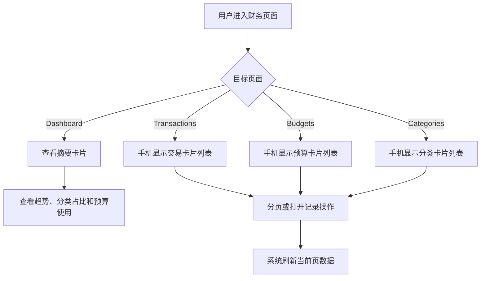
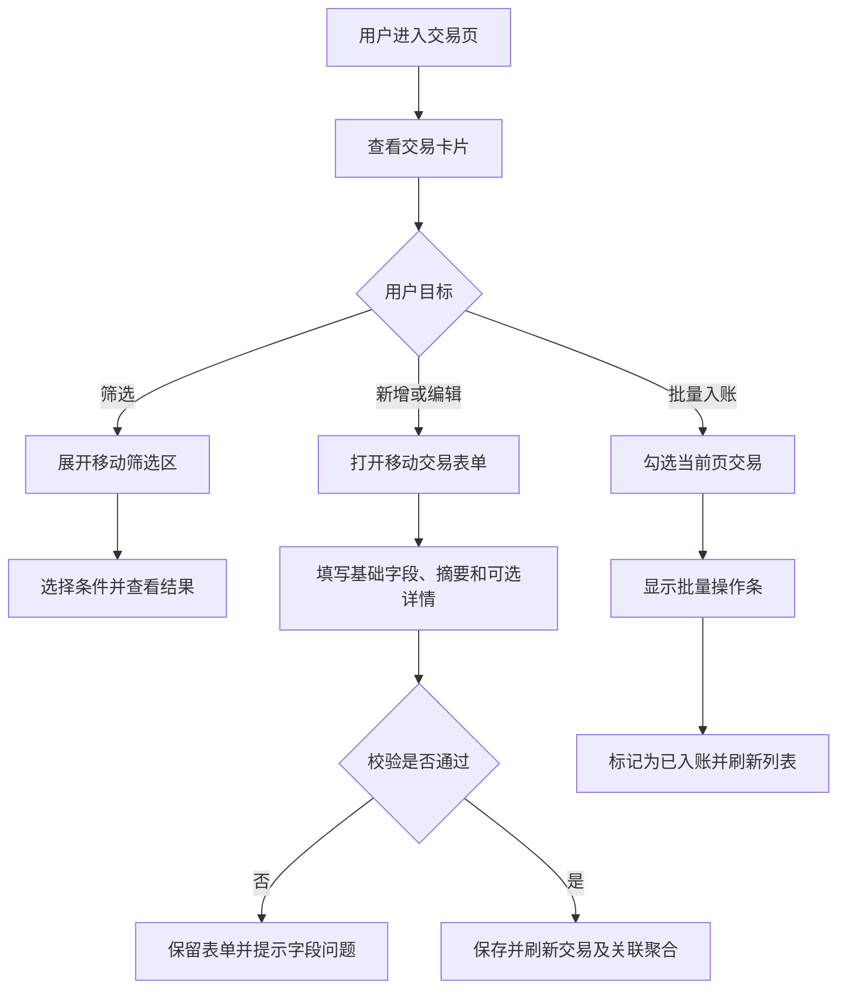

# 移动端财务工作流

## 1. 目标声明

### 背景
Dashboard、交易、预算和分类构成 HomeFin 的主要用户路径。当前 Dashboard 已具备基础 Grid，但部分金额行会在窄屏拥挤；交易、预算和分类仍以桌面表格为主。尤其交易页包含六项筛选、批量选择、十列数据和较长的结构化详情表单，仅依赖表格横向滚动无法形成友善的手机记账体验。

### 目标
- 让用户在手机端快速查看财务概览和关键金额。
- 让用户无需横向滚动即可浏览交易、预算和分类的关键字段及状态。
- 让用户在手机端完成交易筛选、新增、编辑、删除、当前页选择和批量入账。
- 让用户在手机端完成预算和分类的新增、编辑、删除及分页浏览。
- 保持桌面端现有表格、筛选和信息密度不退化。

### 不在范围内
- 不新增图表库、统计维度、搜索接口、排序接口或无限滚动。
- 不改变交易、预算、分类或 Dashboard 的 API 与数据结构。
- 不改变交易批量操作只作用于当前已选择记录的现有语义。
- 不新增预算周期、交易状态或分类层级规则。

## 2. 模块影响表

| 模块 | 影响类型 | 说明 |
|------|---------|------|
| dashboard | 修改 | 调整摘要、趋势、分类占比和预算使用区块的小屏信息布局 |
| transactions | 修改 | 增加移动交易卡片、折叠筛选、批量操作条和单列交易表单 |
| budgets | 修改 | 增加移动预算卡片及适配后的新增编辑表单 |
| categories | 修改 | 增加移动分类卡片及适配后的名称、颜色和父分类表单 |

## 3. 功能描述

### 3.1 财务概览与列表浏览

#### 正常流程
1. 用户从移动侧栏进入 Dashboard 或某个财务管理页面。
2. Dashboard 将摘要、趋势、分类和预算信息按手机可读顺序纵向展示。
3. 交易、预算和分类在手机端使用卡片，在桌面端继续使用表格。
4. 卡片展示完成当前任务所需的关键字段、状态和操作。
5. 用户通过统一分页器切换页面或每页条数。

#### 边界条件
- 金额、分类名、预算名、经手人名和交易摘要过长时必须换行或受控截断，不得撑宽页面。
- 空数据、加载中和最后一页数据减少时均须保持稳定布局。
- Dashboard 中收入、支出、结余为较大金额时，货币文本允许换行但不得重叠。
- 320px 宽度下卡片仍需保留关键状态和主要操作。

#### 异常处理
- 读取失败继续使用现有错误反馈；已成功展示的其他区块不得因单个长文本产生布局破坏。
- 删除因业务引用失败时保留当前列表和页码，并展示后端返回的用户可读原因。

### 3.2 交易筛选、编辑与批量入账

#### 正常流程
1. 手机端交易页首先展示主要操作、筛选摘要和交易卡片列表。
2. 用户按需展开筛选区，选择分类、类型、状态、经手人及日期范围；筛选区显示当前启用条件数量。
3. 用户可清除全部筛选，列表回到第 1 页。
4. 用户新增或编辑交易时，表单按单列顺序展示分类、类型、预算、状态、金额、日期、经手人、摘要、详情备注和明细项。
5. 用户可逐项增加、编辑和移除详情明细，字段组在手机端纵向排列。
6. 用户可勾选当前页交易；存在选中项时显示批量操作条，并执行“标记为已入账”。

#### 边界条件
- 筛选条件变化后继续回到第 1 页；批量选择在数据页或筛选结果变化后清空。
- 卡片至少展示日期、摘要、金额、分类、交易类型、入账状态和经手人；预算和详情预览按是否存在展示。
- 交易详情包含多条明细时，卡片只展示摘要预览，完整内容在编辑表单中可访问。
- 当前页全选只选择当前返回页的数据，不扩展为跨页全选。
- 交易表单中的 Select 弹层、日期输入和数字键盘不得被弹窗边界遮挡。

#### 异常处理
- 表单校验失败或接口保存失败时保持弹窗和已输入内容。
- 批量入账失败时保留当前选中状态，方便用户重试或调整选择。
- 删除失败时不提前从卡片列表移除记录。

## 4. 数据变更

### 新增表
无。

### 新增字段
无。

### 调整已有字段说明
无。

### 废弃字段
无。

## 5. UI 页面

| 变更类型 | 页面名 | 路由 | 说明 |
|---------|-------|------|------|
| 修改 | 财务首页 | `/` | 调整摘要、趋势、分类占比和预算使用的小屏排版 |
| 修改 | 交易管理页 | `/transactions` | 增加移动卡片、折叠筛选、批量操作和移动表单 |
| 修改 | 预算管理页 | `/budgets` | 增加移动预算卡片和响应式表单 |
| 修改 | 分类管理页 | `/system/categories` | 增加移动分类卡片和响应式颜色编辑 |

### 财务首页
- **布局**：手机端摘要卡片单列排列；趋势、分类占比和预算使用中的名称与金额允许上下排列。
- **功能**：继续展示本月收入、支出、结余、预算数量、六个月趋势、分类支出占比和预算使用情况。
- **交互**：无新增写操作；加载和空状态在各自卡片内展示。
- **字段**：沿用现有 Dashboard 响应字段。

### 交易管理页
- **布局**：手机端为页面操作区、可折叠筛选区、交易卡片、批量操作条和分页器；768px 及以上保留表格布局。
- **功能**：保留筛选、CRUD、当前页选择和批量入账。
- **交互**：筛选区显示启用条件数量；卡片可勾选并提供编辑、删除操作；批量操作条只在存在选择时显示。
- **字段**：卡片和表单沿用 `category_id`、`transaction_type`、`budget_id`、`summary`、`detail`、`entry_status`、`handler_user_id`、`transaction_date`、`amount`。

### 预算管理页
- **布局**：手机卡片展示名称、年份、周期、预算金额、已使用金额及操作；桌面保留表格。
- **功能**：保留新增、编辑、删除和分页。
- **交互**：新增编辑表单在手机端单列展示；删除失败保留当前卡片。
- **字段**：预算名称必填；年份、周期和金额沿用现有规则。

### 分类管理页
- **布局**：手机卡片展示名称、父分类、颜色、创建日期和操作；桌面保留表格。
- **功能**：保留新增、编辑、删除和分页。
- **交互**：颜色选择器、色号输入和预览在窄屏下允许换行或纵向排列；父分类 Select 使用完整可用宽度。
- **字段**：名称、颜色、父分类沿用现有唯一性、色号和依赖约束。

### 导航影响
不改变 Dashboard、Transactions、Budgets 和 Categories 的导航名称、顺序、路径或权限。

## 6. 验收标准

- [ ] 用户在 320×568 和 390×844 下可查看 Dashboard 全部区块，金额和名称不重叠且页面无横向滚动。
- [ ] 手机端交易列表无需横向滚动即可识别日期、摘要、金额、分类、类型、状态和经手人。
- [ ] 用户可在手机端展开和收起交易筛选，应用任意筛选后回到第 1 页，并可一键清除全部条件。
- [ ] 用户可在手机端完成交易新增和编辑，包括详情备注以及多条明细项的增加、修改和移除。
- [ ] 用户选择当前页一条或多条交易后可看到批量操作入口，并能成功标记为已入账。
- [ ] 筛选、翻页或批量操作完成后，不再保留与当前结果不一致的选择状态。
- [ ] 用户可在手机端完成预算和分类的新增、编辑、删除及分页浏览。
- [ ] 预算和分类的移动卡片包含桌面列表中的关键业务信息，不因切换为卡片而失去必要字段。
- [ ] 交易、预算和分类的空状态、加载状态、保存失败和删除失败在移动布局中可读且可恢复。
- [ ] 768px 及以上继续展示现有桌面表格，1440×900 下筛选、列表和编辑功能无回归。
