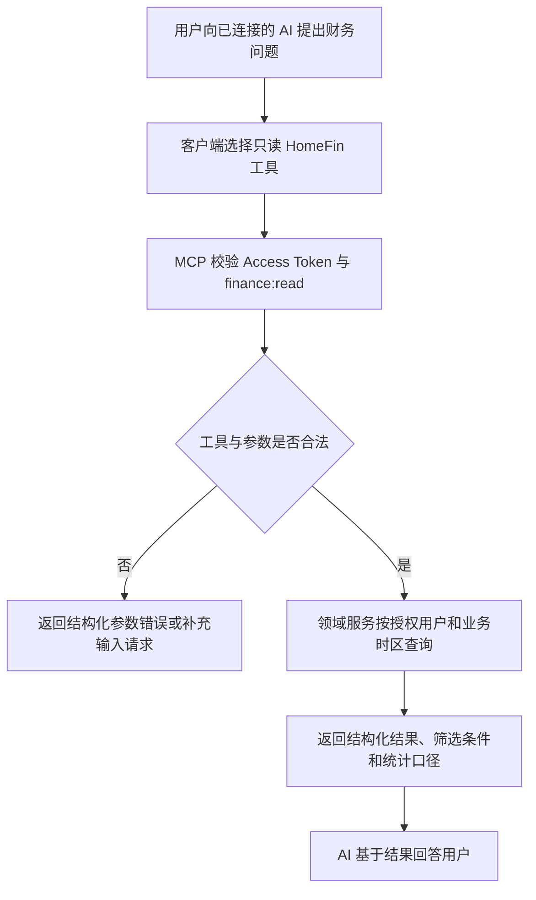

# AI Financial Insights

## 4.1 目标声明

### 背景
现有 Agent API 只把交易、预算和分类 CRUD 暴露给模型，模型必须自行选择 endpoint、组合分页并解释底层字段。新的 AI Connector 需要以用户问题为中心提供稳定的只读财务工具，让兼容客户端可以直接回答“本月花了多少”“最近有哪些餐饮支出”“预算还剩多少”等问题。

### 目标
- 已授予 `finance:read` 的 AI 连接可以查询当前用户财务概览、交易、预算和分类。
- 工具使用明确的业务输入、枚举、金额单位、时间范围和分页结构，不暴露 HTTP endpoint 细节。
- 所有结果都返回结构化数据、实际应用的筛选条件和业务时区。
- 查询严格限制在授权用户数据范围内，并保持与 Web Dashboard 和列表页一致的统计口径。

### 不在范围内
- 不允许 AI 通过只读工具创建、修改或删除任何数据。
- 不提供任意 SQL、任意聚合表达式或数据库 Schema 读取。
- 不提供投资建议、信用评估、税务建议或自动财务决策。
- 不新增币种模型；v0.9 继续沿用 HomeFin 当前单金额体系和“API/工具使用元”的约定。
- 不读取其他用户的财务数据，也不因授权用户是管理员而扩大数据范围。

## 4.2 模块影响表

| 模块 | 影响类型 | 说明 |
|------|---------|------|
| `ai-connector` | 新增 | 注册只读工具、Schema、Scope 和 MCP Tool Result 映射 |
| `dashboard` | 修改 | 抽取可复用的财务概览领域服务，并支持受控时间范围 |
| `transactions` | 修改 | 为语义查询补充关键字、时间和现有业务筛选组合 |
| `budgets` | 修改 | 提供按年份读取预算使用状态的领域用例 |
| `categories` | 修改 | 提供稳定的分类树候选和结构化展示结果 |
| `shared-infra` | 修改 | 增加工具契约、数据隔离、性能和跨客户端回归测试 |

## 4.3 功能描述

### 功能点 1：财务概览工具

**工具定义**
| 工具 | Scope | 主要输入 | 主要输出 |
|------|------|---------|---------|
| `get_financial_overview` | `finance:read` | 预设周期，或自定义开始/结束日期 | 收入、支出、结余、趋势、分类占比、预算使用 |

**正常流程**
1. 客户端调用 `get_financial_overview`，选择 `current_month / last_month / current_year / last_6_months / custom`。
2. `custom` 必须同时提供 `start_date` 和 `end_date`。
3. 系统按 `BUSINESS_TIMEZONE` 解释日期边界，只聚合授权用户数据。
4. 返回金额单位、业务时区、实际日期范围、汇总和结构化明细。

**边界条件**
- 自定义范围开始日期不得晚于结束日期，单次最大跨度为 366 天。
- 默认不把业务日期之后的未来交易计入洞察。
- 分类占比只统计支出，预算使用沿用现有支出统计口径。
- 空数据返回零值和空数组，不把“无数据”包装成错误。

**异常处理**
- 周期与自定义日期组合冲突时返回字段级错误。
- 时区配置无效时服务启动失败，不临时回退到服务器本地时区。
- 聚合失败时返回可重试的工具错误，不返回部分计算结果冒充完整结果。

### 功能点 2：交易语义查询工具

**工具定义**
| 工具 | Scope | 主要输入 | 主要输出 |
|------|------|---------|---------|
| `search_transactions` | `finance:read` | 关键字、日期、类型、分类、预算、状态、经手人、分页 | 交易列表、总数、分页信息和实际筛选条件 |

**正常流程**
1. 客户端提交零个或多个结构化筛选条件。
2. 系统将分类、预算和经手人 ID 限制在当前用户可用范围，并按现有排序规则查询。
3. `keyword` 对交易 `summary`、兼容描述和详情备注执行受控匹配，不搜索任意 JSON 路径。
4. 返回 `summary`、柔性详情、金额、日期、类型、状态、分类、预算和经手人展示信息。

**边界条件**
- 默认 `page=1`、`page_size=20`，最大 `page_size=100`。
- 未提供筛选时仍只返回当前用户最近一页交易，不允许无界全量返回。
- 金额以元返回，并附带 `amount_unit: "yuan"`。
- 未来交易只有在日期筛选明确覆盖未来时才返回。

**异常处理**
- 分类、预算或经手人不属于允许范围时返回参数错误，不静默忽略筛选。
- 页码超出结果范围时返回空页和准确总数。
- 关键字过长或包含不支持的结构时返回校验错误，不拼接为原始 SQL。

### 功能点 3：预算状态与分类候选工具

**工具定义**
| 工具 | Scope | 主要输入 | 主要输出 |
|------|------|---------|---------|
| `get_budget_status` | `finance:read` | 可选年份、分页 | 预算金额、已使用、剩余和使用比例 |
| `list_categories` | `finance:read` | 可选分页 | 分类 ID、名称、颜色、父分类和展示路径 |

**正常流程**
1. `get_budget_status` 未提供年份时使用当前业务年份，并按预算返回使用状态。
2. `list_categories` 返回当前用户分类树信息，并生成稳定、用户可读的分类路径。
3. 两个工具都返回分页信息和实际查询条件。

**边界条件**
- 预算剩余金额允许为负，使用比例可以超过 100%。
- 分类树若存在历史异常数据，工具必须返回明确的数据完整性错误，不能无限递归。
- 工具输出 ID 用于后续写工具精确定位，但 AI 不应把内部 ID 作为主要用户文案。

**异常处理**
- 非法年份、分页参数或分类关系返回结构化错误。
- 单条数据异常不得导致跨用户查询或绕过所有权校验。

### 功能点 4：只读工具契约与安全标记

**正常流程**
1. 所有只读工具声明完整 `inputSchema`、`outputSchema` 和 `readOnlyHint=true`。
2. 工具声明 `destructiveHint=false`、`idempotentHint=true`、`openWorldHint=false`。
3. 服务端仍独立执行鉴权、Scope 和参数校验，不把工具 Annotation 当作安全控制。

**边界条件**
- Tool Result 的结构化内容必须符合已声明输出 Schema。
- 返回结果不包含密码、邮箱、Token、内部堆栈或其他用户数据。
- `tools/list` 可以被客户端缓存，但缓存范围必须按连接/Scope 隔离。

**异常处理**
- 输出 Schema 校验失败视为服务端错误并记录诊断，不能向客户端返回不符合契约的数据。

## 4.4 数据变更

新增表：
| 表名 | 用途说明 |
|------|---------|
| 无 | 只读工具复用现有财务实体和领域服务 |

新增字段：
| 表名 | 字段名 | 类型 | 业务含义 |
|------|------|------|------|
| 无 | 无 | 无 | 本需求不新增持久化字段 |

调整已有字段说明（字段本身不变，但行为/值域在本次需求中有扩展）：
| 表名 | 字段名 | 调整说明 |
|------|------|------|
| `transaction` | `summary` | 成为交易关键字查询的主要文本来源 |
| `transaction` | `detail` | 仅对约定的详情备注字段执行关键字匹配，不开放任意 JSON 查询 |
| `budget` | `year` | 支持 AI 预算状态工具按业务年份筛选 |
| `category` | `parent_id` | 用于生成结构化分类树和用户可读路径 |

废弃字段（保留字段本身，说明中标注 [废弃]）：
| 表名 | 字段名 | 废弃原因 |
|------|------|------|
| 无 | 无 | 本需求不废弃字段 |

## 4.5 UI 页面

| 变更类型 | 页面名 | 路由 | 说明 |
|------|------|------|------|
| 无 | 无独立页面 | 无 | 用户在外部 AI 客户端中使用只读工具 |

每个新增/修改页面：
- 无独立页面。
- Settings 的连接列表可继续通过 `last_used_at` 反映成功调用，但 v0.9 不提供逐次调用日志页面。

导航影响：
- 不影响 HomeFin 导航结构。

## 4.6 验收标准

- [ ] 只有具备 `finance:read` 的连接可以发现和调用四个只读工具。
- [ ] 财务概览在相同业务日期范围下与 Web Dashboard 的金额和统计口径一致。
- [ ] AI 可以组合关键字、日期、类型、分类、预算、状态和经手人筛选交易，并获得准确总数与分页结果。
- [ ] 所有只读结果仅包含授权用户数据，即使授权用户是管理员也不会扩大财务数据范围。
- [ ] 空数据返回合法零值或空集合，非法参数返回结构化错误。
- [ ] 所有金额明确使用元，所有日期明确使用 `BUSINESS_TIMEZONE` 解释。
- [ ] 只读工具的实际行为与 MCP Annotation 一致，但服务端不依赖 Annotation 完成安全判断。
- [ ] 工具输出通过声明的 JSON Schema 校验，且不包含凭证、内部堆栈或其他用户隐私数据。
