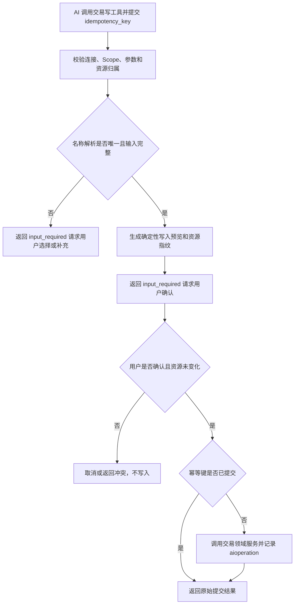

# AI Transaction Management

## 4.1 目标声明

### 背景
交易录入是 HomeFin 最常见的 AI 使用场景。旧 Agent API 要求模型先理解分类、预算和经手人 ID，再直接发出 REST 写请求；请求重试可能造成重复记账，客户端是否展示确认也不可控。新的交易工具必须把业务选择、确认、幂等和所有权校验放回服务端。

### 目标
- 获得相应 Scope 的 AI 连接可以创建、更新和删除当前用户交易。
- AI 可以通过候选工具或精确名称解析分类、预算和经手人，不需要猜测 UUID。
- 所有交易写入在执行前由 HomeFin 服务端生成确定性预览并取得用户确认。
- 所有写工具具备请求级幂等保护，客户端重试不会产生重复记录或重复修改。
- MCP 工具和 Web API 复用交易领域服务及现有金额、详情、状态和关联校验。

### 不在范围内
- 不在 HomeFin 服务端嵌入第二个 LLM 解析自然语言；外部 AI 负责把用户语言转换为工具参数。
- 不允许交易工具自动创建缺失分类、预算或用户。
- 不实现批量交易创建、批量删除或批量入账。
- 不允许 AI 绕过确认直接提交写入，也不提供“永久信任此客户端所有写操作”。
- 不改变交易归属、金额以分存储、`summary + detail` 或经手人模型。

## 4.2 模块影响表

| 模块 | 影响类型 | 说明 |
|------|---------|------|
| `ai-connector` | 新增 | 注册交易候选与写工具，统一执行 Scope、确认、幂等和结果映射 |
| `transactions` | 修改 | 将候选解析、预览和 CRUD 用例收敛到可复用领域服务 |
| `categories` | 修改 | 为交易工具提供当前用户分类候选和精确解析 |
| `budgets` | 修改 | 为交易工具提供当前用户预算候选和精确解析 |
| `users` | 修改 | 提供允许选择的经手人候选，并保持现有展示名规则 |
| `shared-infra` | 修改 | 增加写操作记录、并发冲突、确认恢复和重复调用测试 |

## 4.3 功能描述

### 功能点 1：交易候选与参数解析

**工具定义**
| 工具 | Scope | Annotation | 用途 |
|------|------|------------|------|
| `get_transaction_options` | `finance:read + transactions:write` | 只读、幂等、封闭域 | 返回分类、预算、经手人、交易类型和状态候选 |

**正常流程**
1. AI 在写交易前调用候选工具，或在写工具中提交明确 ID/名称。
2. 分类和预算只在授权用户自己的数据内解析；经手人只从当前允许的激活用户候选中解析。
3. ID 优先作为精确定位；名称只允许规范化后的唯一精确匹配。
4. 名称存在多个候选或不存在时，返回 `input_required` 让用户选择或补充，不自动猜测。

**边界条件**
- 分类为必填；预算可空；经手人可空并默认使用完成授权的 HomeFin 用户。
- 交易日期可空并默认使用 `BUSINESS_TIMEZONE` 的当前日期，确认预览必须明确展示该默认值。
- `entry_status` 可空并默认 `PENDING`。
- 金额必须能精确转换为整数分且大于 0。

**异常处理**
- 客户端不支持 `input_required` 时返回能力不足错误，不选择第一个候选继续执行。
- 关联资源在确认前被删除或变为不可用时重新校验并终止写入。

### 功能点 2：创建和更新交易

**工具定义**
| 工具 | Scope | Annotation | 用途 |
|------|------|------------|------|
| `create_transaction` | `finance:read + transactions:write` | 非只读、非破坏、幂等、封闭域 | 创建一笔交易 |
| `update_transaction` | `finance:read + transactions:write` | 非只读、破坏性、幂等、封闭域 | 更新一笔现有交易 |

**正常流程**
1. AI 提交结构化交易参数和必填 `idempotency_key`。
2. 系统完成金额、日期、类型、状态、摘要、详情和关联候选校验。
3. 创建操作展示完整待写内容；更新操作展示修改前后差异。
4. 工具通过普通结构化结果返回 `status=input_required`、确定性预览和签名 `confirmation_id`；不依赖 Streamable HTTP 客户端提供服务器反向 `elicitation/create` 通道。
5. 客户端取得用户确认后，携带原参数、原 `idempotency_key`、`confirm=true` 和 `confirmation_id` 重试同一工具。
6. 系统再次校验身份、Scope、参数哈希和资源指纹，随后在同一事务中执行写入并记录幂等结果。

**边界条件**
- `idempotency_key` 在同一连接和工具内唯一，建议为 UUID，至少保留 30 天。
- 相同幂等键和相同请求返回首次成功结果；相同键对应不同参数返回冲突。
- `summary` 为主要摘要；`detail` 必须为对象，明细项必须满足现有名称规则。
- 更新只改变明确提交的字段；空值和未提交字段必须区分。
- 确认状态默认 5 分钟失效，不能跨连接、跨用户或跨工具使用。

**异常处理**
- 用户拒绝或取消确认时不产生 `transaction` 或成功 `aioperation`。
- 更新目标在确认期间发生变化时返回并发冲突，并要求重新生成预览。
- 写入失败时事务整体回滚；不能留下成功幂等记录或半完成交易。
- 客户端不执行上述两阶段确认协议时不会写入；服务端不回退到仅依赖客户端自行确认。

### 功能点 3：删除交易

**工具定义**
| 工具 | Scope | Annotation | 用途 |
|------|------|------------|------|
| `delete_transaction` | `finance:read + transactions:delete` | 非只读、破坏性、幂等、封闭域 | 永久删除一笔交易 |

**正常流程**
1. AI 使用精确交易 ID 调用删除工具，并提交 `idempotency_key`。
2. 系统读取当前交易，展示摘要、金额、日期、分类和删除不可恢复说明。
3. 用户通过服务端确认后，系统再次核对资源指纹并执行删除。
4. 删除结果和被删除资源摘要写入 `aioperation`，同一幂等键重试返回原始成功结果。

**边界条件**
- 删除必须使用 ID，不允许按模糊文本或“最后一笔”直接删除。
- 删除不提供回收站，也不级联删除分类或预算。
- 连接必须同时具备 `finance:read + transactions:delete`；只有 `transactions:write` 不足以删除。

**异常处理**
- 目标不存在时返回未找到；若同一幂等键已成功删除，则返回原始成功结果。
- 资源在确认前变化时取消删除并要求重新确认。

### 功能点 4：统一幂等、确认和审计摘要

**正常流程**
1. 所有写工具调用共享 `aioperation` 幂等记录能力。
2. MCP 工具 Annotation 向客户端表达风险，但服务端仍强制 Scope、确认和幂等。
3. 成功调用更新连接 `last_used_at`，并记录不含凭证的结构化诊断信息和 Trace Context。

**边界条件**
- `requestState` 是不可信输入，必须签名、限时并绑定连接、工具、参数和资源指纹。
- `aioperation` 保存重放所需结果摘要，不保存 Access/Refresh Token、Authorization Header 或用户确认原文。
- 过期记录按受控保留任务清理，不能删除配置目录之外的资源。

**异常处理**
- 幂等记录与业务写入必须位于同一数据库事务。
- 结果 Schema 校验失败时事务不得提交。

## 4.4 数据变更

新增表：
| 表名 | 用途说明 |
|------|---------|
| `aioperation` | 保存 AI 写工具的幂等键、请求哈希、目标资源和可重放结果摘要 |

新增字段：
| 表名 | 字段名 | 类型 | 业务含义 |
|------|------|------|------|
| `aioperation` | `id` | UUID | 操作记录主键 |
| `aioperation` | `connection_id` | UUID | 关联 `aiconnection.id` |
| `aioperation` | `tool_name` | varchar(100) | 执行工具名称 |
| `aioperation` | `idempotency_key` | varchar(100) | 客户端提供的幂等键 |
| `aioperation` | `request_hash` | varchar(255) | 规范化工具参数哈希 |
| `aioperation` | `resource_type` | varchar(50) | `transaction / budget / category` |
| `aioperation` | `resource_id` | UUID | 创建或变更的目标资源 ID |
| `aioperation` | `result_payload` | jsonb | 重复调用时返回的结构化成功结果摘要 |
| `aioperation` | `expires_at` | timestamptz | 幂等记录保留截止时间 |
| `aioperation` | `created_at` | timestamptz | 创建时间 |

数据约束：
- `(connection_id, tool_name, idempotency_key)` 必须使用数据库唯一约束，防止并发重试产生重复业务写入。
- `request_hash` 和唯一约束必须在业务写入所在事务中校验和落库。
- `connection_id` 随连接或所属用户最终清理时级联清理；正常撤销连接不会立即删除尚在 30 天保留期内的幂等记录。

调整已有字段说明（字段本身不变，但行为/值域在本次需求中有扩展）：
| 表名 | 字段名 | 调整说明 |
|------|------|------|
| `transaction` | `owner_id` | MCP 写入固定使用授权用户 ID，不再使用 API Token 创建人 |
| `transaction` | `handler_user_id` | 未提交时默认授权用户；显式提交时必须来自实时可用候选 |
| `transaction` | `summary` | 交易确认预览和结果中的主要识别字段 |
| `transaction` | `detail` | 继续使用既有柔性对象和明细项校验规则 |

废弃字段（保留字段本身，说明中标注 [废弃]）：
| 表名 | 字段名 | 废弃原因 |
|------|------|------|
| 无 | 无 | 本需求不废弃交易字段 |

## 4.5 UI 页面

| 变更类型 | 页面名 | 路由 | 说明 |
|------|------|------|------|
| 无 | 无独立页面 | 无 | 写入确认在兼容 MCP 客户端中完成，HomeFin 服务端提供确认内容和约束 |

每个新增/修改页面：
- 无独立 HomeFin 页面。
- v0.9 不提供 AI 调用审计详情页；Settings 连接列表仅更新最后使用时间。

导航影响：
- 不影响 HomeFin 导航结构。

## 4.6 验收标准

- [ ] 同时具备 `finance:read + transactions:write` 的连接可以发现候选、创建和更新工具，但不能在没有 `transactions:delete` 时发现或调用删除工具。
- [ ] 分类、预算或经手人名称不唯一时，服务端要求用户选择，不会猜测或静默回退。
- [ ] 创建、更新和删除在用户确认前都不会改变数据库。
- [ ] 客户端不支持 `input_required` 时，所有交易写操作明确失败且不产生副作用。
- [ ] 相同连接、工具、幂等键和参数的重复调用只产生一次业务变更，并返回首次成功结果。
- [ ] 相同幂等键配合不同参数时返回冲突，不覆盖原操作。
- [ ] 更新或删除目标在确认期间变化时返回并发冲突，并要求重新确认。
- [ ] 交易所有权固定为授权用户，不能通过参数、客户端身份或管理员角色切换为其他用户。
- [ ] MCP 与 Web API 对金额、日期、摘要、详情、分类、预算和经手人的校验结果一致。
