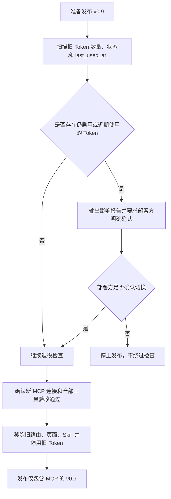

# Legacy AI Access Retirement

## 4.1 目标声明

### 背景
v0.9 建立 MCP / OAuth AI Connector 后，继续保留 Agent REST API、管理员 API Token/HMAC 页面和 `homefin-agent-api` Skill 会形成两套同定位能力，也会迫使团队同时维护两种身份、权限、协议和文档。旧链路应在新能力通过验收后整体退役，而不是改名或长期兼容。

### 目标
- 移除全部 `/api/v1/agent/*` 路由及其专用鉴权、HMAC 和 Nonce 运行时逻辑。
- 移除管理员 API Token CRUD、页面、导航、生成客户端代码和相关测试。
- 删除仓库内 `skills/homefin-agent-api` 及其本地配置约定。
- 在升级前明确识别仍在使用的旧 Token，并要求部署方确认破坏性切换。
- v0.9 发布后只保留 MCP / AI Connector 作为 HomeFin AI 接入能力。

### 不在范围内
- 不保留旧接口代理、兼容适配器、长期 410 Stub 或把旧 Token 自动转换为 OAuth 连接。
- 不把旧 Agent API 改造成通用自动化 API。
- 不在本版本物理删除 `apitoken` 和 `apitokennonce` 表；表先停止使用并标记废弃，后续经独立确认和备份后再删表。
- 不移除供 HomeFin Web 前端使用的普通 `/api/v1` 业务 API。
- 不提供非 MCP 客户端的降级接入方案。

## 4.2 模块影响表

| 模块 | 影响类型 | 说明 |
|------|---------|------|
| `agent-api` | 退役 | 删除 Agent 交易、预算、分类和经手人路由及专用鉴权 |
| `api-tokens` | 退役 | 删除管理员 Token CRUD、HMAC、Nonce 运行时能力和页面 |
| `app-shell` | 修改 | 删除 API Tokens 管理导航和前端路由，引导用户使用 Settings 中的 AI Connections |
| `users` | 修改 | 停止维护旧 API Token 的产品级关联说明，保留废弃表期间的数据库完整性 |
| `ai-connector` | 新增 | 成为唯一 AI 接入能力，但不接受或转换旧 Token |
| `shared-infra` | 修改 | 删除旧 Skill、测试、配置和文档引用，更新 OpenAPI Client 与部署校验 |

## 4.3 功能描述

### 功能点 1：升级前影响审计与发布门禁

**正常流程**
1. v0.9 部署前读取旧 `apitoken`，统计总数、启用数、过期数和最后使用时间。
2. 输出不包含明文 Token、Hash 或 Secret 的影响报告。
3. 若存在启用 Token 或设定观察期内使用过的 Token，部署流程要求操作人明确确认这些集成将永久失效。
4. 新 Connector 的连接授权、只读、交易、预算和分类工具全部通过验收后，才允许继续发布。

**边界条件**
- 影响报告只展示 Token 名称、前缀、状态、创建人和 `last_used_at` 等既有管理信息。
- 没有旧 Token 也必须验证新 Connector 验收状态，不能只凭空表继续发布。
- 确认只针对本次明确的破坏性切换，不能成为以后跳过其他安全检查的通用开关。

**异常处理**
- 无法查询旧 Token 或无法确认新 Connector 状态时停止发布。
- 发现未知活跃调用方时报告给部署方处理，不自动建立代理、导出凭证或延长双轨运行。
- 操作人未确认时保持当前版本，不执行部分删除。

### 功能点 2：退役后端 Agent API 与 Token 能力

**正常流程**
1. 从 API Router 移除 Agent 交易、预算、分类和经手人路由。
2. 删除专用 Agent Token 解析、HMAC 签名、时间窗口和 Nonce 写入代码。
3. 移除 API Token 列表、创建、禁用和删除接口及其 DTO。
4. 升级迁移把现有 `apitoken.is_active` 统一设为 `false`，确保代码回滚或残留入口不会继续接受旧凭证。
5. 重新生成 OpenAPI Client，确认不再包含 Agent 和 API Token Service。

**边界条件**
- 只退役 `/api/v1/agent/*` 和 `/api/v1/system/api-tokens/*`，普通用户财务 API 保持不变。
- 旧 Token 不能作为 MCP OAuth Token、授权码、Refresh Token 或连接导入来源。
- v0.9 发布包中不得保留可重新启用旧 Token 的管理接口。

**异常处理**
- 迁移无法停用全部旧 Token 时停止升级，不带着部分有效凭证启动 v0.9。
- 旧路径在发布后按路由不存在处理，不转发到 MCP，也不尝试猜测对应工具。

### 功能点 3：移除前端页面、Skill 和配置约定

**正常流程**
1. 删除 `/system/api-tokens` 页面、路由、侧边栏入口和相关响应式测试。
2. 在 Settings 中以 AI Connections 作为新的唯一连接管理位置。
3. 删除 `skills/homefin-agent-api` 的 Skill、参考文档、示例配置和 Agent 元数据。
4. 删除 `.homefin-agent-api.json` 的仓库配置约定与专用忽略规则。
5. 更新 README、部署说明和当前态文档，删除“创建 Token 后调用 Agent API”的指引，改为标准 MCP 连接说明。

**边界条件**
- 不创建一个内容相同但改名的 MCP Skill；MCP 客户端通过协议发现工具。
- 旧书签访问 `/system/api-tokens` 时进入统一未找到页面，并提供前往 Settings 的普通导航，不保留 Token 页面组件。
- 历史 PRD 和 Changelog 作为版本事实保留，不重写过去版本记录。

**异常处理**
- 若生成客户端、路由树或测试仍引用旧 Service/Route，构建必须失败并阻止发布。
- 文档扫描发现当前态文档仍把 Agent API 或 API Token 描述为可用能力时，验收不通过。

### 功能点 4：废弃数据保留与后续物理清理边界

**正常流程**
1. v0.9 停止向 `apitoken` 和 `apitokennonce` 写入新数据。
2. 表及历史记录暂时保留，用于升级审计和必要的问题定位。
3. 当前态数据模型文档将两张表标记为 `[废弃]`，注明没有运行时入口。
4. 后续版本如需物理删表，必须单独设计迁移、完成备份并再次获得确认。

**边界条件**
- 保留废弃表不等于保留旧功能；应用不得查询它们完成认证或业务调用。
- 废弃记录继续受数据库访问控制保护，不在新 AI Connections 页面展示。
- 不把历史 Token 数据复制到新 `aiconnection`、授权码或 Refresh Token 表。

**异常处理**
- 不得通过手工删表、直接清空生产数据或跳过 Alembic 历史来“完成清理”。
- 若废弃表影响升级，应停下来修复正常迁移，而不是绕过迁移系统。

## 4.4 数据变更

新增表：
| 表名 | 用途说明 |
|------|---------|
| 无 | 退役需求不新增表 |

新增字段：
| 表名 | 字段名 | 类型 | 业务含义 |
|------|------|------|------|
| 无 | 无 | 无 | 本需求不新增字段 |

调整已有字段说明（字段本身不变，但行为/值域在本次需求中有扩展）：
| 表名 | 字段名 | 调整说明 |
|------|------|------|
| `apitoken` | `is_active` | v0.9 升级时统一设为 `false`，且不再存在重新启用入口 |
| `apitoken` | `last_used_at` | 仅用于升级前影响审计，不再由运行时更新 |

废弃字段（保留字段本身，说明中标注 [废弃]）：
| 表名 | 字段名 | 废弃原因 |
|------|------|------|
| `apitoken` | 全部字段 | 旧 Agent API 和管理员 API Token 功能退役；表暂留但运行时不再使用 |
| `apitokennonce` | 全部字段 | HMAC 防重放链路退役；表暂留但不再新增 Nonce |

## 4.5 UI 页面

| 变更类型 | 页面名 | 路由 | 说明 |
|------|------|------|------|
| 移除 | API Token 管理页 | `/system/api-tokens` | 删除页面、路由、创建/禁用/删除操作和一次性明文展示 |
| 修改 | 应用主框架 | `/_layout/*` | 删除管理员 API Tokens 导航项 |
| 修改 | 用户设置页 | `/settings` | AI Connections 成为唯一 AI 连接管理入口 |

### API Token 管理页移除
- 布局：不保留旧表格、卡片或 Token 弹窗。
- 功能：不再支持创建、复制、禁用或删除旧 Token。
- 交互：旧路径进入统一未找到状态，用户可通过正常导航进入 Settings。
- 字段：不再向前端返回 Token、Secret、前缀或 HMAC 配置。

### 应用主框架与 Settings
- 管理员侧边栏移除 `API Tokens`。
- AI Connections 对所有已登录用户可见，连接只代表当前用户，不因管理员角色扩大权限。

导航影响：
- 删除 `/system/api-tokens` 导航项和路由。
- 不新增同名或改名的管理员 Token 管理入口。

## 4.6 验收标准

- [ ] 发布门禁会报告旧 Token 使用情况，存在活跃或近期使用 Token 时必须由部署方明确确认，未确认则停止发布。
- [ ] v0.9 发布前，MCP 连接、只读、交易、预算和分类能力全部通过验收。
- [ ] `/api/v1/agent/*` 和 `/api/v1/system/api-tokens/*` 不再注册，也不存在到 MCP 的代理或兼容转发。
- [ ] 所有旧 `apitoken` 在升级时被停用，旧 Token 不能调用普通 API 或 MCP。
- [ ] `/system/api-tokens` 页面和管理员导航被移除，Settings 中只保留 AI Connections。
- [ ] `skills/homefin-agent-api`、示例配置和 `.homefin-agent-api.json` 约定被删除，不创建等价改名 Skill。
- [ ] OpenAPI Client、前后端测试和当前态文档不再把 Agent API 或 API Token 描述为可用能力。
- [ ] `apitoken` 与 `apitokennonce` 表在 v0.9 仅作为废弃历史数据保留，运行时没有读写入口。
- [ ] 若退役迁移或影响审计失败，升级会停止并报告，不通过手工删表、兼容代理或无确认继续发布绕过问题。
